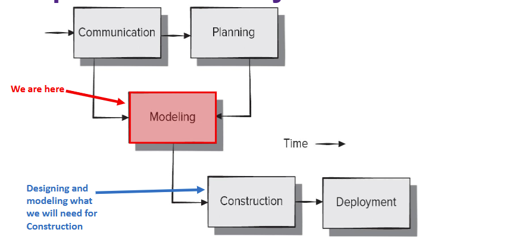
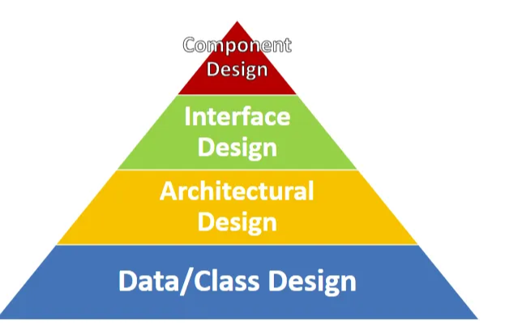

## SOFTWARE DESIGN:



Good software design should exhibit:

- **Firmness:** A program should not have any bugs that inhibit its function
- **Commodity:** A program should be suitable for the purposes which it was intended for
- **Delight:** The experience of using the program should be a pleasurable one

Software design encompasses a set of principles, concepts, and practices that lead to the development of a high-quality system.

- **Design principles:** The main ideas that guide how designers make decisions
- **Design concepts:** Important ideas to understand before starting the design process
- **Design practices:** Practical steps to create different design models of the software

What’s the point in design? Why do we care so much? Even though we know the requirements and how the user will interact with it (use cases), jumping straight into coding can lead to problems. Without proper design and planning, the code can become messy, hard to maintain, and overall just bad

- **Technical debt:** Costs associated with rework caused by choosing “quick and dirty” solution rather than just taking your time and think of a good solution

How do we “pay off” this debt? It can be paid down by **Refactoring**

- **Refactoring:** Essentially refining code but without changing its external behavior

So, for example, imagine building a house without a blueprint. You might finish fast, but you can face problems later such as weak walls or poor plumbing.

### SOFTWARE ENGINEERING DESIGN:

In order to create a structured plan that ensures the software is efficient, maintainable, and meets user needs before coding begins, we use the software engineering design



- **DATA/CLASS DESIGN:**
    
    - Transform analysis classes in implementation classes and data structures. So, this takes the abstract ideas from the analysis phase and turns them into concrete, working software components (classes and data structures)
    - UML Class Diagrams and ERDs are often used
- **ARCHITECTURAL DESIGN:**
    
    - Establishes how the main parts of the system are connected. Defines the relationships between the key components of the software system, showing how they interact with each other
    - Breaks the system down into smaller, interacting pieces. The system is divided into smaller, manageable components that work together to achieve the overall goal
    - Describes the details and connections of each component.
- **INTERFACE DESIGN:**
    
    - Defines how software elements, hardware elements, and end-users communicate
    - Focuses on the user interfaces (UI), user experience (UX), internal interfaces, and external interfaces
- **COMPONENT DESIGN:**
    
    - Converts high-level system structures into detailed functional descriptions for each software component
    - Defines the internal data structures and processing methods for each component
    
    
    

These models and designs become the blueprint for the **Construction Activity.** A good design leads to high-quality software product. But, what is considered a “good” design? How do we ensure that our design is good?

## DESIGN AND QUALITY:

Don’t just start designing and pray that it is good. There are actual guidelines people tend to follow to ensure that their software has a good design:

1. The design must fulfill both explicit and implicit customer requirements
    - So, for example, if the stakeholder wants a login system, you have to take into consideration that you might need a “forget password?” button. Although the stakeholder didn’t explicitly say they wanted it, it’s implied
2. The design must be clear and easy to understand for developers, testers, and support teams
    - It is very important to know your audience
3. The design should offer a complete and comprehensive view of the software
    - It must cover all aspects of the software, including data structures, functionality, and behavior, from the perspective of how it will be implemented

These characteristics are not achieved by luck, they are achieved through the application of:

- Fundamental design principles
- Systematic methodology
- Thorough review

### QUALITY GUIDELINES:

One method of ensuring quality is conducting a **Technical Review (TR)**

- **Technical Review:** Meeting conducted by members of the software team
- 2 to 4 people, one review leader (facilitates the meeting), one recorder (takes notes), and one producer (person whose work product is being reviewed)
- Review the work product and note down any errors, ambiguity, or omissions
- Check if it can finally be implemented into software or if it needs more work. That is the whole point of this damn meeting

### DESIGN CONCEPTS:

Design concepts are concepts that must be understood before design practices are applied

**ABSTRACTION:**

- Involves simplifying a complex system by focusing on the essential features and disregarding the irrelevant details. It helps in identifying general principles that can apply across various situations
- Levels of abstraction can be looked at like this:


- There are two types of abstractions we have:
    - **Procedural abstraction:** Design concept where complex processes or tasks are simplified by encapsulating them into a procedure . This allows the users or developers to interact with the procedure at a high level without needing to understand the intricate details of how it works internally
        - So, for example “log in” is an example of a procedural task because it involves a sequence of specific steps or instructions to achieve a goal. So, to log in, you need to enter your email, password, submitting in the log in form, and the system checks if its right. Do we need to know how the system checks it and stuff? No
    - **Data abstraction:** Defining a data structure (or object) and providing a clear interface for interacting with it, while hiding the internal implementations details.
        - For example, a `Person` class in object-oriented programming might include fields like name and age, but only provide methods like `getName()` or `setAge()`. The internal representation of how name and age are stored is abstracted from the user.

**SEPARATION OF CONCERNS:**

Separation of concerns is basically suggesting that complex problems can be solved easily if you divide these problems into smaller ones and solve each problem independently

A **concern** is a feature that is part of the requirements model.

By separating concerns into smaller ones, a problem takes less effort and time to solve by using divide-and-conquer strategy

**MODULARITY:**

Modularity is the common manifestation of separation of concerns. This is because the software is divided into separately named components, also referred to as **modules,** that are integrated to satisfy requirements.

MODULES ARE CLASSES IN JAVA BASICALLY

- Basically, it allows a program to be broken down into smaller**,** manageable components or modules, each of which handles a specific part of the system's functionality. This separation of concerns makes complex systems more intellectually manageable by allowing developers to focus on individual pieces of functionality without being overwhelmed by the overall system.

In almost all instances, you should break down the design into many modules, in order to understand the design easier, and reduce the cost required to build the software.

However, there is no way to reduce the cost to nothing even if we divide these modules, this is because some modules are implemented together, and when you divide them, it forced you to implement more, which can even be more time consuming.

**INFORMATION HIDING:**

The goal of information hiding is to conceal the internal details of data structures and procedural processes, exposing only the necessary functionality through the module’s interface

It suggests that the system works best when modules are independent and communicate with one another only when necessary.

The benefits of information hiding include:

- **Reducing the likelihood of “side effects”**, by hiding internal details, changes in one part of the system are less likely to affect other parts
- **Keeps changes local,** decisions made inside a module affect ONLY that module
- **Makes communication clearer,** modules interact through clear, controlled interfaces, making their actions easier to understand
- **Discouraging the use of global data,** basically dont use global variables cause it can affect other modules.
- **Supports clean design,** it promotes encapsulation, which is important for creating a well-organized, high-quality software

ong 1, 2, and 4 are saying the exact same thing brah

**FUNCTIONAL INDEPENDENCE:**

This is basically saying that you should develop modules with a “single-minded” purpose, meaning it shouldn’t have to depend on other modules.

It is measured by two factors:

- **Cohesion:** How strongly the functions within a module are related to each other. A cohesion module performs a **single task**, requiring little interactions with other components of a program
- **Coupling:** Measures how dependent one module is on another, with less dependence being better. Sometimes, no coupling isn’t possible, but you want as little coupling as possible

**STEPWISE REFINEMENT:**

Stepwise refinement is a top-down approach to designing software, introduced by some bum loser named Niklaus Writh.

- An application is built by gradually adding more detailed steps
- You start with a broad idea of what the function should do, and then break it down into smaller tasks step by step until you reach the actual code
- Refinement means adding more details at each step, slowly turning a general idea into a complete program

Abstraction and refinement have complementary definitions:

- Abstraction lets you define how data and processes work inside a system without requiring to know the technical details, whereas refinement helps you gradually show MORE detailed information as the design develops

EXAMPLE ABT STEPWISE REFINEMENT:

Apply a stepwise refinement approach to develop three different levels of procedural abstractions for the following problem:

Develop a check writer that given a numeric dollar amount, will print the amount in words normally required on a check. Example Input: 1,456 Example Output: One Thousand Four Hundred Fifty-Six

REFINEMENT 1: This should have the littlest detail possible, so it can be something like:

“Write dollar amount in words”

REFINEMENT 2: A bit more detailed, but not code detailed yet

```
Procedure write_amount;
	Validate amount is within bounds
	Parse to determine each dollar unit
	Generate alpha representation
end write_amount
```

REFINEMENT 3: This should ALMOST be code, so pseudocode

```
procedure write_amount;
	do while checks remain to be printed
			if dollar amount > upper amount bound then print "amount too large error”
			else set process flag true;
			endif;
		
		determine maximum significant digit;
		do while (process flag true and significant digits remain)
			set for corresponded alpha phrase;
			divide to determine whole number value;
			concatenate partial alpha string;
			reduce significant digit count by one;
		enddo;
		
		print alpha string;
	enddo;
	
end write_amount;
```

**REFACTORING:**

We already talked about this, but essentially it refines the design (or code) of a component without changing its behavior

Refactoring is an important part of agile development, helping to improve the design of a system even as it changes frequently through new features, updates, and improvements.

When software is refactored, the existing design is examined for:

- Redundancy, do you have duplicated code
- Unused design elements
- Inefficient/unnecessary algorithms
- Poorly constructed or inappropriate data structures
- Any other design failure that can be corrected to yield a better design

**DESIGN CLASSES:**

During requirements modeling, we defined a set of analysis classes

- These classes describe elements of the problem, focusing on parts that are visible to the user
- As the design progresses, we create design classes that build on these analysis classes by adding more detail, which will help in implementing the system

EXAMPLE ON DESIGN CLASSES: (nouns, which from last notes, can be potential classes)

Citizens can log onto a website and report the location and severity of potholes. As potholes are reported they are logged within a “public works department repair system” and are assigned an identifying number, stored by street address, size (on a scale of 1 to 10), location (middle, curb, etc.), district (determined from street address), and repair priority (determined from the size of the pothole). Work order data are associated with each pothole and include pothole location and size, repair crew identifying number, number of people on crew, equipment assigned, hours applied to repair, hole status (work in progress, repaired, temporary repair, not repaired), amount of filler material used, and cost of repair (computed from hours applied, number of people, material and equipment used). Finally, a damage file is created to hold information about reported damage due to the pothole and includes citizen’s name, address, phone number, type of damage, and dollar amount of damage. PHTRS is an online system; all queries are to be made interactively.

Some potential classes can be:

Citizens, Pothole, Work Order, Damage File, and Repair Crew.

For this example, let us focus on the Pothole class

An analysis class just briefly lists the variables and functions, its a simpler version of the class diagram. So it would look something like this:


In order to refine this into a design class, we essentially add parameters, types, return value, visibility. So make it a class diagram BUT more detailed


You can also add relationships to this and so on

So, essentially, analysis class is the simpler version of a class diagram, and a design class is the more detailed version of a class diagram

There are 4 characteristics of a well-defined design class:

1. **Complete and Sufficient:** A class is **complete** if it includes all the necessary data and methods to perform its intended tasks. It is **sufficient** if it only includes those methods needed to achieve the classes intent
2. **Primitiveness:** Each class method focuses on providing one service for the class
3. **High Cohesion:** Small, focused, single-minded classes with attributes and methods only focusing on that single class
4. **Low coupling:** Class collaborations kept to a minimum, with classes only having limited knowledge of other classes.

### DESIGN MODEL:

As you can see from the example, the design model uses many of the same diagrams as the requirements/analysis model

In some cases, the two models are clearly separate, but in others, the requirements/analysis model gradually evolves into the design model, making the distinction less obvious

The design model is usually more refined and detailed, focusing more on how the system will actually be implemented

Elements of the design model include software engineering design pyramid + deployment design elements

**For the data/class design:**

- The data design creates a high-level model of the data and information
- This model is then refined into more detailed versions that are closer to how the system will actually handle and process the data
- In many software applications, the way data is designed and structured has a big impact on how the overall software architecture is built to process it
- Data model is compromised of data object and database architectures
- Data objects can be an external entity, a thing, event, place, structure, whatever. They contain a set of attributes that act as a quality, characteristic, or descriptor of the object. They may be connected to one another in many different ways


this is considered a data model

**Architectural design will be talked about in a bit**

**Interface design:**

This will be talked more in the next set of notes, but for now: The interface design elements for software depict information flows in and out of the system and how it is communicated among the components of the architecture

There are three important elements of interface design:

- The user interface (UI)
- External interfaces to other systems, devices, networks, etc…
- Internal interfaces between various design components

**Component design will be talked about next set of slides**

## ARCHITECTURAL DESIGN:

Before we start designing the individual components of our software, we need an overall plan or blueprint to make sure it all comes together correctly. We need to document what components we’ll have and how they might interact with one another but not necessarily going into the very technical details.

In order to build these “blueprints”, we use tools such as component diagrams, class diagrams, and communication diagrams to document our work and plan the architecture of our system.

### SOFTWARE ARCHITECTURE:

So, what exactly is software architecture? The architecture of a software system is a comprehensive framework that describes its form and structure - its components and how they fit together. The idea here is to create high-level representations that describe the components in the system, and interfaces they’ll provide to allow communication with other components

In stupider terms, software architecture is the high-level design of a software system, focusing on how components interact and fit together to make the system work. It helps in organizing the structure of the software and defines how different parts will communicate

These representations allow developers to:

- Analyze the effectiveness of the design
- Consider the architectural alternatives
- Reduce risk

### COMPONENT:

I’ve mentioned components a few times but what the hell is a software component?

A **software component** is a modular, deployable, and replaceable part of the system that hides its internal implementation details and provides a set of interfaces for interaction

So, basically, a component is a subdivision of a larger system that breaks the complexity into manageable parts. The idea being that it is easier to solve and understand smaller, more manageable problems, then take on the one large problem as a whole.

Like I said, it hides implementation details behind an interface. Other components in the system should have NO view or dependency on the implementation details of another component.

This information also should allow components to be swapped in and out as long as they share a common interface (without changing other parts of the system)

There are a few different ways we can view what exactly a software component is:

- **Object-oriented view:** A set of one or more collaborating classes that work closely together
- **Traditional view:** Such as in languages like C, a component is a functional element of a program (aka a module)
- **Process-Related view:** Components are pre-existing prepackages components or design pattern. This assumes components are not being created from scratch, but rather they are being chosen from an approved design from a previous program or something

Now, why is architecture important?

1. Provides representations that aid communication with stakeholders. These representations allow us to get early feedback about the overall architecture of the system before commitment.
2. These early architectural designs decisions have an extreme impact on all software engineering work that follows
3. Breaking down our problems into smaller ones makes it more “intellectually graspable”, making it easier to understand.

## ARCHITECTURAL STYLES:

Some common styles we have include:

- Data-centered
- Data-flow
- Main program/Subprogram
- Layered
- Model View Controller

We will be talking about each and every single one of these in a bit… yay….

Each style describes a system category that includes:

- **Set of components:** perform a function required by a system
- **Set of connectors:** enables “communication, coordination, and cooperation” among components
- **Constraints:** defines how components can be integrated to form the system
- **Semantic models:** enable a designer to understand the overall properties of a system by based on the properties of its individual parts

A software architectural style dictates an overall vision of the system that impacts both its outward appearance and inner workings

### **DATA-CENTERED:**


In this style, data store resides at the center of the architecture. This can be a data base, or other kind store such as a file system, repository, or a blackboard.

Components will access the central data store to update, add, delete, or otherwise modify the data in the store.

These components can be completely independent and communicate solely through the modified data in the store.

An **advantage** of this style is that components can be changed or added to the architecture without worrying about the other clients since everything works independently

### DATA FLOW:


In this style, independent components called **filters** are used to transform data.

Pipes define the connection between the filters that transmit the outputs of one filter to the inputs of another. In this way, vastly different overall outputs can be achieved by connecting filters in different layouts.

Filters themselves require no knowledge of other filters, making them easy to swap without significant changes required to the system.

Common applications of this style is in data processing applications, as well as Linux that use pipes to pass data between command line programs.

### CALL-AND-RETURN:


This architectural style aims for a program structure that is relatively easy to modify and scale.

It is normally based on one of two substyles:

- **Main program/subprogram:** a main program invokes a number of program components, which in turn may invoke other components
- **Remote procedure call:** the calls are made to components distributed across multiple networked computers

### OBJECT-ORIENTED:

The components of a system encapsulate data and other operations that are better used to manipulate data. In most cases, these components are classes or collections of collaborating classes

Communication between components are accomplished via message passage (invoking a method)

### LAYERED:


In this style, layers are defined that provide services to the layers above it through operations completed by interacting with the lower layers

- For example, the user interface layer might call on the application layer when the save button is pressed in the GUI. Which in turn, calls on the utility layer to create a file, which then interacts with the core layer to actually create the bits on the hard drive

In this way, outer layers interface more directly with the user, inner-most layer interface with the OS or underlying hardware

We can see each layer getting more abstract as we go towards the outer layer and containing more low-level details as we go towards the inner layer

### MODEL-VIEW-CONTROLLER:


This style is very popular in web and mobile development

Comprised of three different kinds of components:

1. **Model:** contains all application-specific content and processing logic
2. **View:** contains all interface-specific functions and handle the user interface
3. **Controller:** manages access to the model and view, coordinates flow of data

You can also combine multiple styles together, this is perfectly fine. It is often required sometimes

## ARCHITECTURAL PATTERNS:

Architectural patterns address a specific application-specific problem and proposes a solution that is being tested and developed by best practices

These patterns are used in conjunction with architectural style to help shape and customize the overall structure of a system

- At a high level, we can consider a style to be a collection of related architectural patterns

Each pattern focuses on a specific and common problem, and provides a description of a potential solution as well as the limitations of that solution

Remember, these aren’t code, rather, they are high-level descriptions of the solution


The main difference between the architectural style and pattern is:

- Styles apply to the system’s architecture in its entirety, while patterns tend to focus on one, very specific aspect of the architecture

Now we can’t just pick and pray that the architecture we choose works for the software we are making, there are some considerations you might want to think about before actually choosing an architecture

- **Economy:** Software sometimes suffers from unnecessary features or non-functional requirements. The best software is uncluttered, and relies on abstraction to reduce unnecessary detail
- **Visibility:** Architectural decisions and their justifications should be obvious to software engineers who review. So, if you decide to choose a specific pattern/style, it should be obvious WHY you chose them
- **Spacing:** Sufficient spacing leads to modular design, but too much spacing leads to fragmentation and a loss of visibility. We need to break things into components without introducing hidden dependencies
- **Symmetry:** Architectural symmetry implies that a system is consistent and balanced in its attributes
- **Emergence:** A good architecture should have self-organizing behavior and control

## **ARCHITECTURAL DESIGN:**

As **architectural design** begins, the first task is to place the software into context. This means the design should define the external entities (people, devices, other systems, etc…) that the software interacts with and the nature of their interactions

Once this context is defined, the next step is creating a set of **architectural archetypes**. An **archetype** is an abstraction (similar to a class) that represents one element of system behavior. Archetypes don’t have enough detail to be implemented, but rather to define a collection of abstractions that must be modeled by the architecture of a system (we will talk abt archetypes in a second)

First, let us explore the context that we just talked about

### ARCHITECTURAL CONTEXT:

One of the ways we provide visual representation of architectural context is through an **A**rchitectural **C**ontext **D**iagram (ACD)

This is NOT a UML diagram, as UML does not contain any diagrams specifically for showing system contact. But, it can be helpful with the conjunction with other UML representations to detail a systems architecture


Our **target system** is the system or part of the system we are creating

On top, we have **superordinate systems,** these are external systems which use our main system to realize some function

On the bottom, we have **subordinate systems,** these are external systems used by OUR system to realize its function.. its meaning of life…

On the right, we have **peers.** These are closely related external systems or other internal components on the same level. They are both used and are used by our system

Finally, on the left, we have **actors.**

By doing this, it allow us to know its dependencies as well as what interfaces it must provide

Below is an example of an ACD about this damn SafeHome system


### **ARCHETYPES:**

An **archetype** is a generic model of some important component in the system. This might be represented as a class or pattern that is a core abstraction that is critical to the design of an architecture for the target system.

- For example, in the SafeHome system, we might have an archetype named “detector” that is an abstraction that encompasses all sensing equipment such as door sensors, and so on

In general, we don’t need too many archetypes to define the systems architecture. A small set of archetypes can design a relatively complex system.

We can figure out what type of archetypes we need by examining our requirements model, specifically the analysis classes

EXAMPLE:


This is an extremely abstract class diagram that only shows basic relationships and class names

We can use something like this to show our archetypes and their relationships between them. Each class here is an archetype based on the SafeHome system.

Let us look at the relationships:

- The diamond looking arrow head connecting node and controller is **aggregation.** This relationship type means that a controller is made up of one or mode node
- The empty arrow head on the bottom is for inheritance (or generalization). This means Detector and Indicator are children of the Node class/archetype

The Node archetype represents a cohesive collection of input and output elements. For example, a node might be composed of (1) various sensors, and (2) a variety of alarm indicators

A detector is an abstraction that can represent any sensor equipment, feeding information into the target system

An indicator is an abstraction that can represent all alarming mechanisms such as alarm sirens, lights, etc… Anything that indicates that an alarm condition is occurring.

A controller is an abstraction that allows for arming and disarming of a node. The controller resides somewhere on our home network and has the ability to communicate with other controllers

As architectural design proceeds, we naturally refine archetypes. So, we might refine the Detector archetype into the Sensor class hierarchy


As we refine archetypes into components, the structure of the system begins to emerge.

How do we choose these components?

- First, we begin by defining the analysis classes we identified as part of the requirements model.
- These classes represent entities within the application domain that must be included in our architecture
- Finally, infrastructure components need to be identified that are required for the application to function but are not part of the application domain. These would be things like database components, network communication components, etc… These support the application software

EXAMPLE:

Now, let us take a look at the overall safe home architecture


this is called a component diagram, he said we never looked at it too closely so dont shoot the messenger

Let us look through some of the parts


The dotted lines drawn between the components are dependencies. Dependencies are directional relationships which are used to show that some some elements depends on other elements for specification or implementation

In our case, they depends on an interface provided by another component

Let us take a look at what exactly this component diagram is even trying to tell us


first, we have an external communication management component. This component acquires and processes transactions as they move from the user-facing components such as the GUI and the internet interface and calls the SafeHome executive component to complete its functions


The SafeHome executive component manages the information and selects the appropriate product function based on the transactions passed to it from the external communication management component. For the sake of this example, let us say its calling our security function


Under the security function, we have the control panel component that processes physical input from the homeowner, and calls on the security function to arm and disarm the system

We also have the detector management component, which communicates with the sensors and relays alarm conditions to the security component

Finally, we also have the alarm processing component, that produces an output when an alarm is detected

As a summary, these types of component diagrams are used when you are dividing your system into components and want to show the inner relationships through the interfaces or the breakdown of components into lower level structures, which can be seen in the security component and how it is broken into more specific subsystems.

This architecture is still at a very high and abstract level.

Before implementing it, we would still need to refine the architecture further.

This would be accomplished by applying the architecture to a specific part of our problem and trying to uncover additional details.

After elaborating the SafeHome security functions, we might end up with something like:


with more detail on each sensor type and security component

The important thing here is that we are still not providing details on the internal workings of the components. This is left for component level design, which I will talk about next notes

### ARCHITECTURAL REVIEWS:

Like all work products, the architecture must be reviewed before we proceed any further. This involves:

- Assessing your architectural design to meet the systems quality requirements and identifying potential risks. Quality requirements mean the non-functional requirements performance, usability, security, and scalability
- These reviews are important as they have the potential to reduce project costs by detecting design problems early
- Unlike requirements reviews that involve all stakeholders, architecture reviews typically involve ONLY developers and independent experts
- Often make use of experience-based reviews, prototype evaluation, scenario reviews, and checklists. For more information about an architectural checklist, go to the “Supplementary resources” under week 5. I am not covering this shit cause its optional