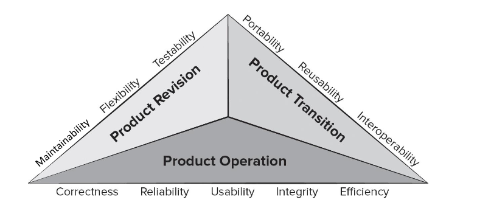
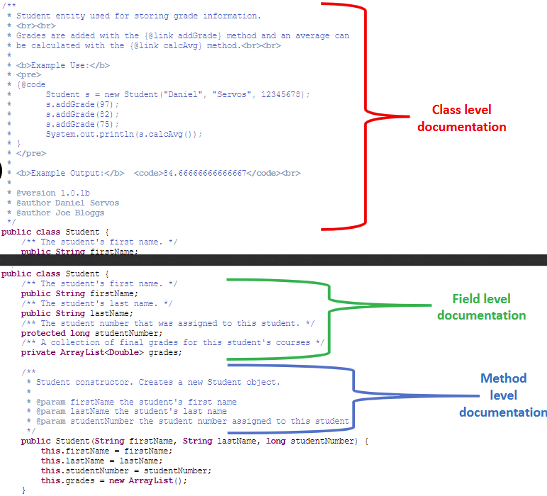
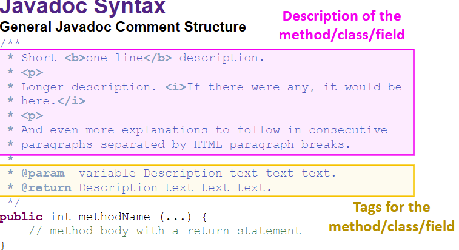
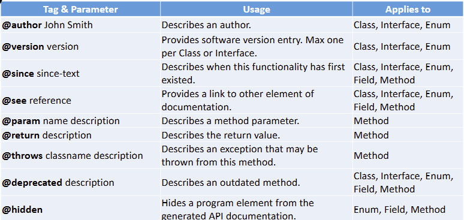

## QUALITY:

What is quality?

There are three types of software quality:

1. **Quality of Design:** Related to requirements, specifications, and system design
2. **Quality of Conformance:** issued focused mainly on implementation
3. **User Satisfaction:** a combination of a compliant product, good quality, and timely delivery within budget

Software quality can be defined as:

An effective software process creates a useful product that provides measurable value for producers and users.

An **effective software process** establishes infrastructure for building high-quality software, including framework and umbrella activities. So, it is basically making sure you have been following the process models and umbrella activities

A **useful product** delivers content, functions, and features desired by the end-user in a reliable and error-free manner. It meets both explicit and implicit stakeholder requirements. Does what you created actually satisfy the user? Is it what they wanted? Is it useful? So on

**Measurable value** provides benefits for both the software organization and end-users

- the software organization benefits since it reduces maintenance effort and customer support
- the end users benefit since it enhances business processes through useful capabilities

Now, why does quality matter?

- Businesses waste billions on software that fails to meet expectations
- Poor software leads to the lost work hours, corrupted data, missed sales, high IT costs, and low customer satisfaction

Software quality remains an issue, but who is to blame?

- Customers blame developers for sloppy practices, while developers blame customers for unrealistic deadlines and constant changes

Who is in the right? Both of them are

### EVALUATION:

How do we assess and evaluate quality?

**Quality factors:** high-level attributes used to assess software quality, either qualitatively or quantitatively

McCall’s software quality factors:



**PRODUCT OPERATION**: Operational elements of a software

- correctness: requires documentation
- reliability: are there any bugs
- usability: how useable is your software
- integrity: how much security does it have
- efficiency: hardware resources, how efficient is it

**PRODUCT TRANSITION:** adaptability of the software

- portability: how hard is it to transfer software from one to another
- reusability: can we reuse some of the software that we made
- interoperability: how well does the software communicate with the system

**PRODUCT REVISION:**

- maintainability: how easy is it to maintain and support the software
- flexibility: how hard is it to extend
- testability: how hard is it to test your software

ISO 25010 standard offers two models of quality: Quality in Use and Product Quality models

**QUALITATIVE QUALITY ASSESSMENT:**

Some examples of qualitative assessment include:

- use user questionnaires and structured tasks to assess quality factors
- observe users performing tasks and gather feedback
- test software in the wild (or in the production environment)

**QUANTITATIVE QUALITY ASSESSMENT:**

Using software metrics:

- if software metric values computed for a code fall outside the range of acceptable values, it may indicate the existence of a quality problem

### **SOFTWARE QUALITY DILEMMA:**

The quality dilemma:

- if you produce a software system that has terrible quality, you lose because no one wants to buy it
- excessive time and cost to achieve perfection can lead to business failure
- balance is needed to deliver a product that is “good enough”

**ANIMUSIC:**

Animusic was an animation company specializing in the 3D visualization of MIDI-based music

They were successful in the early 2000s

However, they later became unsuccessful since:

- this was a 2 man team
- 16 years later, one of the members decide to leave
- the only person left spent too much time perfecting the software and the lack of focus on the end product lead to the downfall of animusic

So, lessons learned:

- Avoid over-engineering and focus on delivering a software that is functional

### “GOOD ENOUGH” SOFTWARE:

One suggested solution to the software quality dilemma is “good enough” software.

What is “good enough” software?

- software that delivers high-quality features but may contain known bugs in less critical areas
- the hope is that the vast majority of end users either miss the bug or overlook them, and they are satisfied with the overall software and what it delivers

This is very common in the video game industry:

- games are released in an unfinished state but the key features are there
- software patches and updates later on fix these bugs
- the reason why they release good enough software is to not miss the critical release window and missing features can be developed and offered as an update or DLC

What are the issues with good enough?

- if you work in a small company and deliver this kind of software, it can ruin your company’s reputation
- you may never get a chance to deliver a 2.0 version because of the bad rep
- if you work in certain application domains, delivering good enough software may be considered negligent

Some game examples:

- No Man’s Sky
- Cyberpunk 2077
- Fallout 76

Focusing more on No Man’s Sky:

- Hello Games took the “good enough” approach to software and launched the game with most hyped features missing including the highly anticipated multiplayer feature
- In 2016, the game had one of the worst end-user ratings with “mostly negative” reviews from 70,000 users
- They did eventually update the game and added multiplayer, but probably lost millions of dollars (although the game seems successful now…. so…..)

### COST OF QUALITY:

Delivering quality software has a cost, in terms of money and time

- fixating on perfection can cause these costs to lead to project failure

Lack of quality also has a cost, not only to end users who must live with buggy software, but also to the software organization that has built and must maintain it

Quality costs fall into one of the following categories:

- **Prevention costs:** quality planning, formal technical reviews, test equipment, and training
- **Appraisal costs:** conducting technical reviews, data collection and metrics evaluation, testing and debugging
- **Internal failure costs:** rework, repair, failure mode analysis
- **External failure costs:** complaint resolution, product return and replacement, help line support, warranty work

the costs to find and repair an error or defect increase dramatically as we go from prevention to appraisal to internal failure to external failure costs

Simply put, poor quality leads to risks, some of them very serious

Low quality software leads to risk for both the developer and the end user

Easy to see potential risk in application domains such as:

- self driving cars
- health and medicine
- aerospace
- embedded systems in factories/industries
- nuclear applications
- military applications

Software quality doesn’t just appear, it is the result of good project management and solid engineering practice

This comes into play in four broad activities:

- Software engineering methods
- Project management techniques
- Quality control
- Quality assurance

## JAVADOC:

Javadoc is a tool for generating API documentation in HTML format from Java source code

Javadoc comments use special tags like `@param`, `@return`, and `@throws`

Most IDEs have built-in tools for generating Javadoc

Classes, methods, and attributes have a different type of Javadoc:



Note:

A normal, multiple line Java comment looks like this:

```java
/*
	This is a regular multi-line comment
*/
```

In Javadoc, it looks a little different:

```java
/**
 * This is a Javadoc comment
 */
```

Even normal comments are different

```java
// This is a regular single line comment
/** This is a Javadoc single line comment */
```



the description CAN contain HTML, but it is not necessary.

There are also the one line descriptions of the method/class/field as seen above

Longer descriptions are there too

Some common Javadoc block tags:



There are also inline tags:


inline tags can be used in the description part of Javadoc

the code basically displays HOW the class, method whatever will work


since this is a comment, obviously it is not going to be interpreted

By default, only public and protected fields/methods are included in the generated documentation. Private fields + private methods can be included with the -private option

**Generating the documentation:**

you do something like this:

```java
javadoc -d output_path package
```

the output_path is basically a path to the directory that the documentation will be generated in. If the directory does not exist, it will be created

the package to generate the documentation for. Your working directory must contain this package

```java
javadoc -d C:\\Users\\yourUser\\docs myclass.java
```

only the documentation for the file [myclass.java](http://myclass.java) will be generated and stored in the C:\Users\yourUser\docs directory

The current working directory MUST contain the java file

Extra command line options:


If you want to practice more (cause this will be needed for our project) go to the week 8 → javadoc tutorial tab