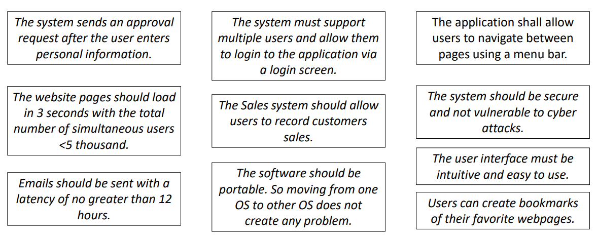
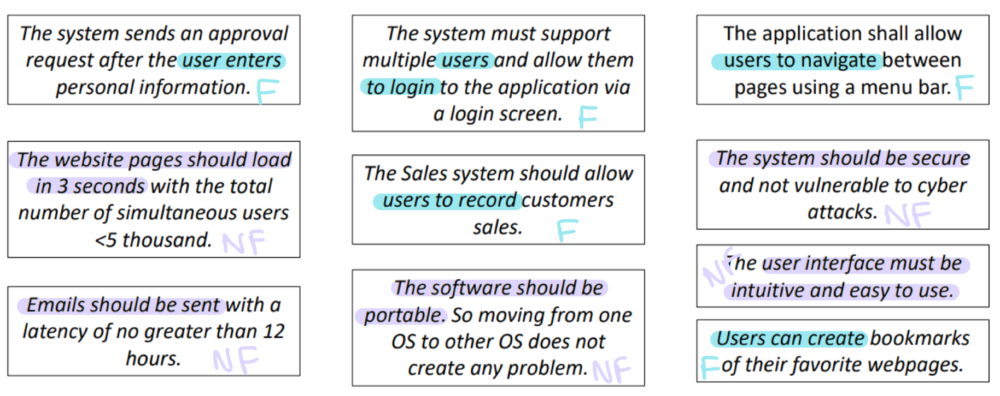
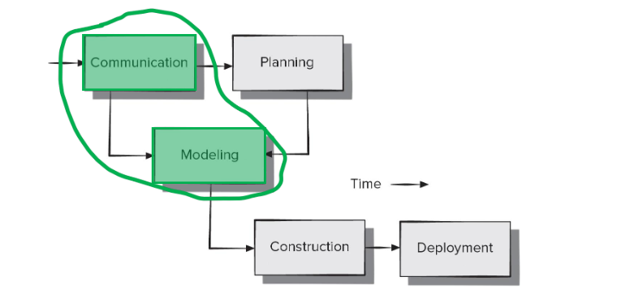
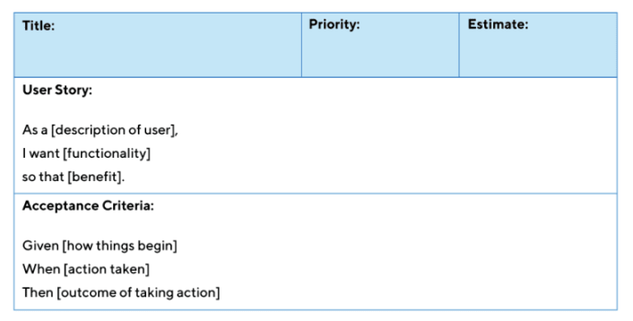
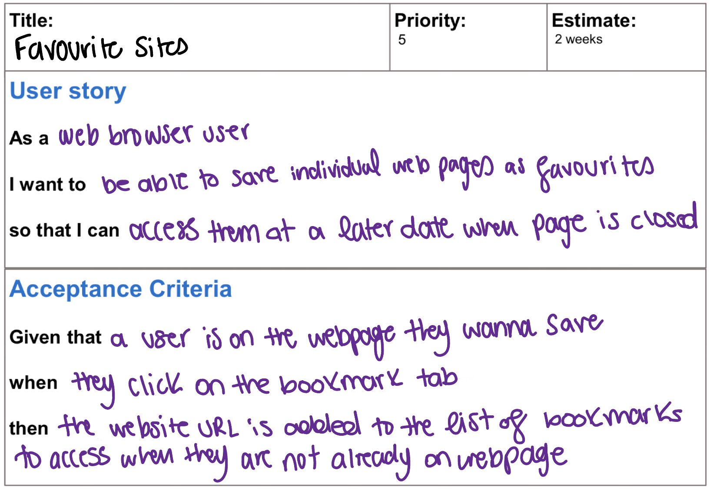

## REQUIREMENTS:

**Requirements** are statements that describe the users’ or stakeholders’ needs and desires with respect to the software in question

Each requirement:

- is a short and concise piece of information
- says something about the software system
- is agreed upon by stakeholders
- helps solve the customer problems

There are 2 main requirements that concern users’/stakeholders’:

- Functional
- Non-functional

### FUNCTIONAL VS NON-FUNCTIONAL:

**Functional requirements:**

- Defines a function of a system or its component
- May involve calculations, technical details, data manipulation and processing, and other specific functionality that define what a system is and what it is supposed to accomplish
- It basically represents that steps that the user is taking
- So, an action that a software is taking is what we call a functional requirement
- For example:
    - “The system sends a confirmation email when a new user account is created”
    - “The player must be able to feed the virtual pet food items from their inventory”
    - These are examples of functional requirements

**Non-Functional Requirements (NFR):**

- A requirement that specifies criteria that can be used to judge the operation of a system, rather than specific behaviors
- So, it defines how a system IS SUPPOSED TO be
- This does NOT describe the steps the user is taking, it describes the properties used
- For example:
    - “The system must be secure”
    - “The system should be able to handle 20 million users without performance deterioration”

So, to give more examples:

If we wanted to classify these as functional or NF requirements, we would end up with:

## REQUIREMENTS ENGINEERING:

**Requirements engineering** is the process of developing a complete requirements specification for a project. In other words, it is the process of defining, documenting, and maintaining the needs of a system

An **action** in the communication activity continues into modeling

This action entails the following tasks:

- **Inception:**
    - A basic understanding of the problem
    - All basic questions are asked on how to go about a task or the steps required to accomplish a task
    - Define the people who want the solution to said problem
    - Define the nature of the solution that is desired
- **Elicitation:**
    - Focuses on gathering requirements for the stakeholders. The requirements establish the key purpose of a project
    - A goal is a long-term aid that a system must achieve
    - This goal deals with both F and NR requirements
    - Establishes prioritization mechanism
- **Elaboration:**
    - Takes the requirements that have been gathered in the first two phases and refines them
    - Creation of user scenarios (will get into this in a bit)
    - Scenarios parsed to extract analysis classes and relationships between them
- **Negotiation:**
    - Emphasizes discussion and exchanging conversation on what is needed and what is to be eliminated
    - Stakeholders and customers may ask for more than can be achieved or propose conflicting requirements
    - These can be resolved via negotiation
- **Specification:**
    - Can be any of the following:
        - Written document
        - A set of graphical models (use cases or user stories)
        - A formal mathematical model
        - A collection of user scenarios
        - A prototype
- **Validation:**
    - Focuses on checking for errors and debugging
    - Looks for:
        - Areas where clarification might be required
        - Missing information
        - Inconsistencies
        - Conflicting or unrealistic requirements
- **Requirements management:**
    - A set of activities where the entire team takes part in identifying, controlling, tracking, and establishing the requirements for the successful and smooth implementation of the project
    - Requirements may need to be changed as the project proceeds

## COLLABORATIVE REQUIREMENTS GATHERING:

A collaborative approach to gather requirements for projects require some guidelines:

- **Meetings (real or virtual)** are conducted and attended by both software engineers and stakeholders
- **Rules** for preparation and participation are established
- **Agenda** is suggested that is formal enough to cover the important parts of the project but informal enough to encourage the free flow of ideas
- A **facilitator (customer, developer, or an outsider)** controls the actual meeting
- A **definition mechanism (worksheets, flip charts, wall stickers, virtual forum, whatever)** is used

The whole point of these guidelines are to:

- Identify the problem
- Propose elements of the solution
- Negotiate different approaches
- Specify a preliminary set of solutions

A variety of work products can be created by requirements **elicitation,** there are a lot, but the main one we will be focusing on is:

- A set of **usage scenarios** that provide insight into the use of the system or product under different operation conditions

Remember those user scenarios that I said we will get to in the last set of notes? Yea I am going to get into them here

## USER SCENARIOS:

### USERS STORIES:

“how things begin” is just context, so it describes the state of the system or scenario before the action actually occurs

“action taken” is the actual event. it specifies what the user does or what trigger occurs

“outcome” is just the expected outcome or result when the action triggers, focusing on an observable behavior

A well-written user story should follow the INVEST principle:

- **I**ndependent → it can be developed and delivered separately from other stories
- **N**egotiable → it is open to discussion and refinement
- **V**aluable → delivers value to the end-user or the business
- **E**stimable → it can be estimated for effort and time
- **S**mall → small enough to be completed in a single iteration
- **T**estable → there are clear criteria to verify the story is complete

Let us walk through an example:

Write a user story that describes the “favorites” feature available on most Web browsers.

the priority and estimate is not something we need to be concerned about

### EPICS:

Epics are large bodies of work that can be broken down into a number of smaller tasks (user stories)

Epics can be seen as a collection of related interdependent user stories

The completion of all these related stories would lead to the completion of the epic

In an agile process such as **scrum, user stories** are something the team can commit to finish within a single sprint, while **epics** take multiple sprints

### USE CASES:

Each scenario is described from the point of view of an **actor** (mainly the primary actor)

It is important to note that actors and end user are **NOT ALWAYS THE SAME THING**

An actor is someone or something that directly interacts with the system to perform specific actions. An end-user is the person who directly benefits from and uses the system to achieve their goals

The difference between use cases and user stories:

- **Use Cases:**
    - Short or lengthy descriptions
    - User flow or interaction
    - In-depth guidance
    - Detailed to write
- **User Stories:**
    - Short descriptions
    - Requirement’s who and why
    - General guidance
    - No technical details

In use cases, we typically have something called “the actor template”

So:

- Actor → the actor we identified
- Description → a brief description of the actor and the role in the system
- Aliases → like the name suggests, what else what we might call this actor. If none, say none
- Inherits → does it inherit from any other actor? If none, say none
- Actor type → Is it an actual person or some hardware, API, whatever
- Active/Passive → if the actor is **ACTIVE**, this means the actor both sends and receives input/output from system. if the actor is **PASSIVE** they might be part of the use case but do not actually trigger anything

We also typically have a use case template:

Use Case → well no shit, the use case

Primary Actor → the main actor that is in the use case

Secondary Actor → other actors that MAY be involved in the use case

Goal in Context → what is the point of the use case

Preconditions → what has to be true before the use case

Trigger → what condition has to trigger this use case

Scenario → a step by step narrative of the use case, and what leads to the actual use case to be triggered

Alternatives → if there is another behavior in the scenario that could be carried out, then it should be labelled here

Exceptions → some issues that may arise from the scenarios

Priority → how important is this use case to be implemented, will the system work without it or no, if it can work without it → not that important, if it makes it BETTER but it isn’t mandatory → better, but not essentially, if the system can’t function without it → essential, very important

these all make sense with the examples below

But you’re probably thinking “erm didnt we alr learn about use cases??” yes that was a use case DIAGRAM, this is like pure use cases. The difference between them is:

- **Use Cases:**
    - Short or lengthy descriptions
    - User flow or interaction
    - In-depth guidance
    - Detailed to write
- **Use Case Diagrams:**
    - Acts as a table of contents of a set of use cases
    - Shows no technical details of any use case
    - Only a quick summary

Let us do an example:

What do we need to do?

1. Identify the actors involved
2. Identify some possible use cases (don’t give proper details, only name and short description)
3. Create a Use Case Diagram
4. Using the templates shown above, document the use case of “Citizen logs in and reports a pothole in detail”
5. Using the template shown above, document the “Create Work Order”

So, for 4 and 5, you would be using the use case template

Tasks 1 + 2:

**Actors:**

- Citizens
- City Employee (although not directly stated, they are going to be involved (most likely) in assigning a work crew + creating the damage file)

Other possible actors include:

- Repair crew (if they interact with the system)
- Public works department repair system (if this is an external system)

Remember, in order to be considered an actor, they/it must interact with the system in some way

Now, what if we wanted to fill out the actor template above with the actors we are given?

What are the possible use cases here?

- Citizen logs in and reports a pothole
- Employee logs pothole with public works department repair system
- Employee creates a work order
- Employee creates a damage file

Task 3:

Creating a Use Case Diagram

It is best to keep this diagram as simple as possible

Task 4:

yes for scenario you go into the itty bitty details of everything

Task 5:

Note for task 4 and 5, if you don’t have the exact same answer, that’s fine. Everyone interprets stuff differently

## PROCESS MODELS (AGAIN):

Like we have discussed before, every software project needs a “road map”, or “generic software process” of some sort

No single software process is appropriate for every project, this is because all projects are different, so it really depends on what you need.

We have already covered a few perspective and agile process models that all have their own pros and cons

Now, we will talk about the process model recommended from the textbook and tips on adapting the process to fit the needs of development teams

### PRINCIPLES FOR ORGANIZING SOFTWARE PROJECTS:

1. It is risky to use a linear process model without feedback
2. It is never possible nor desirable to plan big up-front requirements gathering. Since you’ll put so much time and effort into gathering materials but it’ll be changed later on
3. Up-front requirements gathering may not reduce costs or prevent time slippage.
4. Appropriate project management ensures the project is delivered within the set timelines and budget, and meets the requirements
5. Documents should be able to evolve with the software and should NOT delay the start of construction
6. Involve stakeholders early and frequently in the development process
7. Testers need to become involved in the process prior to software construction

The recommended is going to be a hybrid of an agile and spiral model

Agile methods have minimal rules, meaning there isn’t a lot of documentation

So, how would this agile spiral model look like?

We unfortunately will be going through each and every single damn point that is on this graph

- **Requirements Engineering:**
    - Encourages active stakeholder participation by matching their availability and valuing their input
    - Use simple models in order for them to participate
    - Take time to explain your requirements representation before using them
    - Adopt stakeholder terminology and avoid slang whenever possible
    - Use breadth-first search (BFS) to get the big picture of the project done before getting bogged down in details
    - Developer and stakeholders refine requirements “just in time” as user stories are ready to be implemented. We just need a high level idea of what the user wants
    - Treat list of features like a prioritized list and implement the most important user stories first
    - Collab closely with stakeholders and document requirements so they are useful to all when creating the next prototype
    - Question the need to maintain models and documents not referred to in the future
    - Ensure management support for stakeholder and resource availability during requirements definition
- **Preliminary Architectural Design:**
    - Focus on key quality attributes and incorporate them into prototypes as they are being made
    - Successful software products combine customer-visible features and the infrastructure needed to enable them. Basically, prototypes should have features visible to the customer (like GUI) and also the back-end code that makes these features
    - Agile architectures enable code maintainability and evolvability if attention is actually paid to the back-end progress
    - Managing and synchronizing dependences among functional and architectural requirements is needed to ensure evolving architecture will be ready for future increments
- **Project Resources:**
    - Time is mainly our concern here
    - Team should be able to use historic data to develop an estimate of the number of days needed to complete each user story
    - Loosely organize the user stories into sets that will make up each sprint planned to complete a prototype
    - Sum the number of days to complete each sprint to give an estimate of days to complete the project
    - Revise the estimate as requirements are added to the project/prototypes and delivered and (hopefully) accepted by the stakeholders
- **Construct 1st prototype:**
    - Transition from paper prototype → software design
    - Prototype a user interface
    - Create a visual prototype
    - Add input and output to your prototype
    - Engineer your algorithms
    - Test your prototype
    - Prototype with deployment in mind
- **Evaluate prototype:**
    - Done with the stakeholders
    - Provide scaffolding when asking for feedback on prototype
    - Test your prototype on the right people
    - Ask the right questions
    - Be neutral when presenting alternatives to users
    - Adapt while testing
    - Allow the user to contribute to ideas
- **Go, No-Go Decision:**
    - This decides if we scrap the project and end it or is it worth actually investing more time into it
    - Revised cost estimates and schedule changes are proposed based on how the evaluation went on the prototype
    - Risk of exceeding the budget and missing the delivery date
    - Risk of falling to satisfy the users expectations
    - To get commitment from stakeholders who are the ones providing the resources we need to complete the next prototype
- **Evolve System + Redefine Scope + Construct Next Prototype:**
    - Collect feedback and data from the evaluation of the current prototype. The developers and stakeholders then begin negotiations to plan the creation of another prototype
    - Consideration is given to any known time and budge constraints as well as the technical feasibility of implementing the prototype. So basically, if development risks are minimal, continue on with the work
    - Each prototype should be designed to allow for future changes to avoid throwing it away, we should be able to evolve it rather than remake it
- **Prototype Release:**
    - Before we release it, it is considered a release candidate. It is subjected to user acceptance testing which were recorded as user stories which were added to the backlog
    - User feedback during acceptance testing should be organized by user-visible functions as portrayed via the user interface
    - Developers should make changes ONLY if these changes will not delay the prototype
    - If changes are made, they need to be verified with another round of testing
    - The issues and the lessons you learned should be documented and considered by the developers and stakeholders
    - Lessons learned from the current project can help future developers who want to do something similar
- **Maintain Software:**
    - **Maintenance** is activities needed to keep software operational after it has been accepted and released to the world (this is just the definition, maintain software falls into the 4 categories below. the percentage beside them indicates how much time does it take in this stage)
    - Corrective maintenance (21%): reactive modification of software to repair problems after the software has been delivered
    - Adaptive maintenance (25%): reactive modification of software after delivery to keep the software useful in a changing environment
    - Perfective maintenance (50%): proactive modification of the software to provide better user features, better program code, and the such
    - Preventive maintenance (4%): proactive modification of software after delivery to correct product faults before discovery by users