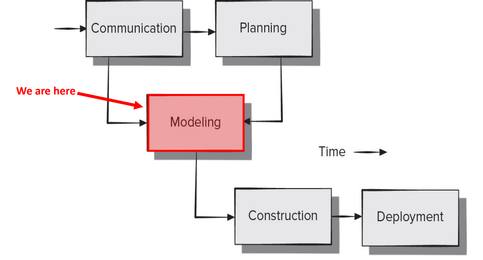

## REQUIREMENT ANALYSIS:

Previously, we have talked about requirements gathering and the process of collecting requirements from stakeholders. After requirements are gathered, we need to analyze and elaborate on them. Requirement analysis has 3 main objectives:

- **Specifies the software’s operational characteristics**: This means defining how the software should work. For example, what features it should have, how it should behave under different conditions, and what kind of performance it needs to deliver
- **Documentation of how the system interfaces with other system elements**: This involves describing how the software will interact with other systems or components. For instance, how it will communicate with databases, other software, or external devices, ensuring everything works together smoothly
- **Establishes constraints that the software must meet**: This refers to setting limitations or requirements that the software must follow. These could include technical limitations, such as hardware requirements, or regulatory constraints, like security and privacy rules

The benefits of this process for us are more detailed in models that depict various aspects of the system, such as: user scenarios, classes, behavior, data, and information flow (WE WILL TALK ABOUT THESSE IN A SECOND IDK WHY THE LAYOUTS EVERYTHING SO WEIRDLY)

The idea here is that:

we have already completed the communication activity, we have our requirements, and now, we are starting to model these requirements into something we can use to build the software

This requirements model we are developing will take us from a system level description (which is a description of the software’s functionality) and provide us with information that can be translated into architectural, interface, and component level designs later in the project. It acts as a bridge between the system description and the design model.

Mind you we are still focused on the WHAT the system is, rather than a technical description of the system.

### REQUIREMENTS MODEL:

Requirements models is actually made up of smaller, more specific models

- **Scenario-Based Models:** Depict requirements from the point of view of various system “actors”. Like use case diagrams, user stories, use cases, actor and user profiles
- **Class-Oriented Models:** Represent object-oriented classes (attributes and operations) and how classes work together to achieve system requirements, this is like class diagrams, or class responsibility collaborator (CRC) (we will talk abt this in a bit)
- **Behavioral Models:** Depict how the software reacts to internal or external “events”, this is like activity diagrams, the swimlane variant, sequence diagrams, or state diagrams (once again, we will talk abt the last two later)
- **Data Models:** Depict the information domain for the problem we are trying to solve. This encompasses areas such as databases, data architecture, data management, anything to do with data. One work we might use is something called Entity Relationship Diagram (ERD). We won’t really talk abt it but I’ll attach an image
- **Flow-Oriented Models:** Represent functional elements of the system and how they transform data in the system. These models are often detailed in something called Data Flow Diagram (DFD)

We will mainly focus on behavioral and class-oriented modeling

Now you’re probably thinking “do i create all these models that is insane what the freak” no we do not, the general rule is to only create models that will be used by the development team

Before we get into the details of the models, there are a few things to keep in mind

1. **High level of abstraction**: The model should focus on big-picture ideas and not get bogged down by small details at this stage.
2. **Insights into key aspects**: The model should help explain how the software works, what information it handles, and how it behaves.
3. **Leave infrastructure details for later**: Don’t worry about things like server setup or performance requirements just yet. Focus on the core functions first.
4. **Keep it simple for everyone**: The model should be easy to understand for all stakeholders (like developers, managers, and users) and provide clear value without unnecessary complexity.

## CLASS-BASED MODELING:

Class-based models represent a few important details about the object-oriented classes that exist in the problem space of our software application.

What is a “problem space”? It is the space where all your stakeholder needs exist that you would like your software solution to address. Basically, it is everything you need to understand about the situation before designing a solution

- For example, if we took our example from the last notes, if you’re building a medical appointment scheduling system, the **problem space** would be the issues related to managing appointments, patient data, security concerns, and any other needs from users or healthcare staff that the software must resolve

Class-based modeling represents:

- **Objects** that the system will manipulate
- **Operations** that will be applied to the objects to affect the manipulation. Basically class methods
- **Relationships** (some hierarchical) between the objects, like generalizations and realizations
- **Collaborations** that occur between the classes are defined

The first step in class-based modeling is to **identify the analysis classes.**

What are analysis classes? These provide a clear and abstract representation of the objects and relationships in the problem space.

One of the techniques we can use to identify analysis classes is by underlining/parsing each noun or noun phrase and entering it into a simple table.

Apparently this course is also an English class cause we should know synonyms of noun words/phrases.

What are some potential analysis classes and what categories do they usually fall under?

- **External entities:** produce or consume information
- **Things:** part of the information domain for the problem
- **Occurrences:** events that occur as a result of system operations
- **Roles:** played by people who interact with the system
- **Organizational Units:** relevant to an application or business (such as teams, groups, whatever)
- **Places:** establish the context of the problem and overall function
- **Structures:** physical objects that define a class of objects or related classes of objects

Let us go through an example (underline nouns):

The SafeHome security function enables the homeowner to configure the security system when it is installed, monitors all sensors connected to the security system and interacts with the homeowner through the Internet, a PC or a control panel.

During installation, the SafeHome PC is used to program and configure the system. Each sensor is assigned a number and type, a master password is programmed for arming and disarming the system, and telephone numbers(s) are input for dialing when a sensor event occurs.

When a sensor event is recognized, the software invokes an audible alarm attached to the system. After a delay time that is specified by the homeowner during system configuration activities, the software dials a telephone number of a monitoring service, provides information about the location, reporting the nature of the even that has been detected. The telephone number will be redialed every 20 seconds until telephone connection is obtained.

The homeowner receives security information via a control panel, the PC, or a browser, collectively called an interface. The interface displays prompting messages and system status information on the control panel, the PC or the browser window. Homeowner interaction takes the following form….

Let us throw these into a table:

Now that we have these nouns, how do we know which ones are going to be classes? There are characteristics that should be used to consider each potential class for inclusion:

1. **Retained information**, is information about the class remembered? If the system does not need to store information about this class, its probably not useful
2. **Needed services,** set of operations that can change its attributes in some way
3. **Multiple attributes,** not a single attribute, cause if you had one attribute (such as telephone number) its better to be considered an attribute of another class rather than making it a class
4. **Common attributes,** defined for potential classes + attributes applied to all instances of the class
5. **Common operations,** same idea as rule 4 but for operations/methods. So, everything in a class should be applicable to all the objects/instances of that class
6. **Essential requirements,** external entities that appear in the problem space and produce/consume information essential to the solution will usually be defined as an analysis class on the model

Let us apply these on the above nouns

- homeowner is rejected since no information is stored about the homeowner, and they don’t have any identifiable operations
- installation is rejected since this is an occurrence, and not truly part of the system when its running
- number, type fail rule 3, they are single attributes of another class (like sensor)
- master password + telephone number also are better suited as attributes of another class
- monitoring service, we don’t store any information about it

**DEFINING ATTRIBUTES FOR THESE CLASSES:**

Attributes describe a class that has been selected for inclusion in the analysis model. So, if we had a person class, attributes can be something like age, name, sex, etc…

So, for our sensor class, we are hinted that a sensor has a number and type, so these would be attributes to these classes.

**DEFINING OPERATIONS FOR THESE CLASSES:**

Operations define the behavior of an object, these are essentially the methods of the class

Operations can be divided into four broad categories:

- Operations manipulate data in some way
- Operations that perform a computation
- Operation that inquire about the state
- Operations that monitor an object for the occurrence of a controlling event

Operations operate on the attributes (obviously)

Operations are usually identified by looking for verbs

So, let us underline verbs:

The SafeHome security function enables the homeowner to configure the security system when it is installed, monitors all sensors connected to the security system and interacts with the homeowner through the Internet, a PC or a control panel.

During installation, the SafeHome PC is used to program and configure the system. Each sensor is assigned a number and type, a master password is programmed for arming and disarming the system, and telephone numbers(s) are input for dialing when a sensor event occurs.

When a sensor event is recognized, the software invokes an audible alarm attached to the system. After a delay time that is specified by the homeowner during system configuration activities, the software dials a telephone number of a monitoring service, provides information about the location, reporting the nature of the even that has been detected. The telephone number will be redialed every 20 seconds until telephone connection is obtained.

The homeowner receives security information via a control panel, the PC, or a browser, collectively called an interface. The interface displays prompting messages and system status information on the control panel, the PC or the browser window. Homeowner interaction takes the following form….

These are some operations that might exist, but we obviously need to think about what class will they belong to

Analysis classes should contain a class name, list of attributes, and a list of operations

Many implementation details are omitted

As we start moving from analysis modeling to design modeling, we start to fill the details of each class (like the type of the attributes, return type of operations, so on)

### CRC MODELING:

How do we figure out what class relationships exist?

One way is through Class-Responsibility-Collaborator (CRC) modeling provides a simple means for identifying and organizing the classes relevant to system requirements

CRC model entails the creation of index cards that represent classes

Each card is divided into three sections:

- Along the top of the card, you write the name of the class
- List the class responsibilities on the left
- List the collaborators on the right

something like this, the “collaborator” are the classes it collabs with

**Responsibilities** are attributes and operations that are relevant to the class

**Collaborators** are those classes that provide a class with needed information, or action required to complete a responsibility.

We should always have a review/validation process to ensure there are no errors and everything is complete. One way to review is using the CRC model review process

1. All stakeholders in the CRC model review are given a subset of index cards
2. The review leader reads the use case we based these cards on. As the review leader comes to a named object, they pass a token to the person holding the corresponding index card
3. The holder of the card is then asked to describe their responsibilities noted on the card. The group then determines whether the responsibilities satisfy the use case requirement
4. If an error is found, modifications are made to the cards

## BEHAVIOURAL MODELING:

A behavioral model indicates how software will respond to internal OR external events

The most common to document these behaviors in UML activity diagrams. They can be used to model how system respond to INTERNAL events.

UML state diagrams can be used to model how system elements respond to EXTERNAL events

Creating a behavioral model:

1. Evaluate all use cases to fully understand the sequence of interaction
2. Identify events that drive the interaction sequence and understand how these events relate to specific objects
3. Create a sequence diagram or activity diagrams for each use case
4. Build a state diagram for objects in the system
5. Review the behavioral model for accuracy and consistency

How do we understand the first step?

As we saw in class modeling, we can gain a lot of information from usage narratives such as use cases.

- A use case represents a sequence of activities that involves actors and the system
- An event occurs whenever the system and an actor exchange information, so whenever they interact with one another
    - An event is NOT THE INFORMATION that has been exchanged, but rather the fact that information has been exchanged
- To determine the events in our system, we need to examine for use cases and parse them for any cases where information has been exchanged

Example 1:

Identify the events taking place in this scenario:

The homeowner uses the keypad to key in a four digit password. The password is compared with the valid password stored in the system. If the password is incorrect, the control panel will beep once and reset itself for additional input. If the password is correct, the control panel awaits further action.

Example 2:

Given this use case, identify all EVENTS in this use case:

The events in this case would be:

- The homeowner inputting their ID and password (scenario 2 + 3)
- The homeowner selecting a function (scenario 4 + 5)
- The homeowner selecting which camera to surveillance on (scenario 6 → 9)
- The system displays the camera’s video (scenario 10 + 11)

### STATE REPRESENTATIONS:

Once we have an understanding of the events in our system, the next step is to identify the different states that exist in our system.

A **state** of a system is an observable circumstance that describes the behavior of the system at a given time.

- In simpler, stupider terms, a **state** is just a **"**situation**"** or **"**condition**"** the system can be in at any time. Think of it like different **"**moods**"** a person or thing might be in.

There are two different ways to look at states:

1. The state of each CLASS at the system performs its function (internally how the system works, you need to know how the internals of the system works)
2. The state of the system as observed from the outside as the user of the system would (this is from an external point of view, you don’t need to know the specifics of how the system interacts with each other)

To summarize:

- An event is an exchange of information, and a state is a set of observable characteristics about part of the system
- An event must occur in order for an object to make a state transition
- Actions (also called triggers) might occur in the system as a consequence of state transition

While there many ways to represent behavioral representations, the main two we will be focusing on are:

1. **State Diagram:** Indicates how a class changes state based on EXTERNAL events
2. **Sequence Diagram:** Shows the behavior of the software as a function of time

### **STATE DIAGRAMS:**

State diagrams represent the active states for a class and the events that cause a transition between these states

state diagram that documents the state and transitions involved in inputting a password from the home user in the safehome example

The first black node represents the initial pseudo-state. It isn’t a real state, this POINTS to the first state so we know where to start

- You can have a final state (like the one in an activity diagram) but that is IF you have a final state, it isn’t mandatory to have one. Only add it if it makes sense to add one

The states are the ones represented in the blue boxes below

- each state is given a name, as well as additional information such as conditions that trigger an action

Transitions are denoted by arrows that are labeled with the name of events that trigger the transition

states can have multiple possible transitions entering and leaving them

Guards are Boolean conditions to transitions that must be satisfied in order for transition to occur

Lastly, we have actions. These are optional and denote something that occurs concurrently with or as a consequence of a transition

Well, now that we know what state diagrams are, you are might be thinking “What the fart is the difference between a state and an activity diagram?”

- An activity diagram detail the sequence of interaction, typically between the system and an actor
    - So, an activity diagram focuses more on the sequence of activities, and how control moves from one activity to another
- State diagrams describe how transitions between states are made
    - A state diagram shows what condition/situation the system is in at any given time, and how it changes when certain events occur

**When to we use state diagrams?**

- Used for describing behavior of an object across one or more use cases
    - This makes them bad at describing behaviors that involve several different objects collaborating
- They are aimed at showing the life cycle of one individual object
- Don’t draw the for every class in the system, only ones that exhibit very interesting behaviors

### SEQUENCE DIAGRAMS:

Sequence diagrams are another tool for behavioral modeling and can be used to show how events cause transitions from object to object

In a way, sequence diagrams can be seen as a shorthand version of a use case, representing key classes and the events that cause behavior to flow from one class to another

Example: In the below example, we are documenting how events cause transitions between objects in the safehome system based on the initial event triggered by the homeowner

At the top of the diagram, we have a list of objects and actors (the actor is represented by stick figures, while objects are represented by rectangles)

- If it’s a specific object, it can be labeled with that objects name and a specific type.

Next, we have the **lifeline.** The dotted lines leading from the object to the bottom of the diagrams are called lifelines. They represent time in the diagram and, obviously, the lifetime of that object

Next, we have **activation bar.** These represent time processing the activity. The taller the box, the more time it took to process the activity

- The round boxes represent the state of the object. It is not part of the UML standard, but its good to put them in order to convey more information

**Messages** are shown as arrows that are labeled with a description of the message sent between the objects

- The type of arrowhead used is important, it denotes if the message is being sent synchronously or asynchronously
    - **Synchronous:** The control will be passed to the object being transitioned to and a return is eventually expected (filled in arrow head)
    - **Asynchronous:** The control will continue in both objects and a return message is not necessarily implied here (shown with an open arrow head)
- There are none shown in this diagram
- The type of line (dashed or not) also matters.
    - Dotted lines indicate **dependency.** They are typically used for showing information being returned as a result of a method call
- The last type of messages we have are **found** messages. These are indicated as circles, either filled or they have the letter ‘A’ in them. It represents a message that comes from somewhere else. The ‘A’ in our example can represent that this messages comes from another sequence diagram in our documentation. This is good practice if you want to make your sequence diagram more readable instead of one huge unreadable diagram, so you decide to split it up.

Lastly, we have **interaction frames.** These are a relatively new notation in UML 2, so you might not see them in older diagrams. Interaction frames allow us to define control structures such as decisions or loops. A box is drawn around the part of the diagram that is going to be impacted by the decision/loop. We then add a Boolean statement in square brackets called “guard”, similar to the state diagram

^ this diagram shows us activating the sensors after a password is correctly input. We added the interaction frame so we can show that this happens for every sensor. Only add this if it makes it more clear

So, what does this diagram show?

- This diagram shows the transition between objects as the user inputs their password and activates the alarm system. Once the system is ready, the homeowner enters their password. This password is read by the control panel, and it is compared to the password that is in the system (communicating with the system object). If the homeowner enters the wrong password, and exceeds the number of tries allows, the account is then locked before allowing the homeowner to try again. If the password is correct, the system requests activation of each sensor, and then offers the home user a choice in selecting a feature of the system.

**When do we use sequence diagram?**

- Used for describing the behavior of several objects in a single use case
- Good at showing collaborations and communications, but they are not good at showing precise definition of behavior
- So, we would use state diagrams for behavior of a single object, activity diagrams for concurrency or more complex behavior, CRC cards for quick exploration of alternative interactions