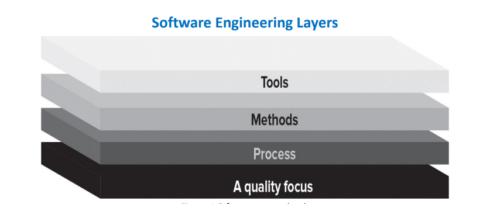
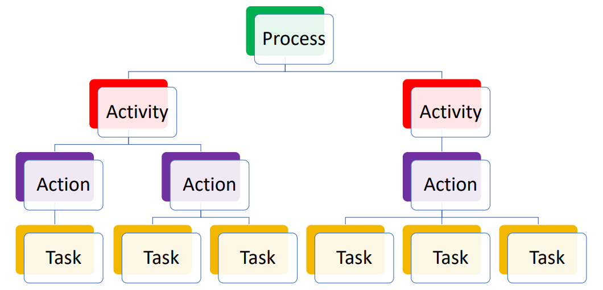
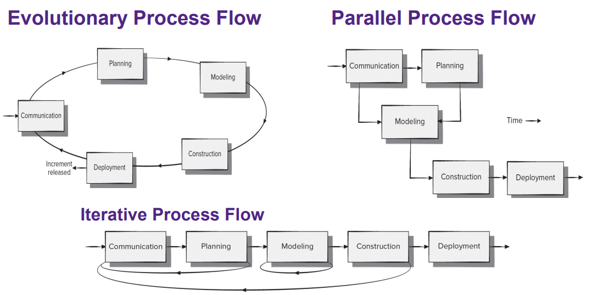
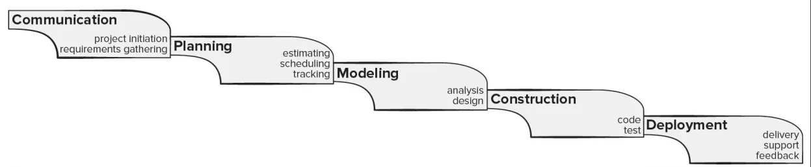
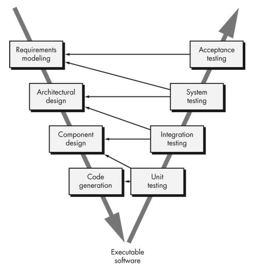
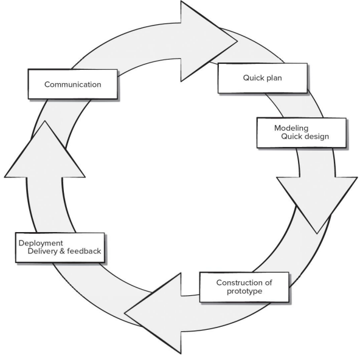
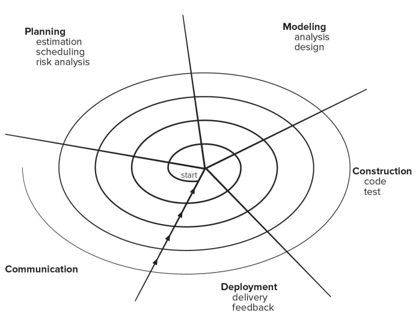
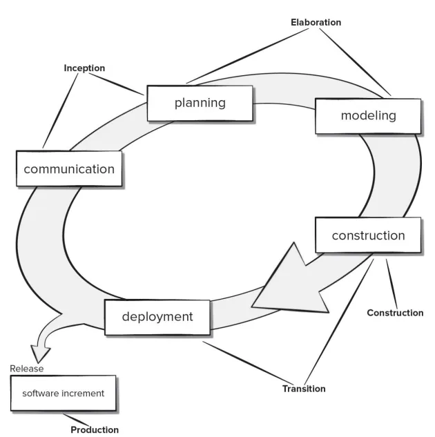

## SOFTWARE ENGINEERING:

What exactly is software engineering?

- It is an area of Computer Science which relates to techniques, methods, practices, and tools for the application of systematic, disciplined, quantifiable approach to the development, operation, and maintenance of software. Basically, it’s about using systematic techniques and tools to ensure that software is built and maintained in a well-organized and effective way

**Software is:**

1. **Instructions (programs)** that when executed, it provides desired features, function, and performance
2. **Data Structures** that allow the programs to adequately manipulate information
3. **Documentation** that describes the operation and use of the programs

Software is **developed or engineered**; it is NOT manufactured in the classical sense like physical objects (not hardware). It doesn’t “wear out” over time from overuse, unlike hardware

## TYPES OF SOFTWARE:

There are **seven** broad categories of software applications:

1. System software
2. Application software (apps)
3. Engineering/Scientific software
4. Embedded software
5. Product-line software
6. Web/mobile applications
7. Artificial Intelligence (AI) software

### SYSTEM SOFTWARE:

System software is a type of computer program designed to run a computer’s hardware and application programs. The best example of this would be operating systems, such as macOS, Windows, Linux

### APPLICATION SOFTWARE:

Application software is a program that helps users perform specific tasks, usually business need. So, apps such as Microsoft word, powerpoint, excel, photoshop, and so on

### ENGINEERING/SCIENTIFIC SOFTWARE:

Engineering/scientific software is software that’s written specifically for engineering/scientific applications (omggggg who would’ve guessed). Apps such as MatLab, AutoCad, PSpice and so on

### EMBEDDED SOFTWARE:

Embedded software is a type of computer program that controls the functions of a device, they are developed into a device’s hardware. They are built into the electronics of cars, telephones, robots, and so on.

### PRODUCT-LINE SOFTWARE:

Product-line software is a collection of software systems that share a common set of features and assets. Composed of reusable components. So, Office 365 and Adobe Creative Cloud is a good example of this. Since they tend to develop a lot of software, instead of re-coding every software from scratch, they can use previously designed software and modify the code a bit

### WEB/MOBILE APPLICATIONS:

**Web applications:** Software-as-a-service that is delivered through your web browser. So, things such as OWL and YouTube

**Mobile applications:** Application software for mobile devices. So, TikTok, Instagram, Twitter, and so on

### ARTIFICIAL INTELLIGENCE SOFTWARE:

AI software is a program that uses machine learning and other technologies to perform tasks. So, things like ChatGPT, Nova AI, Amazon Alexa, and so on

## SOFTWARE ENGINEERING LAYERS:

How do make a “good” software? By using a systematic, disciplined, and quantifiable method to its development. This means applying engineering principles to the field. What are these principles?

- **A quality focus**
    - Software engineering requires a commitment to quality. This layer will only work if the team/organization making applying it commits to a culture of continuous improvement and focus on quality
- **Process:**
    - Defines a framework for delivering software engineering technology efficiently and on time
    - Software processes help manage software project by guiding the technical methods used, ensuring the quality of the work produced, handling changes effectively
- **Methods:**
    - Methods provide the technical how-to’s for building software
    - It covers a wide range of tasks, including communication, requirement analysis, design modeling, program development, testing, and ongoing support
- **Tools:**
    - Tools aid in automation and support of software engineering processes and methods
    - Examples are: source control and management (git), testing (JUnit), Documentation (JavaDoc), Issue and Project Tracking Software (Jira)

## PROCESS FRAMEWORK:

This defines the steps, tasks, and activities involved in software engineering. So, in a sense it’s like a “blueprint”, it lays out the steps needed for software development

**Tasks:** A small, specific, well-defined action that contributes to a larger objective.

- For example, in the context of architectural design, a task might be “conducting a unit test” for a component of the architecture. So, the purpose of this task is to make sure that the specific component works as it should

**Action:** Encompasses a set of tasks (such as architectural design) that produce a major work product (so it’ll produce an actual architectural model)

- Basically, if all the tasks work as expected, the outcome of all the successful tasks is considered an action

**Activity:** Strives to achieve a broad objective (communicating with stakeholder (i will define this in a sec)) and is applied regardless of the application domain, size, complexity, etc..

- For example, “communication with stakeholders” is an activity, its objective is to keep everyone informed about the actual project, but doesn’t focus on the actual testing

**Process:** A collection of activities, actions, and tasks that are performed when some work product is to be created

There are **five activities** applicable to all software projects:

1. Communication
2. Planning
3. Modeling
4. Construction
5. Deployment

### COMMUNICATION:

Communication and collaborate with customers and other **stakeholders** to understand their objectives and to identify their needs and wants.

Okay now what the freak is a stakeholder? A stakeholder is someone who would be interested in the project you are creating and want to help invest in it.

### PLANNING:

Pretty self-explanatory, it describes the technical tasks to be conducted, the risks that may happen, the resources required, the work products that will be produced, and a work schedule

### MODELING:

Also… this makes sense… a software engineer creates a model of the software’s requirements and the design that will achieve those requirements

### CONSTRUCTION:

This implies both code generation and the actual testing of the code in order to find errors in it

### DEPLOYMENT:

The software is delivered to the customer who evaluates the product, provides feedback upon testing, and puts the software into use (assuming everything works fine)

## UMBRELLA ACTIVITIES:

In addition to the framework activities, **umbrella activities** are also applied throughout a software project. They are a series of steps/procedures followed by a software development team to maintain the progress, quality, changes, and risks of complete development tasks. This is putting the said “blueprint” into use, ensuring that everything works as intended. These typically include:

1. **Software project tracking and control**
    - Evaluate the progress of the project according to the plan and take the necessary steps to stay on schedule
2. **Risk management**
    - Assess risks that may affect the output of the project/quality of the product, and make plans to lessen these risks
3. **Software quality assurance:**
    - Activities necessary to ensure software quality. Basically, make sure the quality of the software is 👍🏼
4. **Technical reviews**
    - Assess work products to uncover and remove errors before moving on. So basically debugging before continuing anything
5. **Measurement**
    - Defines and collects process, project, and product measures that assist the team in delivering software that meets the stakeholders’ needs
6. **Software configuration management**
    - Manages the effects of change throughout the software process
7. **Reusability management**
    - Defines criteria for work product reuse and establishes mechanisms to achieve reusable components. So, checks, can i reuse this code later on in the future if needed? If no, go back and try to make it reusable
8. **Work product preparation and production**
    - Activities required to create work products such as models, documents, logs, forms, list, blah blah

## **PROCESS ADAPTATION:**

Software engineering processes should NOT be rigid. Meaning, software engineering processes should not be treated as strict rules to follow without question. Instead, they should be flexible and adaptable to suit the unique needs and circumstances of each project.

Rather, they should be agile and adaptable

## PROCESS MODELS:

The activities and definitions we discussed are not enough information to properly execute them.

We must be able to answer questions such as:

- What **actions** are appropriate for each **framework activity** given our problem, team members, resources, and stakeholders?

The existence of a software process is no guarantee that the software will be delivered on time, meet the customer’s needs, or that it will be high quality.

Software process can be assessed to ensure that it meets the most basic set of process criteria that have been shown to be essential

### **TASK SET:**

A **task set** defines the ACTUAL work to be done to accomplish the objectives of a software engineering **action**

We must choose a task set that accommodates the needs of the project and the characteristics of the team

A task set is defined by creating several lists:

- A list of tasks to be accomplished
- A list of work products to be produced
- A list of quality checks and validation methods to make sure the work meets required standards

## **PROCESS FLOWS:**

It is important to note that the five activities (communication, planning…) are NOT necessarily performed in that specific order. There are many different **process flows** for these activities that determine HOW these activities are actually organized and sequenced over time

## PRESCRIPTIVE PROCESS MODELS:

A process model is a combination of process flows and predefined activities, actions, and task sets

There are many process models we can follow and customize rather than creating our own from scratch

**Prescriptive process models** follow a structured and ordered approach to software engineering. These models enforce clear steps and progressions (requirements first, then design, then coding…) to maintain discipline

Activities and tasks occur sequentially with strictly defined guidelines for progress, leaving little room for iteration or revisiting earlier stages

Some prescriptive process models might be better if you have a small program/small team (just you) since they are very rigid. However, if you have a bigger team/bigger project, using a more agile approach might be better

The different types of process models we will be talking about are:

1. Waterfall Process Model
2. V-Model Process Model
3. Prototyping Process Model
4. Spiral Process Model
5. The Unified Process Model

### WATERFALL PROCESS MODEL:

This is also known as the “classic life cycle”.

The main problem with this model is that there are no feedbacks in between each activity. There is also no way to go back. So, if you were to find an error in construction, there is no way you can move back to modeling and seeing if something went wrong there

The problem with this as well is that stakeholders are only involved at the beginning (communication) and at the end (deployment) of this project. They have no say about any other activity.

The good news is that it is VERY ordered, and it is very simple. It can make sense for individual projects, where you are only working on it and you’re the only stakeholder

### V-MODEL PROCESS MODEL:

variation of the waterfall model

The arrows from the right side pointing to the left side are essentially testing those left side categories. So, for example, integration testing is testing the component and architectural design of the project. Unit testing is testing the code and component design. Acceptance testing tests if the program actually meets the requirements that we modeled at the beginning for the customer.

Now, is this actually that much different that the waterfall model? No, essentially, not really. It has the exact same issues as the waterfall has. And has the same pros as the waterfall model.

For this and the waterfall, you are only testing the software right at the end of the model, when typically, it should be tested all the way through

### PROTOTYPING PROCESS MODEL:

Begins at communication, collecting initial known requirements, and outlining areas where further definition is necessary. Basically, you are making a prototype of your project, sending it to the stakeholder, and they provide feedback on said prototype to see if this is what they want

This flow is iterative, so each time you make a new prototype of the software.

Pros:

- Reduced impact of requirement changes
- Customers are involved early and very often
- Works well for smaller projects
- Reduced likelihood of product rejection.

Cons:

- Customer involvement can cause delays
- At some point you may want to just finish off with a prototype, so you want to “ship” it out
- You can lose a lot of work if you have to throw away a prototype
- It is hard to plan and manage

### SPIRAL PROCESS MODEL:

This kinda combines both the waterfall and prototype method, you want the controlled and well-understood method from the waterfall model, but also getting the frequent prototypes like the prototype model. This model DOES have risk management built in, since you are constantly considering what risks might come up.

The whole point, as you move away from the center, you get a more complete system

Pros:

- Lots of customer involvement
- Risks are managed
- Suitable for long, complex projects.

Cons:

- Risk analysis failures CAN doom the project
- Project can be hard to manage
- Requires an expert development team

This is considered an evolutionary model. Since the prototypes and project evolves with each cycle

### UNIFIED PROCESS MODEL:

It consists of a number of phrases that map to the generic framework activities. This process model tries to overlap them a bit, into the phases like inception, elaboration, and the rest.

**Inception** → Defines the actual objective of the project

**Elaboration** → Build the system given the requirements, cost, and time constraints and all the risks involved from the inception phase

**Construction** → Development, integration, and testing all take place. Build the complete architecture in this phase and hand the final documentation to the client.

**Transition** → Involves the deployment, multiple iterations, beta releases, and improvements of the software. The users will test the software, which may raise potential issues. Clients will document their feedback, issues and so on. This model is big on actual documenting shit

**Production** → If any issues were found, product gets updated

Pros:

- A lot of documentation
- The customer is ALWAYS involved,
- Accommodates requirement changes
- Works well for maintenance projects (like OWL)

Cons:

- Documentation is not ALWAYS great if you’re never going to use it again
- Overlapping phases can cause some problems