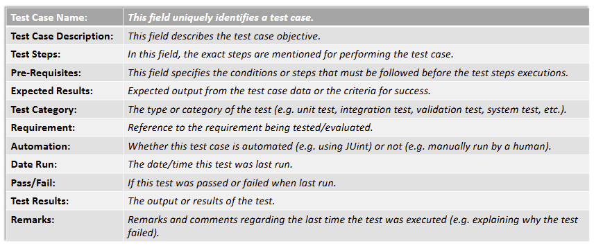

## VERIFICATION AND VALIDATION:

Software testing is one element of verification and validation.

- **Verification:** Ensures software correctly implements a specific function (”Are we building the product right?”)
- **Validation:** Ensures software is traceable to customer requirements (”Are we building the right product?”)

V&V includes a wide variety of Software Quality Assurance (SQA) activities including:

- Technical reviews, usability testing, simulation, database review, algorithm analysis, development testing, performance monitoring, acceptance testing, so on

Well, who does the testing?

**Software developers:** responsible for individual program components

**Independent Test Group (ITG):** Tests after software architecture is complete, removes conflict of interest

### TYPES OF TESTING:

**Unit testing:** Test individual units (methods, classes, modules)

**Integration testing:** Tests combined modules, so like a combo of classes, combo of methods, etc…

**Validation testing:** Validates requirements against the software

**System testing:** Tests the system as a whole

unit testing → integration testing → validation + system testing. test the components first, then combine all them together and test them (integration testing), then high-order tests are done (validation and system testing)

### SOFTWARE TESTING STRATEGY:

TEST PLANNING:

1. Specify product requirements quantifiably
2. State testing objectives explicitly
3. Understand end users and develop user profiles
4. Emphasize rapid cycle testing
5. Build robust software that tests itself
6. Use technical reviews before testing
7. Develop a continuous improvement approach

TEST CASE DOCUMENTATION (RECORDKEEPING):

1. Brief description of the test case
2. Pointer to the requirements being tested
3. Expected output or success criteria
4. Pass/Fail status
5. Date the test was run
6. Comments on why the test may have failed

here is the format of such test case documentation:



CRITERIA FOR DONE:

How do we know we are done testing? How do you know that you’ve tested enough?

Some common (INCORRECT) views are:

- You’re never done testing; the burden shifts to the end user
- When our tests no longer show any errors
- You’re done testing when you run out of time or memory

It is better to have a more rigorous criteria for sufficient testing:

- Use statistical techniques to estimate remaining issues and determine when testing is complete

Attributes of a good test:

1. High probability of finding errors
2. Not redundant
3. Best of breed
4. Neither too simple nor too complex

### TEST CASE DESIGN:

There are two approaches to testing:


Black Box and White Box testing are complementary, meant to be USED TOGETHER, not alternatives to each other

**UNIT TEST CASE DESIGN:**

Test cases are designed to cover the following areas:

- Test component interface (ensuring that information properly flows into and out of the unit)
- Data structures are examined to ensure that stored data maintains its integrity
- Paths through control structures are exercised to ensure all statements are executed at least once
- Boundary conditions are tested to ensure the component operates properly
- All error-handling paths are tested and have sensible error messages

So, what is tested:

1. Test component interfaces
2. local data structures
3. control paths
4. boundary conditions
5. error-handling paths.

**UNIT TEST SCAFFOLDING:**


Because components are not stand-alone, **driver** and/or **stub** software must often be developed for each unit test

- **Driver:** Accept test-case data, pass it to the component, and record results
- **Stubs:** Replace invoked modules, replicate interfaces, and return control to the component

### **WHTE BOX UNIT TESTING:**

Using white-box testing methods, you can derive test cases that:

- Guarantee all independent paths are exercised
- Exercise all logical decisions
- Execute loops at boundaries within operational bounds
- Exercise internal data structures for validity

**Independent paths:** Paths that introduce new processing statements or conditions


So, we have paths:

- 1: 1-11
- 2: 1-2-3-4-5-10-1-11
- 3: 1-2-3-6-8-9-10-1-11
- 4: 1-2-3-6-7-9-10-1-11

An example of a non-independent path:

1-2-3-4-5-10-1-2-3-6-8-9-10-1-11

**Basis set:** Set of paths that execute every program statement

- These are NOT unique (multiple basis sets are possible for each program)

How to determine the upper number of paths in the basis set?

- Cyclomatic complexity

In order to calculate the cyclomatic complexity:

1. Create a flow graph from your code


Here are some examples of how flow graphs look for different loop statements:


Some more examples:

```java
IF (a AND b) THEN
	c;
ELSE
	d;
```


if a is not true, you can short circuit obviously

```java
IF (a OR b) THEN
	c;
ELSE
	d;
```


true or anything is true, so there is no need to check b you only check b if a is false

```java
Do
	a;
Until b;
```


constantly do a until b is true. once b is true, stop, if b is false, continue doing a

```java
while a;
	b;
```


while a is true, do b. otherwise, stop


if i is greater than or equal to 10, end. otherwise, i gets increments and a is executed. that is why we put a and step 3 in the same node

```java
switch(a):
	case 1: b; break;
	case 2: c; break;
	default: d;
```


There are three ways to compute cyclomatic complexity:

- The number of regions of the flow graph corresponds to the cyclomatic complexity
    - cyclomatic complexity = number of regions
- Cyclomatic complexity V(G) for a flow graph G is defined as:
    - V(G) = E - N + 2
    - Where e = number of edges and n = number of nodes
- Cyclomatic complexity V(G) for a flow graph G is defined as:
    - V(G) = P + 1
    - Where p = number of predicate nodes (predicate node is basically a node with 2 edges leaving it)

So, if we look at this again


We can see that the cyclomatic complexity here is:

$V(G)=11-9+2 =4$ , so our basis set’s upper bound is 4

So, the possible paths that we have:

- Path 1: 1-11
- Path 2: 1-2,3-4,5-10-1-11
- Path 3: 1-2,3-6-8-9-10-1-11
- Path 4: 1-2,3-6-7-9-10-1-11

One quick way to evaluate cyclomatic complexity:

- Count the decision points in your code. Each “if”, “for”, “while”, “case” (in a switch), etc. and then add one
- Note that short-circuit evaluations result in multiple decision points if operations like AND or OR are used. THESE MUST BE COUNTED

Example:


<> is basically ≠

1. Based on the code on the right, create a flow graph (nodes are given to you, each number is its own node)
2. Calculate the cyclomatic complexity based on the flow graph

(please note a do while is legit just a while loop btw)


Basis path testing steps:

- Draw a flow graph
- Determine the cyclomatic complexity
- Determine a basis set of independent paths
- Prepare test cases to force execution of each path

### **CONTROL STRUCTURE TESTING:**

Basis path testing is simple and effective, but may not be sufficient on its own for white box testing; other methods can improve white-box testing:

- Condition testing: exercise logical conditions
- Data Flow testing: selects test paths based on variable definitions and uses
- Loop testing: focuses on loop constructs

**LOOP TESTING:**


Test cases for simple loops:

1. Skip the loop entirely
2. One pass through the loop
3. Two passes through the loop
4. m passes (where m < n)
5. n-1, n, n+1 passes

Test cases for nested loops:

1. Start at the innermost loop
2. Conduct simple loop tests for the innermost loop
3. Add tests for out-of-range values
4. Work outward, testing each loop while keeping the outer loops at minimum values

It is important to note that exhaustive white box testing is very expensive and often infeasible for larger programs

### BLACK BOX UNIT TESTING:

Black box testing finds errors in functions, interfaces, data structures, behavior, performance, initialization, and termination

It is often applied during the later stages of testing

Common black box tests:

- Interface testing
- Equivalence partitioning
- Boundary value analysis

**Interface testing:** Ensures proper information flow and data types. This requires the use of stubs and drivers

**Equivalence partitioning:** Divides input domain into classes and derive test cases. Uncovers a class of errors that might otherwise require many test cases to be executed to correct

- If input specifies a range, define one valid and two invalid classes
- If input requires a specific value, define one valid and one invalid class
- If input specifies a set member, define one valid and one invalid class
- If input is Boolean, define one valid and one invalid class

**Boundary value analysis (BVA):** Tests value at the boundaries of input domains

- Test values at boundaries and just above/below boundaries
- Test minimum and maximum value
- Apply to output conditions
- Exercise data structures at their boundaries

## INTEGRATION TESTING:

**Integration testing:** Ensures combined units work together without issues. It is a systematic technique for constructing the software architecture while at the same time conducting tests to uncover errors associated with interfacing

**APPROACHES TO INTEGRATION TESTING:**

**BIG BANG APPROACH:**

Combine all components at once, leads to chaos and difficult error isolation

**TOP-DOWN INTEGRATION TESTING:**

Start with the main control module, integrate subordinate modules incrementally


modules are integrated by moving downwards

There are two approaches to moving downwards:

1. Depth-first integration: Integrate all components on a major control path before starting another.
    1. A prototype could be made of the features currently being integrated
    2. Stubs are required to replace modules not currently being integrated


1. Breadth-first integration: Integrate all components at each level before moving down


Use main control module as a test driver

Replace stubs with actual components one at a time

Conduct tests as each component is integrated

Perform regression testing

**BOTTOM-UP INTEGRATION TESTING:**

Start with low-level components, combine into clusters, and test


Steps:

- Combine low-level components into clusters
- Write a driver to coordinate test-case input/output
- Test the cluster
- Remove driver and combine clusters

**CONTINUOUS INTEGRATION:**

Merge components into the evolving software increment daily

- Common in agile development such as XP and DevOps
- Uses smoke testing and automated testing/development

**SMOKE TESTING:**

Exercises the entire system to expose major problems

- Ensures the build is stable enough for further testing

Steps:

1. Integrate current software components into a build
2. Design tests to expose “show-stopper” errors
3. The build is integrated (either top-down or bottom-up) with other builds, and the entire product is smoke tested daily

Advantages:

- Minimizes integration risk
- Improves end product quality
- Simplifies error diagnosis
- Easier progress assessment
- Resembles regression testing

**REGRESSION TESTING:**

Re-executes tests to ensure changes don’t introduce unintended side effects

- Run after corrections or configuration changes (the program, its documentation, or the data that support it)

Helps to ensure that changes do not introduce unintended behavior

Regression testing may be conducted manually, by re-executing a subset of all tests cases or using automated test tools

**VALIDATION TESTING:**

Demonstrates conformity with requirements model (e.g. user stories, use cases, etc.)

A test plan outlines the classes of tests to be conducted and a test procedure defines specific test cases that are designed to ensure that all:

- Functional requirements are satisfied
- Behavioral characteristics are achieved
- Content is accurate and properly presented
- Performance requirements are attained
- Documentation is correct
- Usability and other nonfunctional requirements are met

Performed after integration testing using black-box methods

- Deficiency list created for deviations from specifications

### SYSTEM TESTING:

Incorporates software with other system elements (hardware, people, information, procedures)

- Conducts system integration and validation tests

**TYPES OF SYSTEM TESTING:**

- **Recovery testing:** Forces software to fail and verifies recovery
    - So, this tests: “How will software preform if something goes wrong?”
- **Security testing:** Verifies protection mechanisms
- **Stress testing:** Demands resources in abnormal quantities
    - this tests: “Is the software going to handle a lot of people on it?”
- **Performance testing:** Tests runtime performance
    - this tests: “Is it laggy?”
- **Deployment testing:** Exercises software in each environment
    - this tests: “Is software going to work in the end users environment?”

## JUNIT:

JUnit is a unit testing framework for Java

- It is used to create automated tests for classes, methods, and code units
- Tests are grouped in test fixtures

Each test should test only one specific function, feature, or branch of the code

Test fixture contains multiple test as well as code to run before and after each test method

JUnit life cycle phases:

- **Setup phase:** Prepare test infrastructure
- **Test execution:** Run tests and validate results
- **Clean up phase:** Remove test data and close connections

Many IDEs support automatically creating a template test fixture for a given class


Methods annotated with `@BeforeAll` are run BEFORE any tests

- this is used to setup anything needed for testing beforehand

Methods annotated with `@AfterAll` are run AFTER all tests have been completed

- used to tear down anything needed to be closed properly before testing is complete

Methods annotated with `@BeforeEach` are run ONCE BEFORE each test

- used to set up anything that needs to be reset before each and every test

Methods annotated with `@AfterEach` are run ONCE AFTER each test

- used to tear down anything that needs to be reset after each and every test

These methods are all optional

How does a JUnit test look like? Mind you this is for the class given in the slides… so obv not all JUnit tests look like this, but briefly this is their structure


- assertsEquals(expResult, result) is MANDATORY though, this checks if the given values are equal. if they are not, then we have failed

some other asserts

