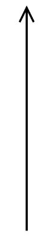

## CLASS DIAGRAMS:

Just a quick review about what UML is:

- UML stands for Unified Modeling Language
- It visually depicts various aspects of the overall design of a solution
- It is independent of a particular programming language
- Can be used as a sketch/blueprint
- Can be used in two directions: Forward engineering and reverse engineering

A **class diagram** describes the types of objects in the system and the various kinds of static relationships that exist amongst them.

It shows attributes (fields) and operations (methods) of a class, it is the most commonly used UML diagram

Can be used for both requirements engineering and design modeling

COMPONENTS OF A CLASS:

- Class name
- Attributes/Fields
- Operations/Methods

For attributes: you can add the type of the variable (int, String, whatever)

For methods: you cam add return types, parameter names, and types

For attributes and operations, you can add visibility that indicates which other classes can see and access them (use + for PUBLIC, - for PRIVATE, # for PROTECTED)


So, a better example would be something like:


### SYNTAX:

**For attributes:**

`visibility name: type multiplicity = default`

Example so these make sense:

`- password: String = "myPass"`

- this is a private attribute named password of type string and its initial value is “myPass”

`+ userIDs: int [1...*]`

- this is a public attribute named userIDs of type int that can hold 1 or more userIDs of type int. so this can be an array, linked list, whatever

**For operations:**

`visibility name(parameter-list) : return-type`

parameter list has the form:

`name: type = default-value` (default value is usually optional)

Example:

`+ program(masterPassword: String, telephone: String)`

- this is a public method that has the parameters masterPassword of type String and telephone of type String. since there is no return type, it is void by default. you CAN write void at the end if you want to, but you don’t need to

Static operations + attributes are shown by underlining them in the class


so here, display() and delayTime are static

### RELATIONSHIPS:

Class diagrams use arrows to denote relationships between classes

There are 3 different types of relationships available that we will talk about

- Associations
- Generalizations
- Realization

There are two others: dependency and composition, but we won’t cover these. Only add them if they are seriously needed. If you wanna know when to add them, google it

**Relationships** show how the elements are associated with each other and this association describes the functionality of the system

### **ASSOCIATION:**



An **association** is a structural relationship that represents how two entities are linked or connected to each other within a system

If two classes need to communicate with each other, there must be a link between them, which is represented by association. The arrow points in the direction of navigability.

Let us do a small example:


If we wrote a method in course class, we can use it in the student and professor class since there is an association between them

You can also add multiplicity as well:


Let us talk about what they indicate:

- From course to professor, the `0 ..*` beside the course class indicates that professors teach 0 or more courses
- From professor to course, the `1 .. 1` beside the professor class indicates that each course has exactly one professor
- From course to student, the `1 .. *` beside the course class indicates that a student takes one or more courses
- From student to course, the `0 .. *` beside the student class indicates that each course has 0 or more students

Let us talk about the different multiplicities you can have and the shorthand notations:

`* or 0..*` = zero to many

`1..*` = one to many

`1 or 1..1` = exactly one

`0..1` = zero to one

You can also use other numbers for this, it doesn't have to be only 0 and 1

- `2..5` = two to five
- `3` = exactly three

### GENERALIZATION:


**Generalizations** represents inheritance relationship between 2 classes. The arrow points to the parent object in the relationship. If you see the `extends` keyword in a java code, that is considered generalization

A better example will be provided when we actually want to draw one. Cause now you must be like “what is the difference between generalization and association” patience child

### REALIZATION:


**Realizations** represents a relationship where a class implements an INTERFACE. So, it is where one element defines certain responsibilities or behaviors (usually through an interface), but does not provide an implementation. The other element (usually a class) then implements those responsibilities. If you see the `implements` keyword in java, this is realization

Once again, this will make sense when we do examples trust me

Usually things like interfaces and enumeration are enclosed by `<< >>` and placed above the name of the class

UML allows you to give differing level of details in your diagram based on the concept you are focusing on, your target audience, and if you are using it for conceptual or software modeling.


conceptual modeling is just very abstract, there isn’t much detail on the attributes and methods that will be used in the class. software modeling, obviously, is more in depth.

We are gonna do a lot of examples, I will give you a code, and you must draw a class diagram for it. Remember, the word `extends` is generalization, and `implements` is for realization! Also, all the examples connected, meaning example 2 has to do with the class in example 1, and so on

Example 1:

```java
public class Person {
	private String name;
	private int age;
	
	public Person(String initialName) {
		this.name = initialName;
		this.age = 0;
	}
	
	public void printPerson() {
		System.out.println(this.name + ", age " + this.age + " years");
	}
	
	public String getName() {
		return this.name;
	}
}
```


simple enough, i mean its just one class

Example 2:

```java
public class Book {
	private String name;
  private String publisher;
	private ArrayList<Person> authors;
	
	public ArrayList<Person> getAuthors() {
		return this.authors;
  }
 
	public void addAuthor(Person author) {
		this.authors.add(author);
	}
}
```

some important things to note:

- We are now adding a Book class to our system and a relationship between Person and Book
- A person can be the author of zero or more books
- A book can be authored by 1 or more people


Example 3:

```java
public class Music implements Media {
  private String title;
  private int lengthInSeconds;
  private ArrayList<Person> authors;
  
  public ArrayList<Person> getAuthors() {
	  return this.authors;
  }
  
  public void addAuthor(Person author) {
	  this.authors.add(author);
  }
}
```

things to note:

- Add an **interface** to your class diagram called Media that has methods getAuthor() and addAuthor(). Assume that the Book class now **implements** this interface


there is no need to add the getAuthor and addAuthor in book and music class, since they implement the same methods from the interface Media

Example 4:

```java
public class Customer extends Person {
	public int customerID;
	private String username;
	private String password;
	
	public Customer(String initName, String uname, String pass) {
		super(initName);
		this.customerID = genID();
		this.username = uname;
		this.password = pass;
	}
	
	private int genID() {
	//this method generates a new unique ID for this customer
	return newID;
	}
}
```

note:

- use the diagram from before and simply add the customer class


We did reverse engineering a class diagram. Let us try forward engineering a class!

Create a UML diagram for a design of a shopping cart system. It should contain the following classes.

- A **ShoppingCart class** that has a checkou t() operation (takes no parameters and has no return), a getItems() operation that returns the collection of items currently in the cart (it can have zero or more items), and addItem(item) and removeItem(item) operation to add/remove items. ShoppinCart should have a private attribute that stores a collection of Items currently in the cart.
    
- An **Item class** that represents the items users can buy. This class has a getName() operation that returns the name of the item and a getPrice() operation that returns the price of the item. Add any necessary attributes.
    
- A **User class** that represents a user of the store. It should have attributes for their name, address, and email and operations to get/set their values. The User class should also contain a reference to the one ShoppingCart that belongs to the user.
    
    
    

## DEPLOYMENT DIAGRAM:

Deployment-level design indicates how software functionality and subsystems will be allocated within the physical computing environment. Basically, how different parts of a software system will be placed and run on the physical computers/servers.

UML deployment diagrams are used to visually represent this setup. These diagrams show how the software components will be distributed across the hardware

- **Descriptor form deployment diagrams** are more general. They show what the environment looks like, but don’t go into the details of the specific configurations
- **Instance form deployment diagrams** are more detailed. These are created later on and show the exact hardware setup, like which specific servers or machines will be used

Descriptor form example:


This is what the environment will look like for example, we don’t know what servers or machines will be used, but its a general overview of what implements what and so on

Instance Form:


more specific, we see what servers are being used and so on

## DOMAIN ANALYSIS:

First, let us define what a domain is. A **domain** is the targeted subject area of a computer program.

Example:

- Let’s say our project is regarding the creation of a desktop software program to manage appointments for a hospital.
    - The **domain** would be the specific hospital this software was created for, or hospitals if it was made for multiple hospitals
    - The **software domain** would be the desktop application, something like “Appointment Scheduling Software” or whatever the hell you want to call this damn software

**Software domain analysis** involves the identification, analysis, and specification of requirements that are common to a software application domain.

For example, what requirements are common for all appointment scheduling systems? This knowledge is valuable as it enables reuse. Meaning, if we know what common requirements are found in one appointment scheduling system, we might be able to reuse them when creating a new appointment scheduling system.

**Object-oriented domain analysis** involves the identification, analysis, and specification of common reusable capabilities within a specific software application domain. This means we can potentially reuse not only requirements, but also specific classes, and so on.

Regardless of which analysis you use, the end goal is saving time and resources by analyzing systems that already exist in this domain. This can lead to:

- Accelerated development
- Improved communication between stakeholders
- Leads to a higher quality system, better meeting the needs of stakeholders
- Helps in anticipating and managing risks

The analysis process involves reviewing multiple sources of domain knowledge, including:

- Technical literature
- Existing applications
- Customer surveys
- Expert advice
- Current/future requirements


This analysis should result in a domain analysis model that contains:

- Class taxonomies (a way of organizing + grouping things (classes) in a particular area (domain) into hierarchy)
- Reuse standards
- Functional models
- Domain language

An example of class taxonomies is basically like, if we had the domain of animals, you might have the general category “Animals” at the top, and under it, more specific categories like “Mammals”, “Birds”, “Reptiles”, and so on

A simplified version of this process can be seen by completing these steps:

1. Identify and define the domain to be investigated
2. Collect a representative sample of application in the domain
3. Analyze each application in the sample
4. Develop a domain analysis model using this information

For the project we are working on in this God forsaken course, the domain analysis is pretty simple, it involves answering these few questions. Our domain analysis should include the following:

- What is the software domain for this project?
    - Both at high level (system software, application software, embedded software, etc..) and at a more specific level (video game, word processor, GIS, etc…)
- What do we know about the domain?
    - Both the software domain and the general domain
- What are common issues encountered in this domain?
- What are the common solutions to the above issues in this domain/
- How can we use this domain understanding to improve or accelerate development of this project?

Let us go through an example

Hospital Appointment System

**Software domain:** Desktop application

**Subdomain:** Appointment scheduling systems

**What do we know about the domain?**

1. Health Information Systems help manage patient data, appointments, and other healthcare processes.
2. Appointment Scheduling are a part of Health Information Systems that focus on scheduling patient appointments.
3. Regulations like HIPAA ensure patient data is handled safely and legally.

**Common issues encountered in this domain:**

1. Integrating with existing systems, like electronic medical records (EMR), can be hard and time-consuming
2. Handling a large number of appointments can be difficult.
3. Scalability to handle high volume of appointments can be challenging.

**Common solutions to the above issues:**

1. Use of APIs and standards (like HL7) to connect with other systems easily.
2. Implementing strong security measures to protect patient data.
3. Cloud-based solutions are used to manage growth and ensure reliability.

**How can we use this domain understanding to improve or accelerate development of this project?**

1. **Best Practices**: Understanding common issues helps the development team use best practices, like strong security and cloud solutions, to avoid problems
2. **Prioritizing Needs**: The team can prioritize important tasks, like integrating with EMR systems, to address critical requirements
3. **Improved Communication**: Shared domain knowledge helps the team communicate better with stakeholders, leading to fewer misunderstandings
4. **Faster Development**: Using existing solutions and standards (like APIs and HL7) speeds up development and integration
5. **Better User Experience**: Domain understanding helps design a user-friendly system for medical staff and patients, improving efficiency