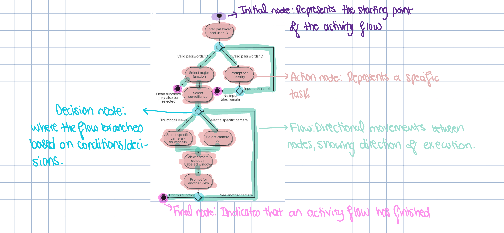
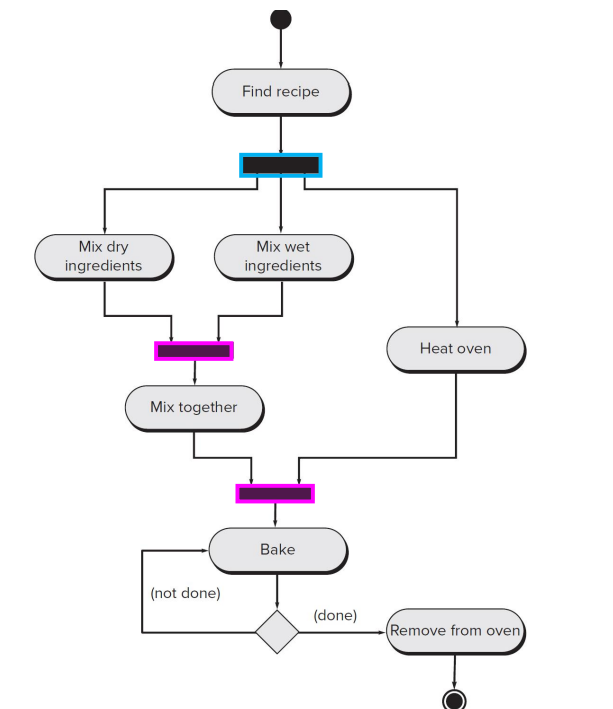
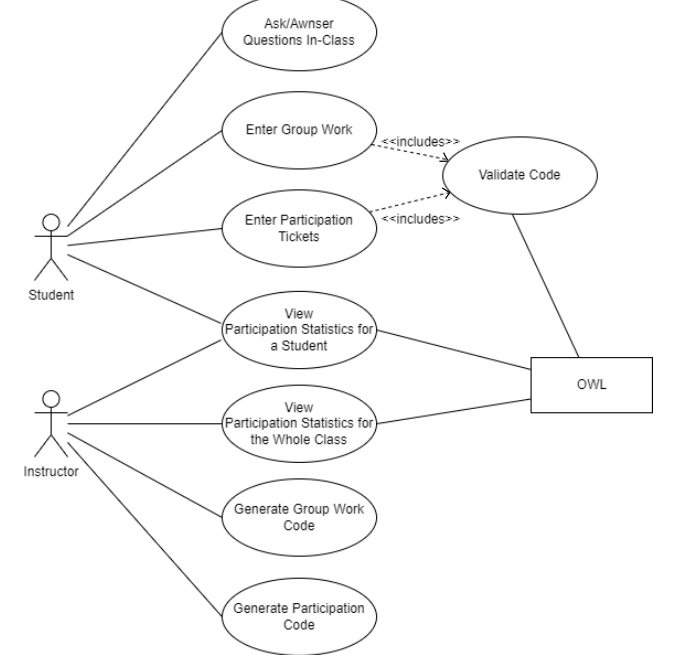
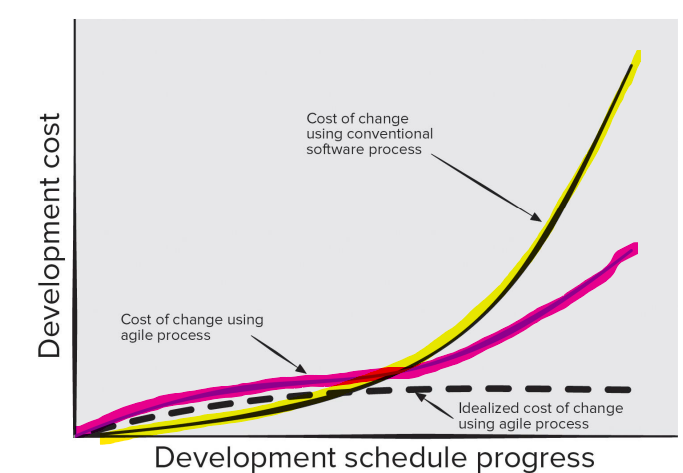
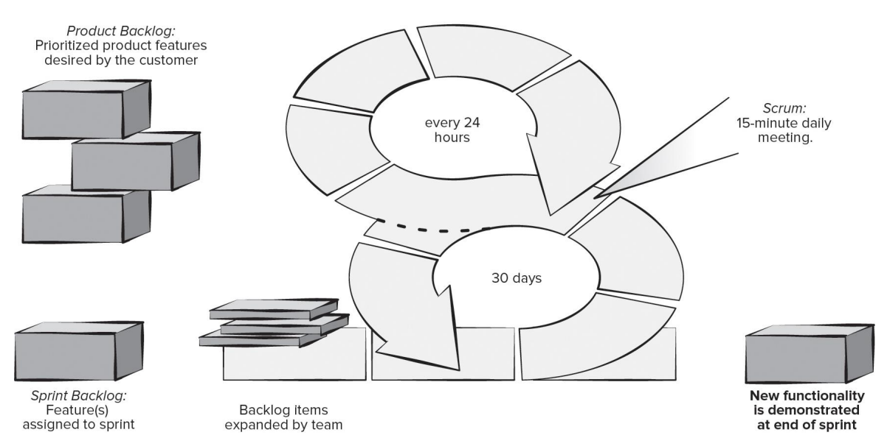
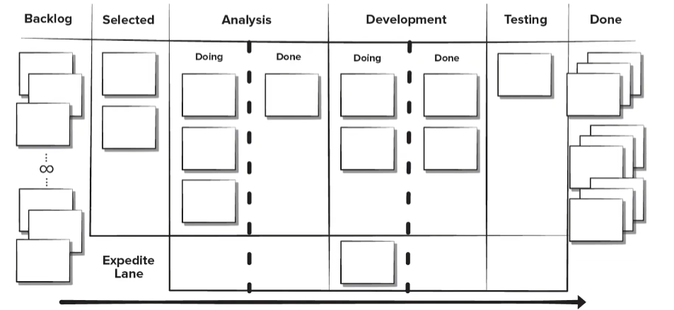

## UML:

What does UML mean?

UML stands for **U**nified **M**odeling **L**anguage

- **Unified:** It brings together several techniques and notations for design as well as a collection of diagrams (set of diagrams)
- **Modeling:** It describes a software system and its design at a high level of abstraction (this is like a blueprint, rather than actual code)
- **Language:** It provides the means to communicate this design in a logical, consistent and comprehensible fashion (uses diagrams/symbols, where each symbol represents a different thing)

What is the point of UML? Or, what are the goals of UML?

- Enable the modeling of object-oriented designs (OOD)
- Visually show various aspects of the overall design of a solution
- Provide extensibility and specialization mechanisms to extend core concepts
- Be independent of a particular programming language (meaning you can use UML on any programming language you want)
- Support higher-level development concepts such as collaborations, frameworks, patterns, and components

We have two different types of diagrams:

1. Behavior Diagram (depicts behavior of the system and how it interacts with users)
    1. The main behavior diagrams we will focus on are activity and use case diagrams
2. Structure Diagram (defines the structure of the software)
    1. For example, class diagram

How is a UML actually used?

- **Sketch:** Quickly share rough ideas and alternatives
- **Blueprint:** Detailed description of a system with the most detail imaginable of the system. So, if you were to give the blueprint to someone, they can implement it with ease
- **Programming Language:** Some tools can generate code based on detailed UML diagrams

There are two ways you can go about using UML:

1. **Forward engineering:** Creating models, plans, blueprints for a software (basically making a UML diagram then coding)

Can you guess what the second one is..

1. **Reverse engineering:** Working backwards from an existing program to create a UML diagram to document what is going on

### ACTIVITY DIAGRAMS:

Remember, activity diagrams are BEHAVIOR diagrams, meaning they describe the behavior of the system when interacting with a user

What do Activity Diagrams do?

- Provides a graphical representation of the flow of interaction
- Represents how a system reacts to internal events
- Focuses on the sequence of activities, decisions, and parallel processes in a system
- Can show concurrent flows (meaning it can show multiple tasks being carried out simultaneously)
- Can be used to document use cases or diagramming code and algorithms



Some things to note are:

- For action nodes, you can have many flows leading into one action node, but typically, one flow goes out
- As shown, there is not only one final node, it can definitely be more than one. It can also lead to other activities
- For decision nodes, the decisions being made HAVE TO GO ON THE FLOWS, NOT IN THE DIAMONDS
- For flows, the arrows MUST be drawn with the arrow head being filled in

Activity diagrams can also be used to show concurrency

**Fork:**

- Denotes that all flows split and all branches are taken.
- These are the blue colored boxes
- Note these are NOT decision nodes
- So, after you find a recipe, you need to do the three action nodes that they split into

**Join:**

- Denotes that multiple flows are rejoined
- Waits until ALL incoming flows have reached the join before proceeding
- So, in the image we are given, the action node “mix together” can not be executed until “mix dry ingredients” and “mix wet ingredients” are both done



The **Swimlane Diagram** is a useful variation of the activity diagram that allows you to represent the flow of activities

Swimlane Diagrams indicate which actor has responsibility for the specific action

So, given our example above:


As you can tell, responsibilities are represented as parallel segments that divide the diagram vertically, like a swimming pool, hence the name swimlane diagram

Note that “actors” aren’t always actual human beings. We will get into this more in use case diagrams

Naturally, you can also create use case diagrams for code

```java
void printEvenNumbers(int start, int end){
	for (int i = start, i <= end; i++){
		if (i % 2 == 0){
			System.out.println(i);
		}
	}
}
```

Let say we are given this small function, are we able to draw an activity diagram from it?


it would look something like this!

### USE CASE:

Once again, this is also a BEHAVIOR diagram.

- It describes interactions between users of a system and the system itself
- Users are referred to as **actors,** as are external systems
- Actors are a role that the user (or external system) plays in the **use case** (will get to the definition in a bit)

Let me talk about what symbols are used in use cases and give an example

- **Actors**
    - Represented as stick figures
    - Associated with one category/role of user or other elements that interact with the system
    - You CAN have many actors in a use case diagram
    - In some cases, non-person actors are represented by a rectangle with the name of it inside. While this is nonnormative, it is very common
- **Use Cases:**
    - They are displayed as ovals
    - The actors are connected by lines (just straight lines) to the use cases they carry out (so basically: if you have a use case “responds to alarm events” and the homeowner does this (therefore an actor), the “responds to alarm events” would be put in an oval, and the homeowner would be connected to it with a straight line).
    - All use cases are surrounded by a rectangle. The uses cases are put right under each other. The actors, however, are OUTSIDE of this rectangle. The rectangle represents the **boundaries of the system**
- **Relationships:**
    - **Association**
        - This is the “straight line” I was talking about. It shows that the actor communicates with the system in some way
        - This communication can be providing input, receiving output, or both
        - ALWAYS BETWEEN ACTORS AND USE CASES
    - **Generalizes**
        - This is an arrow with an unfilled arrow head
        - Denotes that this actor ALSO INHERITS ALL use cases of another actor
        - So, if we had that person A communicates with the system in 5 ways (use cases), and person B ALSO communicates with the system in the same 5 ways, we would draw a generalizes arrow towards person A. I guess this is to prevent drawing association lines again so it looks neater. However, person B could be associated with a use case that person A is not associated with. Since the arrow is pointing TOWARDS person A, person A does NOT inherit this association
    - **Includes**
        - Denotes that this use case is made up of one or more subcases and would be incomplete without them.
        - This is represented by a dotted arrow with a unfinished arrow head at the end (I’ll show this in an example)
        - Each smaller subcase describes some logical unit of behavior. So, although this subcase is not directly drawn in the use cases, we have to logically figure out this subcase
        - So, for example, if we had a use case “access locked laptop”, we can assume a subcase would be “enter password” since the laptop is locked. So, we would have an includes arrow point from “access locked laptop” to the subcase “enter password”
        - This subcase is OUTSIDE of the rectangle with the use cases
        - Above the arrow, you would put the word `“<<includes>>”` with the `<<>>`
    - **Extends:**
        - Denotes that this use case may OPTIONALLY make use of the extended use case
        - This is just an includes arrow but pointing the opposite way
        - For example, if we had a use case “access locked laptop”, we might have an extended use case “forgot password help” in order for the user to get help in case they forgot their password. There would be an arrow extending from the “forgot password help” to the use case “access locked laptop”
        - Once again, this is also OUTSIDE of the rectangle with the use cases
        - Above the arrow, you would put the word `“<<extends>>”` with the `<< >>`

Use case diagram are helpful in ensuring that you have covered all functionality of the system as you get to see the system as a whole

Important to not over complicate a use diagram. `<<includes>>` and `<<extends>>` should also be used if they make the diagram simpler, not more complex

Example:

Create a Use Case diagram for the CS1 Ask Tool

- This is the tool we use in class to ask/answer questions live in class, enter groupwork codes, enter participation tickets, and view our participation stats.
- Your instructor uses this tool to generate groupwork and participation keys, view participation statistics for a given student, view class participation statistics as a whole, and view incoming questions/answers during class.
- Assume that the CS1 ASK Tool communicates with an external system (OWL) when validating codes and viewing participation statistics.

Who would the actors be in this case and what would the use cases be here?



## AGILITY AND PROCESS:

Like we talked about before, there are some issues with the prescriptive process models. They are not good at handling change, which obviously is an issue

A real world is **fluid:**

- Requirements change
- Market conditions change rapidly
- End-users needs evolve
- New competitive threats emerge

So, needless to say, the world changes. We need a process model that can handle these rapid changes

Prescriptive process models tend to be very rigid and structured to deal with this change

Agile methods aim to reduce the cost of change (cost means time in this case). We also want to add a more human method that the traditional models are lacking

What is agility?

- Effective (rapid and adaptive) response to change
- Effective communication among all stakeholders
- Drawing the customer onto the team
- Organizing a team so that it is in control of the work performed
- Rapid, incremental delivery of software

In prescriptive models, the further you are into development, the higher the cost of change becomes. This is because a lot of prescriptive models don’t have feedback to actually deal with change.

Although the cost of change is cheaper in agile models, we still can’t avoid it completely.



for example, the yellow highlight represents the cost of change in a prescriptive process model. the one in hot pink represents agile models. although yes they are still cheaper than prescriptive models, the further and further you get into the agile process, it does become a bit more expensive. even if you have the craziest project, if the customer decides “actually, i want to make the biggest change imaginable”, this is gonna cost you a lot

no methods are perfect BUT agile methods can handle change better than prescriptive

The agile process is built on 3 key assumptions:

1. Difficult to predict which software requirements will change
    1. So, we may have a big list of software requirement when we were talking with the stakeholder, we can make some educated guess on what will change. We can’t make an exact guess on what they want to change overtime, but, we can generalize it
2. Some activities should be done at the same time
    1. We can get better feedback on those activities
3. Analysis, design, construction, and testing are not predictable
    1. Maybe in the design phase, you were planning to use this specific API/library. But, when you started to actually construct it, you no longer were gonna use that API/library anymore. So, even though you decided not to use it, it shouldn’t make you go alllllll the way to the beginning again. That is what agile methods are for

The whole point of agile process is you need adaptability to deal with uncertainty

Process must adapt incrementally based on customer feedback

Delivers multiple software increments as executable prototypes in short time periods

Prototypes act as catalyst for customer feedback

The agile process we will be talking about tend to work best for small teams

Key traits must exist among the people on an agile team to successfully execute an agile process:

- Competence
- Common focus
- Collaboration
- Decision-making ability
- Fuzzy problem-solving ability
- Mutual trust and respect
- Self-organization
- Discipline

Not everything is sunshine and rainbows in this world.. there comes a cost of agile process in terms of predictability and manageability

Agile methods can seem chaotic and uncontrolled at times, especially to those who are more set on older models and can’t adapt to newer models (grow with the time brah)

If people on the team do not have the right traits or those leading the team lack discipline, an agile process can become a lack of process (BARS)

There are a few key agility principles:

1. The highest priority is to satisfy a customer through early and continuous delivery of valuable software
2. Welcomes changing requirements, even in late developments. Agile process MUST be able to handle changes in case the customer wants to change something in the software pretty late in the development due to competitiveness
3. Deliver WORKING software frequently
4. Business people and developers must work together daily throughout the project
5. Build projects around people who are actually motivated. Give them support and trust them
6. The most efficient and effective method of conveying information to a development team is by talking to them face-to-face
7. Working software is the primary measure of progress. Obviously, you need your project to work
8. Agile processes promote sustainable development. The sponsors, developers, and users should be able to maintain a constant pace indefinitely
9. Continuous attention to technical excellence and good design enhances agility
10. Make sure it is simple and efficient. Just because you have a lot of code, this does not mean your project is better
11. The best architectures, requirements, and designs emerge from self-organizing teams
12. Regularly, the team should reflect on how they can become more effective, and adjusts their behavior accordingly

### SCRUM:

The core framework activities are:

Requirements, Analysis, Design, Evolution, and Delivery

- R.A.D.E.D

Tasks in each framework activity take place in a short time box called a **sprint** (normally 2-4 weeks)

Small teams consist of:

1. **Product owner**
    1. Usually a stakeholder rep who is part of the team
    2. Responsible for maximizing the value of the product resulting from work of the development team.
    3. Their responsibility is to manage the product backlog
2. **Scrum master**
    1. Makes everything easier to all members of the team
    2. Runs the scrum meetings, and removes objectives identified as obstacles by team members
    3. They are responsible to deal with the product owner
3. **Development team (3-6 people):**
    1. Creates software increments
    2. Decide when increment is done and when to present to the product owner

There are some artifacts that the scrum model creates:

1. **Product Backlog:**
    1. A prioritized list of product requirements
    2. Items added to the backlog at any time (as long as there is approval from the product owner and development team)
    3. Product owner orders items in product backlog
2. **Sprint Backlog:**
    1. Subset of product backlog, will contain some items in the product backlog
    2. It represents the set of items to be completed during the current sprint
    3. Items CANNOT be added after the sprint starts (unless it is cancelled or restarted)
3. **Code Increment:**
    1. Union of ALL PRODUCT BACKLOG items completed in previous sprints and ALL SPRINT BACKLOG items to be completed in current sprint

**SCRUM MEETINGS:**

Since this does rely on face-to-face meetings, here are the different type of meetings that can be held:

1. **Backlog Refinement Meeting:**
    1. Developers work with product owner and stakeholders to create a product backlog
    2. They are then ranked by importance of product owner’s business needs
2. **Sprint Planning Meeting:**
    1. Held prior to starting a sprint
    2. Product owner gives goals for next increment
    3. Scrum master and development team select items from the product backlog to the sprint backlog
3. **Daily Scrum Meeting:**
    1. This is everyday, the team members synchronize their activities and plan work day (around 15 mins max)
    2. The point of these meetings are to also ask: what have you done since last meeting, what obstacles are you encountering, and what do you plan to accomplish by next meeting
    3. Scrum master leads the meeting and clears obstacles by next meeting, they are NOT problem-solving activity
4. **Sprint Review:**
    1. Occurs at the end of the sprint
    2. Prototype “demos” are delivers to the stakeholders for approval or rejection
    3. If the prototype is rejected, stakeholders provide feedback for the new sprint
    4. New features are either added or removed from product backlog
5. **Sprint Retrospective:**
    1. After the sprint is complete, team considers what went well and what needs improvement
    2. What went well, what could be improved, and what the team will commit to improving in the next sprint
    3. Meeting is run by the scrum master



Okay, so what are the pros and cons of scrum?

**PROS:**

- Product owner sets priorities since they are organizing the backlog
- The team makes it own decision making
- Documentation is very light
- Supports frequent updating

**CONS:**

- Difficult to control the cost of changes
- May not be suitable for large teams
- Requires expert team members

### EXTREME PROGRAMMING (XP) FRAMEWORK:

Extreme programming encompasses a set of rules and practices that occur within the context of four framework activities (P.D.C.T)

1. Planning
2. Design
3. Coding
4. Testing

**PLANNING:**

- Planning begins with the creation of “user stories”, which is a type of documentation that describes the required outputs, features, and functionalities for the software to be built
- Team assesses each story and assigns a cost of how long it will take to implement each story into the software
- Stories are grouped together for deliverable increment (kinda like sprint backlog in scrum)
- Delivery date of increment is decided. After the first increment, a “project velocity” is calculated (estimate of how long it’ll take)

**DESIGN:**

- Design in general follows the KISS principle (Keep It Simple Stupid)
- Encourages the use of CRC cards (Class-Responsibility-Collaborator) as a mechanism to think about the software in an object-oriented context
- CRC cards are the only work product from the design activity. It is recommended to think about design both before and after coding
- Immediate prototype creation is recommended for difficult design problems in order to lower risk
- Due to the previous principle, this encourages refactoring. Refactoring is the modifying or optimizing of a code in a way that DOES NOT change any external behavior.

**CODING:**

- Unit tests are created before the code
- Unit tests cover each of the user stories that will be included in the current release
- When we develop software this way, this is called Test-Driven Development (TDD)
- Encourages the use of “pair programming”. As the name suggests, this is when two people are working together at a work station for real-time problem solving and quality assurance

**TESTING:**

- All unit tests are executed daily, preferably in an automated fashion
- “Acceptance tests” are defined by the customer and executed to see if the customer likes what they see

There are typically 3 ways to implement pair programming

1. **Unstructured** → Two people switch back and forth between who is coding and who is testing
2. **Driver/Navigation** → One developer sets the architectural or strategic direction, and the other implements these decisions as code
3. **Ping-Pong** → Shifts rapidly back-and-forth between the two developers, so they are working on a similar or same problem on two computers rather than one

AgileFramework.png)

What are the pros and cons of XP framework?

**PROS:**

- Emphasizes customer involvement
- Establishes rational plans and schedules
- High developer commitment to the project
- Reduces the likelihood of product rejection

**CONS:**

- Temptation to “ship” a prototype
- Requires frequent meetings about increasing costs
- Allows for excessive changes
- Depends highly on skilled team members

### **KANBAN FRAMEWORK:**

This is a lean methodology for improving ANY process or workflow

Focuses on change management and service delivery. It shows all the projects tasks, the current statuses, and helps track progression overtime

It tries to limit the amount of work in progress at any given time



each square represents a task. this is called a kanban board

There is a more simple representation of this:


**Backlog:** Tasks waiting to be selected for development

**To Do:** Tasks selected for development that are waiting to be worked on

**In Progress:** Tasks that are currently assigned and are being worked on

**Done:** Tasks that have been completed

This approach is flexible so organizations will frequently have their own columns and conventions for their own business needs

Kanban recommends daily meetings called “walking the board”

- Team identifies any items missing from the board that are actively being worked on
- Team tries to advance any items they can to “done”
- Goal is to advance high value or high risk items first, so this will lower the overall risk of the project

Kanban framework can be easily combined with other agile development practices

What are the pros and cons?

**PROS:**

- Lower budget and time requirements
- Allows early product delivery
- Process policies written down
- Continuous process improvement

**CONS:**

- Team collaboration skills determine success
- Poor business analysis can doom the project
- Flexibility can cause developers to lose focus
- Developer reluctance to use measurement

### DEVELOPMENT OPERATIONS (DEVOPS) FRAMEWORK:

Attempts to apply agile and lean development principles across the entire software supply chain

Involves several stages that loop continuously:

- **Continuous Development:** Deliverables broken down and developed in multiple sprints
- **Continuous Testing:** Automated tested tools used prior to integration
- **Continuous Integration:** Code pieces with new functionality added to existing running code
- **Continuous Deployment:** Integrated code is deployed to the production environment
- **Continuous Monitoring:** Team operations staff members proactively monitor software performance in the production environment

AgileFramework.png)

What are the pros and cons of this framework?

**PROS:**

- Reduced time to code deployment
- Team has developers and operations staff
- Team has end-to-end project ownership
- Proactive monitoring of deployed product

**CONS:**

- Pressure to work both old and new code
- Heavy reliance on automated tools to be effective
- Deployment may affect the production environment. If you push the code and something goes wrong, the system is gonna go down for everyone, which can be messy
- Requires an expert development team