## WIREFRAMES:

What are wireframes?

**Wireframes** is a simple sketch of a user interface. It can be used to show stakeholders to get feedback on your UI design.

There are three levels of wireframes:

1. **Low fidelity:** Create new concepts, focus on ideas not detail, and generate lots of options.
2. **Mid fidelity:** Used to get feedback, great for creating prototypes
3. **High fidelity:** Provide detailed instructions, used as a guide for development

In our project, we are aiming for mid fidelity, you want it to be detailed, but not EXTREMELY detailed

## USER EXPERIENCE DESIGN:

Now we know there is something called UX (user experience) and UI (user interface), what is the difference between the two?

UX is the overall experience from what the user expects, while UI is the artistic design of what the user sees

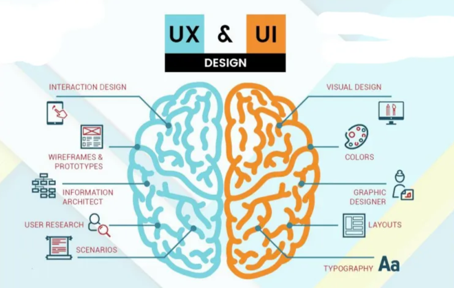

UX is more research based, its for people who do research to see what people want from a software, while UI is simply artistic, how the software will actually look like

### DESIGN ELEMENTS:

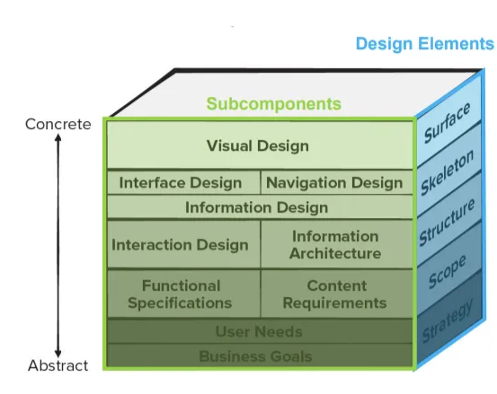

I’m just gonna define each design element (the ones in blue, since those are the main components of UX design elements)

**STRATEGY:**

- Identifies user needs and customer business goals that form the bases of all UX design work. Basically, understand the target audience, their goals, and so on
- Subcomponents:
    - User Needs + Business Goals

**SCOPE:**

- Covers both functional and content requirements needed to create features that match the project strategy. Define what content is needed and how it will be structured
- Subcomponents:
    - Functional specifications + content requirements

**STRUCTURE:**

- Consists of the interaction design (e.g., how the system reacts in response to user action) and information architecture. Map out how users will interact with the system
- Information architecture is the process of organizing content to help users find information and complete tasks.
- Subcomponents:
    - Interaction design + information architecture

SKELETON:

- Consists of interface design, navigation design, and information design. So, in case you read that from the slides and still don’t know what it means, its basically creating low-fidelity layouts to arrange elements on each screen. Also, to develop a consistent and intuitive navigation system (this is navigation design). Finally, designing individual components like buttons, menus, and so on (this is interface design). So, the whole point of this component is to actually building a mid-fidelity layout of the interface
- Subcomponents:
    - Interface, navigation, and information design

**SURFACE:**

- Presents visual design or the appearance of the finished project to its users. This is actually adding colors, aesthetics, more life to the interface and so on
- Subcomponents:
    - Visual design

## GOLDEN RULES:

This guy named Theo Mandel defined three golden rules of interface design, which are:

1. Place users in control
2. Reduce users’ memory load
3. Make the interface consistent

**PLACE USER IN CONTROL:**

- Define interaction modes in a way that does not force a user into unnecessary or undesired actions. Meaning, do not force interactions that the user does not want to do.
    
    - For example, the image below is a bad design, since it does not allow the user to exit out of the popup, it forces the users to accept cookies even if they don’t want to
        
        
        
- Provide for flexible interaction, meaning your interface should work with keyboards, touch screen, mouse, anything
    
- Allow user interaction to be interruptible and undoable.
    
    - For example, if you accidentally archive a conversation in you gmail, you get a popup to undo this action.
- Allow users to reconfigure the UI as they got more used to the interface
    
- Hide technical internals from the casual user
    
- Design for direct interaction with screen objects
    

**REDUCE USERS’ MEMORY LOAD:**

- Reduce demand on short-term memory. Basically, if the interface requires the user to remember too many details or steps, it can be very annoying
    
- Establish meaningful defaults. Basically, provide pre-selected options to help them make quicker, more efficient decisions so they don’t have to use their damn brain (God forbid users make decisions on their own)
    
- Define shortcuts that make sense.
    
    - For example, we know that Ctrl + C is to copy something. Copy starts with a C… so Copy.. Ctrl C, you get the point. The shortcut makes sense
- The visual layout of the interface should be based on a real-world metaphor.
    
    - So, for example, in real life if you wanted to throw something away, you throw it in the trash. This metaphor is seen in Windows when you want to throw something away, you drag it to the recycle bin
- Disclose information in a progressive fashion
    
    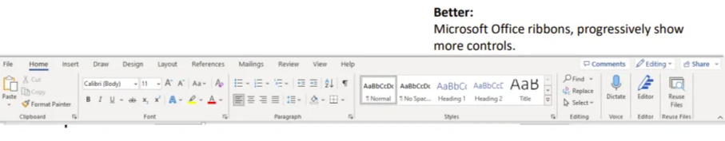
    

**MAKE INTERFACE CONSISTENT:**

- Allow the user to put the current task into meaningful context. Basically, this ensures users understand their current position in the workflow, what they’re expected to do next, and how their actions fit into the larger task or goal
    
    - For example, if a user is filling out a form, progress indications (such as saying Step 1 of 3) show how many steps are left
- Maintain consistency across a family of applications
    
    - Steam has a very inconsistent UI, its buttons are always somehow different
    
    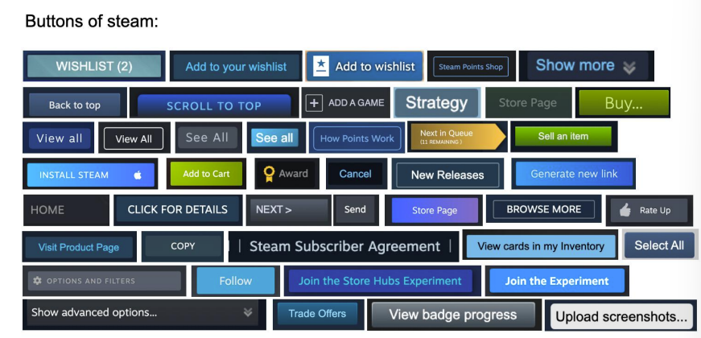
    
- If past interactive models have created user expectations, do NOT make changes unless there is a compelling reason to do so.
    

## USER RESEARCH:

- User research helps designers understand the specific needs, challenges, and characteristics of the users who will be interacting with the system
- Basically, it should answer questions like:
    - Are users trained professionals, technicians, manufacturing workers, etc…?
    - What level of formal education do users have?
    - What is the age range of the user community?
    - What is the primary spoken language amongst users?
    - These sort of questions
- There are two main representations for modeling and understanding users:
    - Customer Journey Map
    - User Personas

### CUSTOMER JOURNEY MAP:

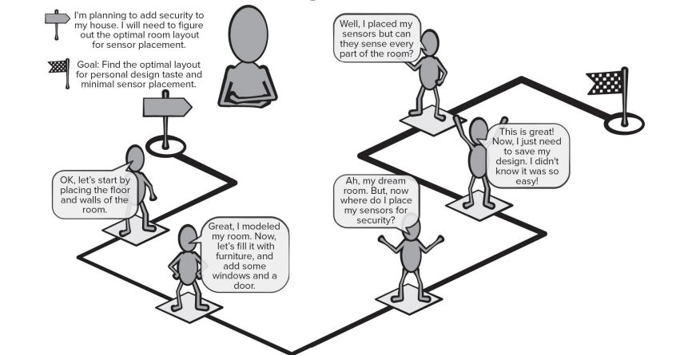

This helps you visualize how users interact with a product/service throughout their journey, from the initial contact to the final interaction. To build an effective CJM, these are some important steps:

1. **Gather stakeholders,** this ensures that the map reflects the business goals as well as the user needs
2. **Conduct research,** collect all information you can about the things users may experience using the software and define your customer phases.
3. **Build the model,** create a visualization of the touchpoints
4. **Refine the design,** make the deliverable visually appealing and ensure touchpoints are identified
5. **Identify gaps,** note any gaps in the customer experience, so if there is a poor transition between two phases, fix it up
6. **Implement your findings,** assign responsible parties to bridge the gaps and resolve pain points found

### **USER PERSONAS:**

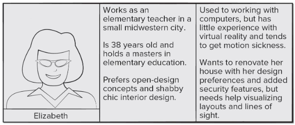

User personas are fictional representations of your ideal end user. They are based on user research and incorporates the needs, goals, and observed behavior patterns of your user base.

They are used to improve product designers’ abilities to see through the eyes of target users.

There are a few steps to build an effective user persona:

1. **Data collection and analysis:** Stakeholders collect information about end users and determine each user group’s needs
2. **Describe personas:** Developers decide how many personas to create and determine which persona will be their main focus
3. **Develop scenarios:** Scenarios are user stories about how personas will use the software. They tend to focus on touchpoints and obstacles describes in the customer journey
4. **Acceptance by stakeholders:** Scenarios are validated using a review technique or demonstration called cognitive walkthrough

## USER INTERFACE DESIGN:

While there are many user interface design models, all suggest some combination of the following:

1. Using information developed during interface analysis, define interface objects and actions
2. Define tasks and events (user actions) that will cause the state of the user interface to change and model this behavior
3. Depict each interface state as it will actually look to the end-user (wireframes)
4. Evaluate the interface design with prototype reviews and user testing

### UI DESIGN EVALUATION CRITERIA:

The UI design model (user scenarios, personas, wireframes, whatever) should be evaluated in early design reviews:

1. Length and complexity
    - The length and complexity of the requirements model and the system’s interface indicate how much users will need to learn in order to effectively use the system
2. Number of user tasks and average number of actions per task
    - Offers insight into the interaction time and overall efficiency of the system
3. Number of actions, tasks, and system states
    - Specified in the design model suggests the memory load that users will experience with the system
4. Interface style, help facilities, and error-handling protocol
    - Provide a general indication of the complexity of the interface and how likely it is to be accepted by users

### **USABILITY GUIDELINES:**

The below guidelines are foundational principles to enhance UX design. These include:

- **Anticipation:** Design should predict user needs and actions based on past experiences
    - For example, a shopping website suggests items based on a user’s previous searches or purchases
- **Efficiency:** Ensure that tasks can be completed in as few steps as possible, enhancing the speed and ease of use
    - A form auto-fills the user’s name and email, based on previous entries, reducing the number of fields they need to fill out each time
- **Flexibility:** The system should be adaptable to different user needs, preferences, and contexts
    - A photo editing app offers both preset filters for beginners and advanced manual controls for expert users, allowing everyone to customize their experience
- **Focus:** Help users focus on the most important tasks by minimizing distractions and providing clear visual hierarchy
    - If you are buying a membership of some sort, only show the prices and have a drop down arrow on the side of it to show additional information. Here, the user is focused on choosing a plan, then finding out more with the drop arrow key if they want to. This makes it less overwhelming
- **Latency Reduction:** Minimize waiting times and delays, ensuring smooth, quick interactions
    - A video streaming app buffers a few seconds of video ahead of time so that playback starts instantly when the user hits play
- **Learnability:** The interface should be easy to learn, enabling new users to get up to speed quickly with minimal effort
    - A new user is welcomed with a tutorial that walks them through basic functions of an app so they can quickly get started
- **Metaphors:** Use familiar concepts or objects as metaphors to make the system more intuitive and relatable
    - Spotify using the play, pause, skip, rewind, shuffle icons
- **Readability:** Ensure text and information are easy to read and understand, using appropriate font sizes, colors, and layout
    - A news website uses a large, bold font for headlines, a smaller font for body text, and appropriate contrast between text and background to make reading articles easy on the eye

## COMPONENT-LEVEL DESIGN:

First, let us review what a component is

A **software component** is a part of a system that contains its own processing logic and internal data structures. It offers an interface through which other parts of the system can interact with it, allowing for invocation and data exchange.

The whole goal is to hide implementation details behind this interface so that the component can be swapped out without requiring changes to other parts of the system

In the object-oriented view of components, components may be a class or a set of classes that collaborate closely together

First step of designing our components is **elaboration**

In this process, we begin with the classes from the analysis model and divide them into components based on their collaborations and define interfaces for these components

Due to this, our analysis classes become design components and we can identify interfaces based on operations in analysis classes

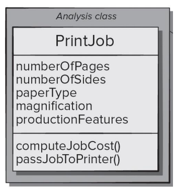

This is an example of an analysis class. Remember, it is a really simplified version of a class diagram

Let us see how we can elaborate on this analysis class to design our component

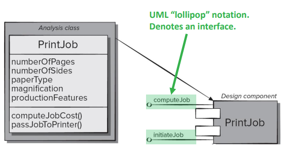

This is how we might represent our PrintJob design component

The “lollipop” notation represents an interface that the PrintJob component offers

Now, we must refine the class into a design class by adding more detail for each attribute, operation, and interface.

Data structures are defined for each attribute and expand on the algorithmic detail for each operation

Any extra attributes or operations needed to implement the class/interface are also added

In many cases, we may also need to add infrastructure classes to support our design classes

- Infrastructure classes belong to the infrastructure domain, which consists of components that support the application software. These tend to relate to low-level hardware, networks, system software, communication, and database components. So, they handle lower-level operations

Once we have filled in all the necessary details for implementation, we should be at a point where we can hand this design to our developers and they can implement the system

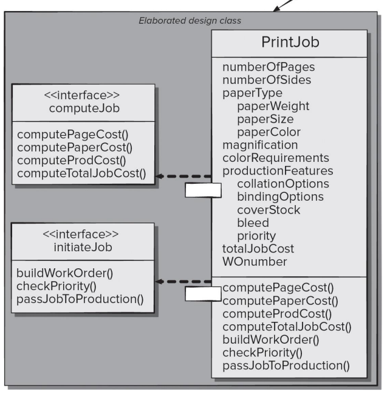

Here, we can see the PrintJob component elaborated into a design component, which includes a PrintJob design class, as well as a set of interfaces. Extra attributes and operations have been added

However, more work needs to be done here

- You still need to define types and data structures
- Provide algorithmic detail for operations
- Consider breaking up the PrintJob class into smaller classes with related attributes and operations
- Elaborate on all other components in the software

## BASIC DESIGN PRINCIPLES:

Now, we will talk about a few design principles that will guide us when creating these components

We have 7 that we will talk about….

- Open-Closed Principle (OCP)
- Liskov Substitution Principle (LSP)
- Dependency Inversion Principle (DIP)
- Interface Segregation Principle (ISP)
- Release Reuse Equivalency Principle (REP)
- Common Closure Principle (CCP)
- Common Reuse Principle (CRP)

### OPEN-CLOSED PRINCIPLE:

This principle states that a component should be open for extension but closed for modification.

This mean that our component should be designed such that they can be extended without needing to make modifications to the internal code or logic of the component

Example:

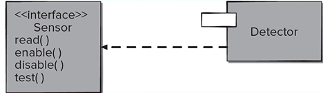

Here, we have a sensor interface and a detector component which may contain a set of classes that each defines a different kind of sensor

This would be an ideal design, as we can simply add new sensor types in the detector component that implements the Sensor interface, So, the component is open for extension (adding new classes) but you do not have to modify anything else in the detector component.

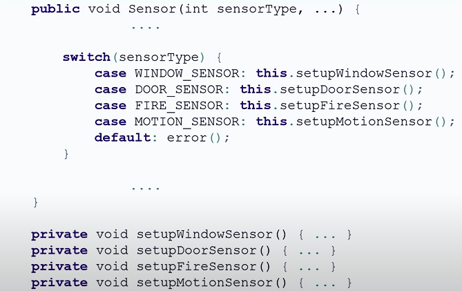

this would be a bad example, because it does not incorporate polymorphism. And, if you wanted to add a new sensor type, you would have to modify the code which violates the OCP. When you are using a switch case, this hints maybe you should be splitting this class up into several other classes.

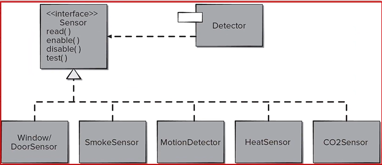

this would be a better example, as they all have their own class BUT they still use the same interface

So, if you wanted to add a new sensor type, you would simply create a new class that implements the sensor interface without having to modify the other classes and not having to modify the interface.

### LISKOV SUBSITUTION PRINCIPLE:

This states that subclasses should be substitutable for their base classes. This means that-in object oriented programming-a derived class (aka a child class) can be used in place of its base class (parent class) without breaking the functionality of the program.

In other words, you should be able to replace instances of a base class with instances of any derived class without affecting the behavior of the program

Example:

Assume we have this base class

```java
class Animal {
	public void makeSound(){
		System.out.println("Some generic animal sound");
	}
	
	public void printAnimalSound(Animal animal){
		animal.makeSound();
	}
}
```

Now, let us assume we have two derived (child classes) Dog and Cat

```java
// Class DOG:
class Dog extends Animal{
	public void makeSound(){
		System.out.println("Woof!");
	}
}

// Class CAT:
class Cat extends Animal{
	public void makeSound(){
		System.out.println("Meow!");

```

Since both Dog and Cat are subclasses of Animal, we can substitute them into printAnimalSound(), and it should work as expected

```java
public class Main {
    public static void main(String[] args) {
        Animal dog = new Dog();
        Animal cat = new Cat();

        printAnimalSound(dog);  // Output: Bark
        printAnimalSound(cat);  // Output: Meow
    }

    public static void printAnimalSound(Animal animal) {
        animal.makeSound();
    }
}
```

### DEPENDENCY INVERSION PRINCIPLE:

This principle states that we should depend on abstractions and not on concretions

Abstractions, such as interfaces and classes are places where a design can be extended without significant complication. The more components depending on concrete components, the more difficult it will be to extend our system

### INTERFACE SEGREGATION PRINCIPLE:

This states that many client-specific interfaces are better than one general purpose interface.

This basically means we should split up our interfaces such that they contain operations that are relevant to the clients that use them. No code should be forced on a client that does not use it

The reason for this is because if you want to change or modify an interface, the impact on any client component that depends on it, is minimized

Example cause this doesn’t make sense lol:

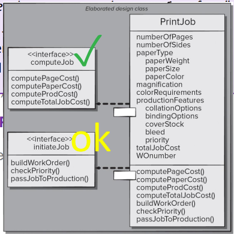

The computeJob interface does a good job staying focused on one thing, calculating the cost of a print job. It is likely that any client component making use of this interface is most likely going to use those operations.

initiateJob, on the other hand, is mid. It has operations related to print job, work orders, and so on, but there is room for improvement. Such as separating the building and processing of a work order from getting the status of the current work order

Something you do NOT want to do is combine both interfaces together. This violates the ISP and makes our life harder if we ever need to make changes to our interface

The next following three designs are classified as **component placing and packaging principles**

### RELEASE REUSE EQUIVALENCY PRINCIPLE:

This principle states that the granule of reuse is the granule of release. This yapfest is basically stating to achieve effective reusability, we need to track our releases and address classes as a group or as a package rather than individually.

EXAMPLE:

Imagine you are building an E-commerce platform, and you have different components such as Product Management, User Management, and Order Management

- WITHOUT REP:
    - You release individual classes like `Product.java` , `User.java` , and `Order.java`
    - This leads to complexity in managing versions and dependencies, as updates to one class might conflict with others
- WITH REP:
    - You release related classes into packages
        - Product Management Package (e.g., `Product.java`, `ProductService.java`)
        - Order Management Package (e.g., `Order.java`, `OrderService.java`, `Cart.java`)
    - You release the entire package as a unit, ensuring all classes inside the package are compatible and work together. So, you can just update and release packages instead of individual classes

note:

- When we say classes are “reused together”, this means that these classes have a strong relationship in how they operate together. Meaning, when one class is reused, others in the group will likely be needed as well

### COMMON CLOSURE PRINCIPLE:

This discuss how to package our components and classes. This states that classes that change together should belong together. So, classes that address the same functional or behavioral areas should be packaged together as they are likely to change together if modification is needed.

This limits how much the system should be modified when a change is required to that area of the application. This implies that classes should be packaged **cohesively**

### COMMON REUSE PRINCIPLE:

This is the opposite of CCP, this states that classes that aren’t reused together should not be group together. This is to say that only classes that are reused together should be included within the same package.

Adding extra or unneeded classes to the same package can just lead to more work

## COHESION:

As a review, cohesion describes the single-mindedness of a module, component, or class. That is, how focused it is on a single function or responsibility

From an object-oriented perspective, cohesion implies that a component encapsulates only the attributes and operations that are closely related to one another and the component itself. The higher the level of cohesion, the easier it is to implement, test, and maintain

Cohesion can be broken into 3 primary different types:

1. **Functional:** Module performs ONE AND ONLY ONE computation
2. **Layer:** Refers primarily to packages, components, and classes in a layered architecture (go back to the layer diagram thing in the last slide). This states that a higher layer of the system can access the services of lower layers, but lower layers can NOT access higher layers
3. **Communicational:** All operations that access the same data are defined within one class

## COUPLING:

The next important design consideration for components is coupling. As we have stated before, coupling is how much a component depends on other components and external systems.

At an object-oriented level, this can be the degree to which classes are connected to one another or call on each others methods

Once again, there are 3 different types of coupling:

1. **Content:** Occurs when one component modifies the data that should be internal to another component. An example would be a class modifying another class’s attributes directly rather than through a specified interface or operation
2. **Control:** Occurs when control flags are passed to an operation to request alternative behaviors.

Example:

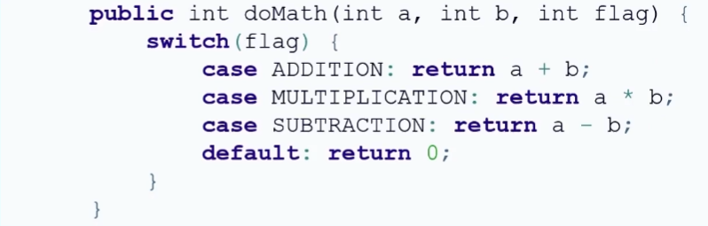

a simple method that does specific calculations depending on the flag passed to the method

Here, the flow of execution is not controlled by the class itself or the method itself, rather, it is controlled by the operation that DOES class doMath. This is something you don’t want. Remember, if you see that your code has switch-case, this means your code should be broken down into multiple operations, that are more cohesive and focus on just one computation

1. **External:** Occurs when a component must communicate with infrastructure component. Meaning, a component in your system needs to interact with external systems/infrastructure components (such as databases, file systems, hardware, etc…)

Example: If you have a weather app, the app needs to get the weather from external weather services (like an API). The weather app depends on external service to get the information it needs

So, let us summarize the component-level design process

1. Identify all design classes that correspond to the problem space. This is based on our requirements and architectural models, specifically the analysis classes from the requirements model
    
2. Identify all design classes that correspond to the infrastructure domain. These are classes not from the requirements model and probably not even in our architectural model either, but are needed to implement the system.
    
3. Elaborate all design classes by ensuring all interfaces, attributes, and operations are detailed
    
    1. You need to specify message details. Collaboration diagrams are used
    2. Identify interfaces
    3. Fill in data structures and types
    4. Describe the process flow within each operation, using pseudocode, an activity diagram, or a flowchart
    
    What are collaboration diagrams? Here they are:
    
    
    
    collab diagram for that PrintJob example
    
    the “links” can be potential communication path and overall just a link between them
    
    labeled arrows show messages that will be sent with sequence numbers, indicating the order of the messages. These are commonly method calls, that include the method name and the arguments it takes
    

So, the ProductionJob object first calls the buildJob operator in the WorkOrder object to pass a work order number (WOnumber) to it. This is rarely used (the diagram) so we won’t be focusing on it BUT im mentioning it in case he tests us about it idk

1. Describe the data sources (such as database and files) and identify the classes (usually infrastructure classes) that will manage them
2. Behavioral representations of classes and components are created. State diagrams are usually used here
3. Deployment diagrams can be used to provide additional implementation details about where each component will live physically within the system’s hardware
4. Refactor our component-level design representation and always consider alternatives