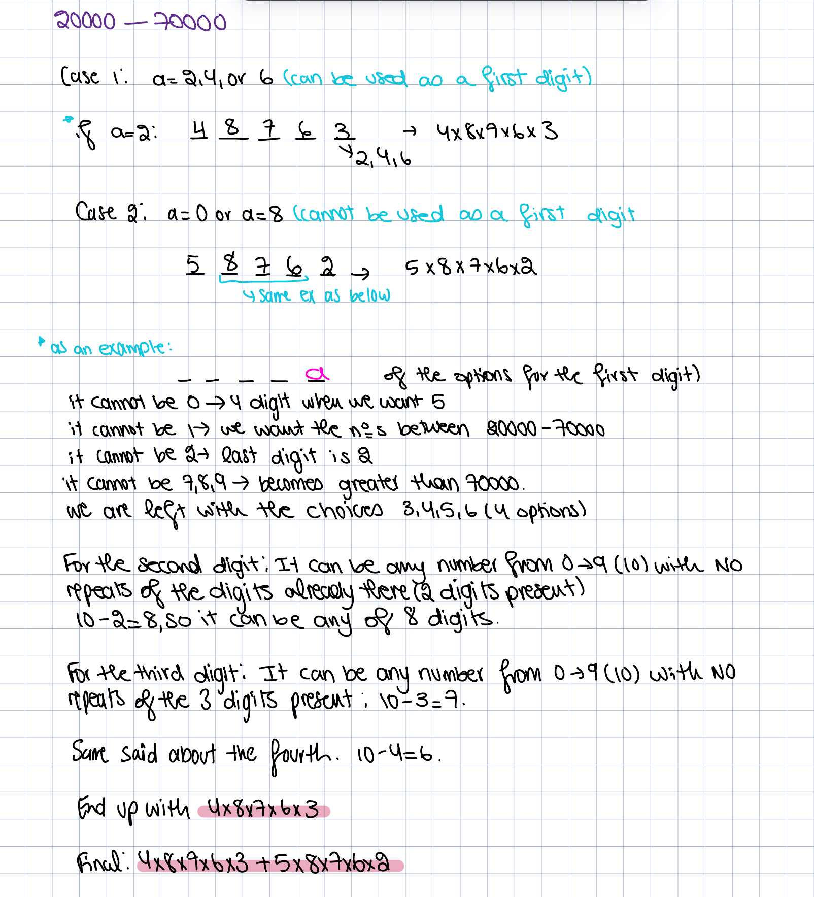
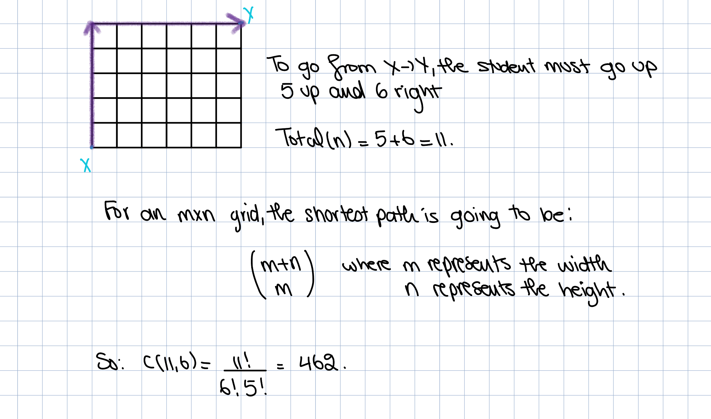
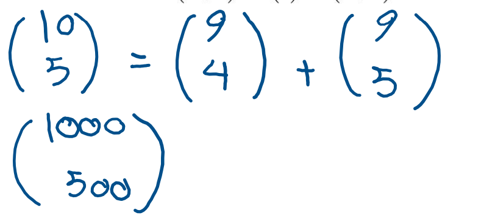

## PRODUCT RULE:

If a procedure has two sequential tasks with $n_1$ ways to do the first and $n_2$ ways to do the second, the total number of ways to complete the procedure is $n_1\times n_2$

For example:

Making a sandwich with 3 bread choices and 4 filling choices → 3 x 4 = 12 possible sandwiches

Another one:

**How many Canadian postal codes can there be?**

Canadian postal codes are written in a way such that it goes LNL NLN where L represents a letter and N represents a number.

For numbers → there are 10 possible options (0 → 9)

For letters → there are 26 possible options (A → Z)

So, you have 3 letters → $26^3$ and 3 number options → $10^3$

So, there are $26^3\times 10^3$ Canadian postal code combinations

How many 5-digit **EVEN** numbers are there if the digits are from the set $\{1,2,3,4,5,6,7\}$

For a number to be even, the last number MUST be either 2, 4, or 6 → 3 options

The rest of the 4 numbers can be any number they want from the 7 numbers we have → 7 options

So, we can have $7^4\times 3$ even numbers from the set

## THE SUM RULE:

If a task can be done in $n_1$ ways OR $n_2$ ways (mutually exclusive) → total ways = $n_1+n_2$

For example:

A student can choose a computer project from one of three lists. The three lists contain 23, 15, and 19 possible projects, respectively. **No project is on more than one list.** How many possible projects are there to choose from?

Literally just $23+15+19=57$

### THE PIGEONHOLE PRINCIPLE:

Did anyone here get 2209 flashbacks…?

This is basically stating if $k+1$ objects are placed into $k$ boxes, at least one box has ≥ 2 objects

(as if this isnt common fucking sense… 2 + 2 = 4 type of principle)

Example:

Among any group of 367 people, there must be at least two with the same birthday, because there are only 366 possible birthdays

**The generalized pigenhole principle is basically:**

If $N$ objects are placed into $k$ boxes, then there is at least one box containing at least $\lceil\frac{N}{k}\rceil$ objects (the upside down L is called a ceiling function, it essentially ROUNDS UP the number inside)

Example:

Among 200 students in this class, there are at least __ who where born in the same month?

- There are 200 students → $N=200$
- There are 12 months → $k=12$
- $\lceil\frac{200}{12}\rceil=17$

So, there are at least 17 students who were born in the same month

## PERMUTATION:

A permutation of a set $S$ is an **ordered list** of elements of the set

Example:

Permutations of $\{1,2,3\}$ are → 123, 132, 213, 231, 321, 312

**Formula:**

There are $n!$ permutations for $n$ distinct elements

A $k-$permutation refers to an ordered arrangement of $k$ distinct elements selected from a larger set of $n$ elements

- The sequence, for example, “AB” is DIFFERENT from “BA”
- No repetitions: Each element is used ONLY ONCE in the arrangement

The number of $k-$permutations from a set of $n$ elements is denoted by $P(n,k)$ and calculated as:

$$ P(n,k)=\frac{n!}{(n-k)!} $$

The denominator cancels out the unused positions

For example:

Write all 2-permutations of the set $\{1,2,3\}$

$k=2$, since we need to write 2-permutations. There are 3 elements in the set → $n=3$

$$ P(3,2)=\frac{3!}{(3-2)!}=\frac{6}{1}=6 $$

Example:

Between 20000 and 70000 find the number of even integers in which no digit is repeated

I didn't write the explanation of the second case but… its the same thing kinda

Example:

In how many ways can five couples and two singles form a line of each couple is standing together and the two singles are at the the two ends?

You have 2 singles, and they must go at the two ends → the number of ways to assign them to the two ends is: $2!=2$

- for example, it is like saying you have person A and person B who are single, you can either:

1. Assign A to the left and B to the right
2. Assign A to the right and B to the left

- That is 2 assignments, so $2!=2$

Since each couple must stand together, we treat each couple as a “block” or “one person” when arranging

We are arranging 5 blocks (couples) in a line (between the two singles at the end)

$5!$ ways to order the couple

- So, in the one right after the far left single, you have 1 of 5 couples to put there. In the one right next to that, you have 1 of 4 couples, and so on

Each couple can stand in 2 different ways:

- Man, Woman or Woman, Man

There are 5 couples and 2 different ways → $2^5$ ways

So, the total number of valid arrangements are:

$2\times 5!\times 2^5$

## COMBINATIONS:

A $k-$combination of elements of $S$ is an unordered selection of $k$ elements of the set.

- So, in this case “AB” is the SAME as “BA”

The number of $k-$combinations on a set of cardinality $n$ is denoted by $C(n,k)$. This number depends ONLY on $n$ and $k$, not on the actual elements of S

The formula is:

$$ C(n,k)=\frac{n!}{k!(n-k)!} $$

This can also be noted as: $\binom{n}{k}$

Example:

Write all the 2-combinations of the set $S=\{1,2,3\}$

$k=2$ → we need to write ALL 2-combinations

$n=3$ → the number of elements in the set

$$ C(3,2)=\frac{3!}{2!(3-2)!}=\frac{6}{2(1)!}=\frac{6}{2}=3 $$

The subsets are:

$\{1,2\}$, $\{1,3\}$ and $\{2,3\}$

Example:

A committee consisting of 4 people is to be selected from a group of 10 women and 7 men. In how may different ways can this be done so that tall 4 people on the committee are the same sex?

$$ \binom{10}{4}+\binom{7}{4} $$

Example:

A student wishes to walk from the corner X to the corner Y through the streets as given in the street map shown below. How many shortest routes are there from X to Y available to the student?

Example:

In a $5\times 6$ rectangle grid (where 5 is the number of rows and 6 is the number of columns), each CELL is a rectangle. How many rectangles can be observed in the grid?

Suppose you have a $1\times1$ grid (so one cell)

- You need 2 horizontal lines (top and bottom) to enclose the 1 cell
- You need 2 vertical lines (left and right)

So, 1 row → 2 horizontal lines, and 1 column → 2 vertical lines

Now, if we extend this to a $2\times 1$ grid

- You now have 3 horizontal lines to make 2 rows
- Still 2 vertical lines

To generate $r$ rows of cells:

- Each cell needs a top and bottom edge
    
- But adjacent cells share a line-so you don’t need 2 separate lines per row
    
- You need:
    
    - One top line
    - One line between each row
    - One bottom line
- So:
    
$$ \text{Number of horizontal lines = }r+1 $$
    

Likewise, for $c$ columns, you need $c+1$ vertical lines

So, in a $5\times 6$ grid:

- 5 rows = 5 + 1 = 6 horizontal lines
- 6 columns = 6 + 1 = 7 vertical lines

$$ \text{rectangles} = \binom{6}{2} \cdot \binom{7}{2} = 15 \cdot 21 = \boxed{315} $$

### PASCAL’S IDENTITY:

For any natural numbers $n,k$, with $k\le n$:

$$ \binom{n+1}{k+1}=\binom{n}{k}+\binom{n}{k+1} $$

