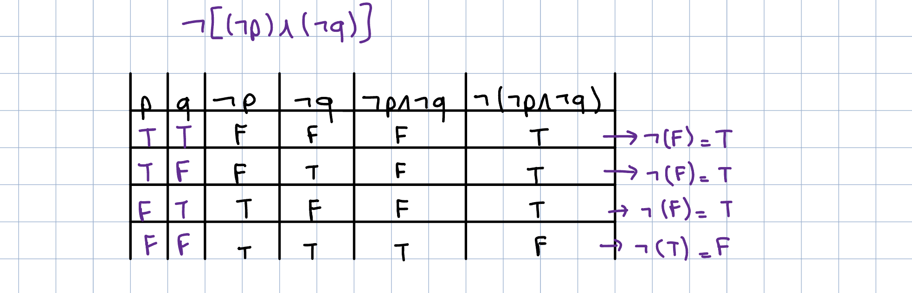

## STATEMENT:

What is a statement? A **statement/proposition** is a sentence that is either completely true or completely false, but **NOT BOTH.**

Example time (who misses this):

Each of the below sentences is a statement, indicate whether they are true or false.

1. Tampa is a city in the state of Florida
    1. This is TRUE
2. 2 + 1 = 5
    1. This is obviously false…
3. The moon is made of blue cheese
    1. Well… obv… it is false
4. The digit in the 105th decimal place in the decimal expansion of $\sqrt{3}$ is 7
    1. Well, if you wanted to google this, the answer would be false

**NONE** of the following is a statement because it makes NO SENSE to ask if any of them are true or false

1. Come to our party!
    1. This is obv not a statement, because we cannot ask the age old question “is this true or false”
2. How are you today?
    1. Are you feeling false or true? Clearly, this is not a statement

The first 4 examples provided are known as **simple/atomic statements.** They are known to be the most basic building block for building an argument. So, something like “the sky is blue” would be considered an atomic statement.

A combination of two or more simple statements is a **compound statement.** So, something like “2 + 1 is 5 AND the digit in the 105th decimal place in the decimal expansion of $\sqrt{3}$ is 7” is considered a compound statement, this is because you connected two atomic statements “2 + 1 is 5” along with “the digit in the 105th…” together with an AND

As a side note, we usually use letters to represent statements, we typically use $p,q,r$, which may refer to either a simple statement or a compound statement (though usually, they are used to mainly represent simple statements)

There are many other ways to connect simple statements to form compound statements, but we mainly use 5:

1. NOT connective, denoted as $\neg$
2. AND connective, denoted as $\land$
3. OR connective, denoted as $\lor$
4. IF…THEN connective, denoted as $\longrightarrow$
5. IFF connective, denoted as $\iff$

## NEGATION:

Let $p$ be some proposition. The **NEGATION** of $p$, denoted as $\neg p$, is basically saying “it is not the case that $p$”, or simply “the opposite of $p$”. The proposition $\neg p$ is read as “not $p$”.

So, basically, if $p$ had a truth value of true, $\neg p$ would have a truth value of false, it is just the opposite of p.

There are also other ways to write down $\neg p$, such as ~$p$, $\bar{p}$, $-p$, $p'$, $Np$, and $!p$, but we typically just stick to $\neg p$, but if there ever comes a time where you see $Np$, just know it means “not $p$”, dont be a baby and get lost

The truth table of negation would be:

|p|~p|
|---|---|
|T|F|
|F|T|

So, if I were to give a more concrete example, if we had the proposition $p$, which is defined as $p = \text{This is an easy course}$, then, the negation of $p$ would be:

$\neg p =\text{This is NOT an easy course}$

## CONJUNCTION:

Let $p$ and $q$ be two distinct propositions. The **CONJUNCTION** of $p$ and $q$, denoted as $p\land q$, is the proposition “$p$ and $q$”. Conjunction is also known as the AND connective, obviously, the more formal name is simply “conjunction”

The conjunction $p\land q$ is true when **BOTH $p$** and $q$ are true, and false otherwise

The truth table for conjunction:

|p|q|p AND q|
|---|---|---|
|T|T|T|
|T|F|F|
|F|T|F|
|F|F|F|

To give a more concrete example, if we had two propositions $p = \text{It is raining}$ and $q=\text{The ground is wet}$, the propositions $p\land q$ is defined as:

$p\land q =\text{It is raining and the ground is wet}$.

Here, we combined two atomic statements, then made it a compound statement by connecting the two propositions with a conjunction

So, let us say we have this compound statement

$\neg[(\neg p)\land (\neg q)]$, construct a truth table for this statement

if you say “errrrrrmmmm do i really have to make columns for $\neg p$ and $\neg q$” NO you don’t have to, this is for clarity

## DISJUNCTION:

Let $p$ and $q$ be two distinct propositions. The **DISJUNCTION** of $p$ and $q$, denoted as $p\lor q$, is the proposition “$p$ or $q$”. The disjunction $p\lor q$ is false ONLY when BOTH propositions are FALSE, otherwise, it is true.

The truth table:

|p|q|p OR q|
|---|---|---|
|T|T|T|
|T|F|T|
|F|T|T|
|F|F|F|

To give a sentence example, if we had two propositions $p=\text{The sun is out}$ and $q=\text{The moon is shining}$, then, the propositions

$p\lor q=\text{The sun is out or the moon is shining}$

Here, we combined two atomic statements, then made it a compound statement by connecting the two propositions with a disjunction

An example:

Construct the truth table for $(p\land q)\lor (p\land r)$

|p|q|r|(p AND q)|(p AND r)|(p AND q) OR (p AND r)|
|---|---|---|---|---|---|
|1|1|1|1|1|1|
|1|1|0|1|0|1|
|1|0|1|0|1|1|
|1|0|0|0|0|0|
|0|1|1|0|0|0|
|0|1|0|0|0|0|
|0|0|1|0|0|0|
|0|0|0|0|0|0|

## IF…THEN:

Suppose a statement is: if it rains, then we don’t play

Let: $A: \text{It is raining}$ and $B:\text{we will not play}$.

- If A is true, that is, it IS actually raining, and B is false, meaning, we WILL play, then, the statement A implies B is false.
- If A is false, meaning it is not raining, and B is true, meaning we will not play, the statement is true. As long as A is false, we do not care about the truth value of B. Kind of like saying “as long as it is not raining, we can do whatever we want”
- Naturally, if A is true, meaning it is raining, and B is true, meaning we will not play, then A implies B is true

Let $p$ and $q$ be two propositions. The **CONDITIONAL** statement $p\longrightarrow q$ is the proposition “if $p$, then $q$”. In the conditional statement $p\longrightarrow q$, we call $p$ the **hypothesis (or antecedent/premise)** and we call $q$ the **conclusion (or consequence)**

The truth table for this bad boy:

|p|q|IF p THEN q|
|---|---|---|
|T|T|T|
|T|F|F|
|F|T|T|
|F|F|T|

There is a lot of terminology used to express $p\longrightarrow q$. Here they are:

Example:

Show that $p\rightarrow q$ is equivalent to $\neg (p\land \neg q)$ using a truth table

|p|q|!q|p → q|!(p AND !q)|
|---|---|---|---|---|
|1|1|0|1|1|
|1|0|1|0|0|
|0|1|0|1|1|
|0|0|1|1|1|

Since they have the same truth valuation for every combination of p and q, then they are equivalent

## IFF:

Let $p$ and $q$ be two distinct propositions. The **BICONDITIONAL** statement $p\iff q$ is the proposition “$p$ if and only if $q$”. The biconditional statement is true ONLY when $p$ and $q$ have the same truth values (so either both are true OR both are false), it is false otherwise. Biconditional statements are also called “bi-implications”

Truth table:

|p|q|p IFF q|
|---|---|---|
|T|T|T|
|T|F|F|
|F|T|F|
|F|F|T|

These are the main connectives that we use, but we also have something called equivalent and XOR

## EQUIVALENT:

When two statements $P$ and $Q$ (simple or compound), have the same truth values in EACH of all the logical possibilities, then $P$ is said to be **LOGICALLY EQUIVALENT** (or equivalent) to $Q$, and we denote this as $P\equiv Q$

So, for example, show that:

$p\longrightarrow q$ is equivalent to $\neg(p\land (\neg q))$

Let us refer to $P=p\longrightarrow q$ and $Q=\neg(p\land(\neg q))$, even though they are two different formulas, since they have the same truth value for each logic possibility, we can say that $P\equiv Q$

## EXCLUSIVE OR:

Let $p$ and $q$ be propositions. The **EXCLUSIVE OR** of $p$ and $q$, denoted by $p\oplus q$ (which is also referred to as $p\oplus q$), this proposition is true ONLY IF ONE OF THE PROPOSITIONS is true, false otherwise. It is essentially saying “one or the other, but not both”

The truth table for this bad boy

|p|q|p XOR q|
|---|---|---|
|T|T|F|
|T|F|T|
|F|T|T|
|F|F|F|

^ both cannot be true or false at the same time and lead to a true value, it has to be one is true and the other is false

## CONVERSE:

If we had a proposition $p \rightarrow q$, the **converse** of this proposition is $q\rightarrow p$

It is important to note that $p\rightarrow q$ IS NOT EQUIVALENT TO $q\rightarrow p$ (do the truth table, you’ll see they aren’t)

### CONTRAPOSITIVE**:**

If we had a proposition $p\rightarrow q$, the **contrapositive** of this proposition is $\neg q\rightarrow \neg p$

HERE, we can say that $p\rightarrow q \equiv \neg q \rightarrow \neg p$

We can use a truth table to prove this

|p|q|!q|!p|p → q|!q → !p|
|---|---|---|---|---|---|
|1|1|0|0|1|1|
|1|0|1|0|0|0|
|0|1|0|1|1|1|
|0|0|1|1|1|1|

Clearly, they are equivalent

### INVERSE:

If we had a proposition $p\rightarrow q$, it’s inverse is $\neg p \rightarrow \neg q$

## PRECEDENCE:

ohhhh who doesn’t love precedence….

We evaluate logical operators in this order (from left to right)

$$ \neg \text{ , }\land \text{ , }\lor \text{ , }\rightarrow \text{ , } \iff $$

So, if we had: $\neg p\land q$, if we wanted to add parenthesis to this: $(\neg p)\land q$, since we said negation has the highest precedence

If we had: $p\lor q\land r$, how would you evaluate this? $p\lor (q \land r)$, since the conjunction has higher precedence than disjunction

Is it true that $(a\land b)\land c\equiv a\land (b\land c)$?

Let us make a truth table:

|a|b|c|(a AND b) AND c|a AND (b AND c)|
|---|---|---|---|---|
|1|1|1|1|1|
|1|1|0|0|0|
|1|0|1|0|0|
|1|0|0|0|0|
|0|1|1|0|0|
|0|1|0|0|0|
|0|0|1|0|0|
|0|0|0|0|0|

clearly they are equivalent.. forehead

## TAUTOLOGY:

A statement is considered a **tautology** if all its truth valuations are TRUE regardless of what the truth valuations of the smaller propositions are.

To make sense of this, I will provide an example so hopefully it will make more sense

Is the statement $p \lor \neg p$ a tautology? To prove this, like we always do, we construct a truth table

|p|!p|p OR !p|
|---|---|---|
|1|0|1|
|0|1|1|

Since the result of $p\lor \neg p$ is always T (1) no matter what p or !p is, we call the statement a tautology

## **CONTRADICTION:**

Let us put 2 and 2 together.. we can establish what contradiction means

A statement is considered a **contradiction** if all its truth valuations are FALSE regardless of what the truth valuation for the smaller propositions are

Example…

Is $p\land \neg p$ a contradiction? Once again, our best friend, truth table

|p|!p|p AND !p|
|---|---|---|
|1|0|0|
|0|1|0|

Since the result of $p\land\neg p$ is always F (0), we call this statement a contradiction

## EQUIVALENCES:

We have some important equivalences we should know

Some of these are kinda a no shit sherlock..

We also have logical equivalences involving conditional statements:

You can use the above equivalences to prove some of these. For example, to prove the 3rd one, we basically do:

$$ \neg p \rightarrow q\\ \equiv\neg(\neg p)\lor q\\\ \equiv p\lor q $$

i mean kinda obvious

We also have logical equivalences involving biconditional statements:

You can further simplify the first one:

$$ (p\rightarrow q)\land (q\rightarrow p)\\\ \equiv (\neg p \lor q)\land (\neg q \lor p) $$

Let us give an example:

Without using a truth table, show that $\neg(p\lor (\neg p\land q))$ and $\neg p\land \neg q$ are logically equivalent

$$ \neg(p\lor (\neg p\land q))\\\ \equiv \neg p \land \neg(\neg p\land q)\\\ \equiv\neg p \land (\neg(\neg p)\lor \neg q)\\\ \equiv\neg p \land (p\lor \neg q)\\\ \equiv (\neg p \land p)\lor (\neg p \land \neg q)\\\ \equiv F\lor (\neg p \land \neg q)\\\ \equiv \neg p \land \neg q $$

This is what we called using **deductive reasoning**

## SATISFIABILITY:

A compound proposition is considered satisfiable if there is an assignment of truth values to its variables that make it true. So, as long as the compound proposition evaluates to true at least ONCE, then the proposition is satisfiable. It is unsatisfiable when ALL truth values are False

Note:

- A compound proposition is unsatisfiable IF AND ONLY IF its negation is true for all assignments of truth values to the variables (meaning the negation is a tautology)

Examples:

Determine whether each of the compound propositions:

1. $(p \lor \neg q)\land (q \lor \neg r)\land (r \lor \neg p)$
2. $(p\lor q\lor r)\land (\neg p\lor \neg q\lor \neg r)$
3. $(p \lor \neg q)\land (q \lor \neg r)\land (r \lor \neg p)\land (p\lor q\lor r)\land (\neg p\lor \neg q\lor \neg r)$

is satisfiable

For number 1, using trial and error would probably be our best bet (there are proof methods that i will discuss next set of slides)

- $p=1,q=1,r=1$ would make the equation satisfiable

For number 2, once again, trial and error:

- $p=1,q=0,r=1$ would make the equation satisfiable (mind you, this solution isn’t unique)

For number 3, we do something called proof by case

(image of explanation will be inserted here someday lol cause i want to draw this out)

## QUANTIFIER:

Whenever we talk about literally anything, we have in mind a specific **universe** or **domain** of discourse, which is a collection of objects whose properties are under consideration. For example, when we say “All humans are mortal”, the **universe** is the collection of ALL HUMANS. Now that we know what a universe is, the statement “all humans are mortal” can be also expressed as:

$$ \text{For all x in the universe, x is mortal} $$

The phrase “for all x in the universe” is called a **UNIVERSAL QUANTIFIER,** and is symbolized as $\forall x$. The variable x in this sentence is essentially “humans”. So, if we were to substitute the word humans in the above sentence, we would end up with “for all humans in the universe, human is mortal”, which is basically another way of saying “all humans are mortal”. Hopefully it makes sense!

The sentence “x is mortal” says something about x; so we can symbolize this as $p(x)$. Using these new symbols, we can rewrite “All humans are mortals” as

$$ \forall x p(x) $$

Now, consider the statement “Some humans are mortal”. Here, the universe/domain is still the same here. However, we are no longer referring to ALL humans, we are referring to SOME humans. So, we can rephrase the sentence “some humans are mortal” as

$$ \text{There exists at least one x such that x is mortal} $$

The phrase “there exists at least one x” is called a **EXISTENTIAL QUANTIFER,** and is symbolized as $\exists x$. The variable x, once again, is sill referring to humans. So, if we were to substitute human in the above sentence we would get “there exists at least one human such that human is mortal”. The reason we are using “there exists” rather than “for all” is because in the sentence we are given, we are told that SOME humans are mortal. In other words, we are saying there exists AT LEAST one individual who is mortal. So, similar to the above example, “x is mortal” can be rewritten as $p(x)$. Then, we can rewrite “some humans are mortal” as

$$ \exists x p(x) $$

In general, suppose we have a domain of discourse $U$ and a general statement $p(x)$, called a **propositional predicate (we usually refer to quantifier as predicate logic),** whose “variable” x ranges over $U$. Then, $(\forall x)(p(x))$ asserts that FOR ALL X THAT IS IN U, the statement $p(x)$ about x is true.

For $(\exists x)(p(x))$ means that there EXISTS AT LEAST ONE X IN U, such that $p(x)$ is true

### NEGATION OF QUANTIFIERS:

What happens if we were to negate these two quantifiers? The negation of the statement $p(x) \text{ is true for every }x \text{ in }U$ → $\neg[(\forall x)(p(x))]$ is considered to be the same as the assertion “$\text{there exists at least one } x \text{ in } U \text{ for which } p(x) \text{ is false}$” So, this can be rewritten as

$$ \neg[(\forall x)(p(x))]\equiv (\exist x)(\neg p(x)) $$

Similarly, the negation of the statement “$p(x)\text{ is true for at least one } x \text{ in } U$” → $\neg[(\exist x)(p(x))]$ is considered to be the same as the assertion “$\text{there is not a single } x\text{ in }U\text{ such that }p(x)\text{ is true}$”. So, this can be rewritten as

$$ \neg[(\exist x)(p(x))] \equiv (\forall x)(\neg p(x)) $$

Let us do some examples so this makes more sense:

Which of the following statement is equivalent to the negation of the statement ‘All snakes are poisonous”?

1. All snakes are not poisonous
2. Some snakes are poisonous
3. Some snakes are not poisonous

What are the negations of the statements $\forall x(x^2>x)$ and $\exists x(x^2=2)$

$$ \neg(\forall x (x^2>x))\\\equiv\exists x \neg(x^2>x)\\\equiv \exists x(x^2\leq x) $$

I think its kinda obvious that the negation of $x^2>x$ is $x^2\leq x$… If we are saying “it is not true that $x^2>x$”, then this means that $x^2\leq x$

$$ \neg(\exists x(x^2=2))\\\equiv\forall z\neg(x^2=2)\\\equiv\forall x(x^2\neq 2) $$

### NESTED QUANTIFIERS:

One quantifier is within the scope of another, such that:

$$ \forall x \exist y(x+y=0) $$

This statement is claiming that for any $x$, there exists at least one $y$ such that $x+y=0$. Is this true? Well it does depend on our domain, but if we consider our domain “all integers”, then this statement is true. Why? Well think about it. We are saying FOR EVERY INTEGER X, THERE EXISTS AT LEAST A SINGULAR INTEGER Y SUCH THAT X + Y = 0. So, if we can find ONE condition where this is true, then the whole statement is true. If we take $x=3$ and $y=-3$, then $3-3=0$, so our statement is **TRUE**

What about if we had this statement

$$ \exist x\forall y(x+y=0) $$

This statement is claiming that “there exists at least one x such that for all y $x+y=0$”. Is this true? Absolutely not. We are saying that “for one singular integer x, every single integer y, it must be true that $x+y=0$” does this even sound right? No bro, if I choose $x=1$, is it true that if you add all of the other integers in the world to 1 it will give you 0? No, if you take $y=2$, $1+2=3\neq 0$, so obviously this statement is **FALSE**

What if we had this statement:

$$ \exist x\forall y(x.y=0) $$

This statement is claiming that “there exist at least one x such that for all y, $xy=0$”. is this true? Yes. Why though? Well, if we find at least one $x$ that’ll make this statement true, then this becomes true. If we were to take $x=0$, it is true that every $y$ in the universe multiplied by $x(x=0)$, will be 0. So, our statement is **TRUE**

What if we had the statement:

$$ \exist x\exist y(xy>0) $$

This statement is claiming that “there exist at least one x, there exist at least one y such that $xy>0$”. Is this true? Yes, if you take $x=1$ and $y=2$, you have $1\times2=2$, which is most definitely greater than 0. So, since we found at least one x and y, that when you multiply them you get a number greater than 0, this statement is **TRUE**

What if we had the statement:

$$ \forall x\forall y(xy>0) $$

This statement is saying (I say for the 50th time) that “for every single integer x, and for every single integer y, x times y is greater than 0”. Is this true? No, because we are making the ballsiest assumption that all integers x and all integers y is always going to be greater than 0 when you multiply them. If I were to take $x=-2$ and $y=1$, we end up with $(-2)(1)=-2<0$, so clearly, we at least one x and one y such that $xy<0$. Therefore, our statement is **FALSE**

So, to sum it up in a table:

Translate the statement “the sum of two positive integers is always positive” into a logical statement. Note, you can use logical expressions like conjunction and whatnot normally.

Translate the statement “Every real number except zero has a multiplicative inverse” (a multiplicative inverse of a real number x is a real number y such that xy = 1)

Essentially, this is saying for all real numbers x, there exists at least one real number y such that if x ≠ 0, then, xy = 1

$$ \forall x\exist y(x\neq 0 \rightarrow xy = 1) $$

Since “there exist y” is also used in the second half of the statement, we can also rewrite this as

$$ \forall x(x\neq 0\rightarrow \exist y(xy=1)) $$

Both of these are correct, but since the scope of y is only on the consequence of the if.. then, we can simply only write it in the consequence. But, for all x has to be written in the start because the scope of x is the entire statement.

### TRANSLATING NESTED QUANTIFIERS:

Translate the statement

$$ \forall x(C(x)\lor \exist y(C(y)\land F(x,y))) $$

into English, such that $C(x)=x \text{ has a computer}$, $F(x,y)= x\text{ and }y\text{ are friends}$, and the domain of both x and y consists of all students in you school

For all students in the school, all students have a computer or there exist at least one student such that that student has a computer and x and y are both friends.

In order to make this statement a bit more.. prettier, we can rewrite this as:

“All students in the school has a computer or has a friend with a computer”