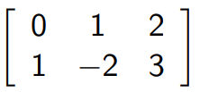

## MATRIX:

A matrix is a rectangular array of numbers, each of which is called an entry of the matrix.

If a given matrix has $m$ rows and $n$ columns, it is called an $m\times n$ matrix, and the number $m$ and $n$ are the dimensions of the matrix

for example, in this matrix, it has 2 rows, and 3 columns, so the dimensions of this matrix would be

$2\times 3$

We sometimes refer to an $m\times 1$ matrix as a **column vector** and a $1\times n$ matrix as a **row vector**

the one on the left is referred to as a column vector since it has 1 column and $m$ rows, the one on the right is referred to as a row vector since it has 1 row and $n$ columns

A matrix is a square if it has the same number of rows as columns, In this case, the number of rows or columns is called the **order of the matrix**

The way we denoted matrices is by using capital letters, and the entries of a matrix are denoted by the corresponding lowercase letter with “double subscripts”. As an example, if we had this $3\times 3$ matrix:

If we wanted the value in the 2nd row 3rd column, instead of saying “the entry in the matrix A in the 2nd row 3rd column is…” you can just say $a_{23}=$, just makes naming easier

So, if we had this matrix:

and we wanted the value of the 1st row, 2nd column, we would write $b_{12}=2$. If we wanted the value of the 3rd row 1st column, this would be $b_{31}=0$

### SUM OF MATRICIES:

Let $A$ and $B$ be matrices with the same dimensions. The sum of $A$ and $B$, written as $A+B$, is the matrix obtained by adding corresponding entries of $A$ and $B$. So, you would add $a_{11}+b_{11}, a_{12}+b_{12}$ and so on

Example:

Find the sum of these two matrices

### MULTIPLICATION BY SCALAR:

Let $A$ be a matrix and $c$ be a scalar. Then, the scalar multiple $cA$ is the matrix obtained by multiplying each entry of $A$ by $c$

Example:

Find the value of $2A$

There is also something called a zero matrix but i am not making a header for it… can you GUESS what a zero matrix is…………………… this isnt rocket science

### MATRIX MULTIPLICATION:

Let $A$ and $B$ be matrices such that **the number of columns of $A$ is equal to the number of rows in $B$.** Let $A$ be a $m\times n$ matrix, and $B$ be $n\times q$. Then, the product $AB$ is the $m\times q$ matrix, such that the entry in the $i^{th}$ row and $j^{th}$ column is the dot product of the $i^{th}$ row of $A$ with the $j^{th}$ column of $B$

- So, if you wanted to multiply a $2\times 3$ and $3\times 4$ matrix, this is fine, you end up with a $2\times 4$ matrix.
- However, if you wanted to multiply a $2\times 3$ and a $2\times 3$ matrix, you CAN’T, since the column of the first matrix is not equal to the row of the second matrix

It is also very important to know that $AB\neq BA$

The best way to explain this is through an example

Examples: Find the value of $AB$

Given the below values of $A$ and $B$, find the values of $AB$ and $BA$

### DIAGONAL MATRIX:

The entries $a_{ii}$ of a square matrix $A$ form the main diagonal of $A$. For example, in the below matrix, the main diagonal of the matrix consists of 1, 2, 4

A square matrix in which every element NOT on the main diagonal is zero is called a **diagonal matrix.** It is important to know that it MUST be a square matrix

these are considered diagonal matrices, all the non main diagonal entries are 0

### IDENTITY MATRIX:

An identity matrix, denoted by $I$, is a square matrix which has $1$’s all along the main diagonal, and zero everywhere else

If you multiply a non-zero matrix $A$ with an identity matrix, you are just going to get $A$ again

$$ AI=IA=A $$