## PROOF OF VALIDITY:

An **argument** is the assertion that a statement, called the conclusion, follows from other statements, called the hypotheses or premises. An argument is considered to be valid IF the conjunction of the hypotheses implies the conclusion.

Let me give an example to make sense of this bullshit:

Consider the following argument involving the propositions:

If you have a current password, then you can log onto the network.

So “You have a current password” then, therefore, “You can log onto the network”

We want to determine whether this is a valid argument. In order to do this, we would like to determine whether the conclusion “You can log onto the network” must be true when the premises “If you have a current password, then you can log onto the network” and “you have a current password” are BOTH TRUE

Let us look at the form of this.

Let us denote $p=\text{You have a current password}$ and $q=\text{You can log onto the network}$

Then, the above argument has the form:

$$ p\rightarrow q \\ p \\-----\\ \therefore q $$
$$ p\rightarrow q \\ p \\-----\\ \therefore q $$
$$ p\rightarrow q \\ p \\-----\\ \therefore q $$
$$ p\rightarrow q \\ p \\-----\\ \therefore q $$

where $\therefore$ is “therefore”

We know that when $p$ and $q$ are propositional variables, then the conjunction of the premises must imply the conclusion. So, $((p\rightarrow q)\land p)\rightarrow q$ must be a tautology. When both $p\rightarrow q$ and $p$ is true, we know that $q$ must also be true. So, when the conjunction of all premises are true, we look at the conclusion. If the conclusion is true when the conjunction of the premises are true, then the argument is valid. Using a truth table here can help us determine whether or not this is true, so let us use a truth table

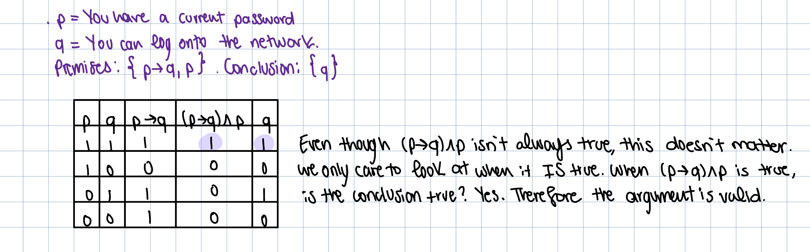

Now, suppose that both “If you have a current password, then you can log onto the network” and “you have a current password” are true statements. When we replace $p$ by “You have a current password” and $q$ by “You can log onto the network”, it necessarily follows that the conclusion “You can log onto the network” is true. This argument is valid because its form is valid. Note, that whenever we replace p and q by propositions where both $p\rightarrow q$ and $p$ are BOTH true, then $q$ must be true (refer to truth table)

For example, if given the following four arguments and the conclusion:

$$ 1.\ M\rightarrow E\\ 2.\ A\rightarrow L\\3. \ (E\lor L)\rightarrow\neg W\\4.\ W\\-----\\\therefore \neg M \land \neg A $$

Where:

$$ M:\text{Studies medicine}\\A:\text{Studies art}\\E:\text{Prepares to earn a good living}\\L:\text{Prepares to live a good life}\\W:\text{College tuition is wasted} $$

So, let us translate the following arguments and conclusion to see if the conclusion falls through:

1. If he studies medicine, then he prepares to earn a good living
2. If he studies art, then he prepares to live a good life
3. If he prepares to earn a good living or prepares to live a good life, then, his college tuition is not wasted
4. His college tuition is wasted

$\therefore$ He studies neither medicine not arts.

Does the conclusion fall through? Yes. This is because it logically makes sense and also has the form

$$ p\rightarrow q\\ p\\---\\\therefore q $$

### RULES OF INFERENCE:

While we did say we can do a truth table to prove an argument is valid, sometimes, this can be very tedious. Imagine you have 10 arguments, you would have $2^{10}=1024$ different rows. Thankfully, we don’t always need to resort to truth tables. Instead, we can establish the validity of some relatively simple argument forms, called **rules of inference.** These rules of inference can be used as building blocks to construct more complicated argument forms

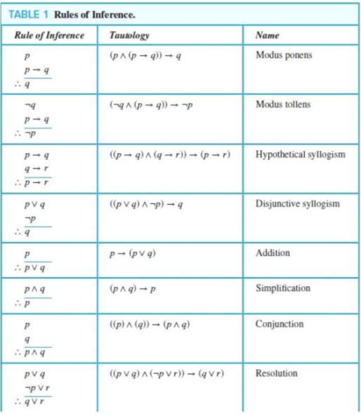

The proofs of theorems designed for human consumption are always almost informal, where more than one rule of inference may be used in each step, where steps may be skipped, where the axioms being assumed and the rules of inference used are not explicitly stated. Informal proofs can often explain to humans why theorems are true, whereas computers are perfectly happy producing formal proofs using automated reasoning systems.

## THEOREM:

Formally, a theorem is a statement that can be shown to be true. In mathematical writing, the term “theorem” is usually reserved for a statement that is considered at least somewhat important. Less important theorems sometimes are called propositions. Theorems can also be referred to as “facts” or “results”

### PROOF:

A **proof** is a valid argument that establishes the truth of a theorem. The statements used in a proof can include axioms, which are statements we ASSUME to be true, the premises (if any), of the theorem, and previously proven theorems. Meaning, the premises are statements already proven to be true.

### LEMMA, COROLLARY, AND CONJECTURE:

A **lemma** is generally considered used to describe a “helper” fact that is used in the proof of a more significant result. Complicated proofs are usually easier to understand when they are proved using a series of lemmas, where each lemma is proved individually. The significant results are frequently called **theorems**

A **corollary** is a “smaller” theorem that can be directly established from a theorem that has already been proven.

A **conjecture** arises when one notices a pattern that holds true for many cases. However, just because a pattern holds true for many cases, this does not men the pattern will hold true for all cases. So, since many times conjectures are shown to be false, they are not theorems.

## METHODS OF PROVING THEOREMS:

We’ve been talking about theorems left and right, but how the hell do we proof these theorems?

We have some methods:

1. Direct proofs
2. Proof by contraposition
3. Proof by contradiction
4. Exhaustive Proof and Proof by cases
5. Proofs of equivalence
6. Counterexamples
7. Existence Proofs

### DIRECT PROOFS:

A direct proof of a conditional statement $p\rightarrow q$ shows that this statement is true such that by literally showing that if $p$ is true, then $q$ must also be true, so that the combination of $p$ is true and $q$ is false never occurs.

In direct proof, we assume that $p$ is true and use axioms, definitions, and previously proven theorems, together with the rules of inference to show that $q$ must also be true

So, if we want to prove $p\rightarrow q$ is true, we **assume** $p$ is true, then show that $q$ is true as well

Examples:

- Prove that the following theorem is true “The sum of two odd numbers is even”

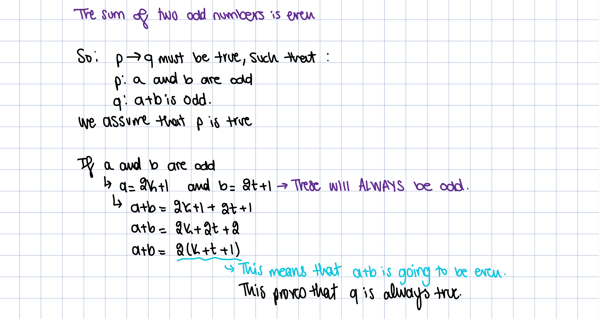

When we write $a=2k+1$, this is because we can rewrite ANY ODD NUMBER in the form of $2n+1$.

- Directly prove that if $n$ is an odd integer, then $n^2$ is also an odd integer

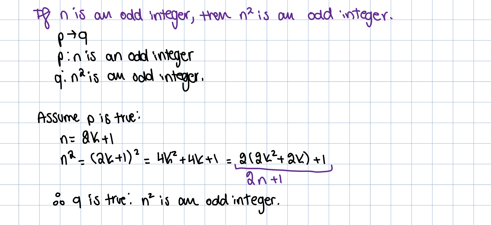

- Prove that if $n$ is odd, then the remainder of $n^2$ by 8 is 1

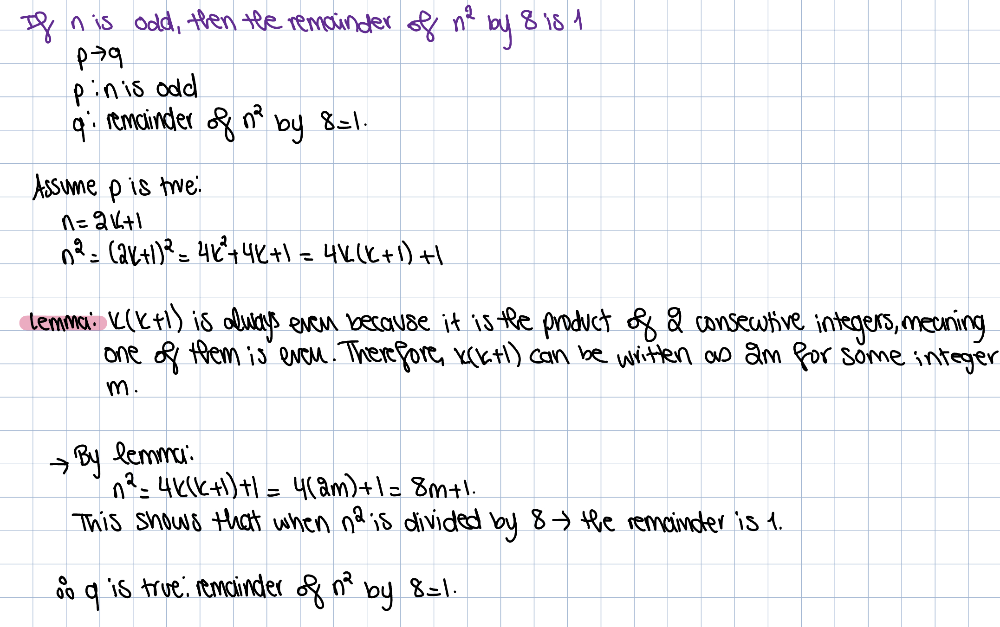

### PROOF BY CONTRAPOSITION:

This proof makes use of the fact that $p\rightarrow q$ is equivalent to $\neg q\rightarrow\neg p$. So, we assume that $\neg q$ is true in order to prove that $\neg p$ is true. When we prove that $\neg q \rightarrow \neg p$ is true, therefore, $p\rightarrow q$ is true

Example:

- Prove that the following theorem is true “If n is an integer and 3n + 2 is odd, then n is odd”

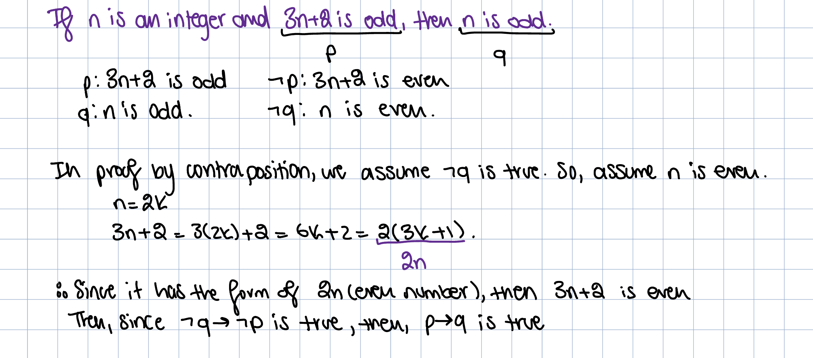

### PROOF BY CONTRADICTION:

If we have one proposition: if we have $p$, suppose that $\neg p$ is true, then, find a contradiction that shows that $\neg p$ is FALSE, so $p$ is true

If we have an implication: if we have $p\rightarrow q$, we start by assuming $\neg p$ is true. We find a contradiction such that $\neg p\rightarrow q$ is true. Since $q$ is false, but $\neg p\rightarrow q$ is true, we must conclude that $\neg p$ is false, so $p$ must be true by contradiction.

So, if you stared at the text for 30 minutes and still don’t understand what it means, basically, what we do is:

- Assume $p$ is true, but $\neg q$ is true
- Find a contradiction that shows either: $p\rightarrow q$ OR $\neg q \rightarrow \neg p$

Let us show this via an example to make things clearer

Example:

- Prove by contradiction $\sqrt{2}$ is irrational

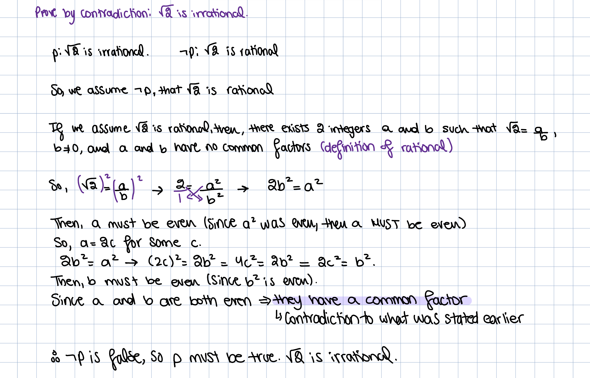

- Prove by contradiction of the theorem “If $3n+2$ is odd, then $n$ is odd”

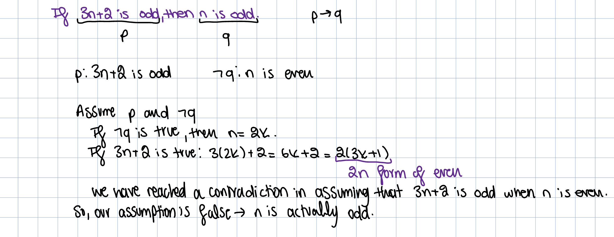

### EXHAUSTIVE PROOF AND PROOF BY CASES:

In a proof by cases, we must cover ALL possible cases that arise and cover all the domain. This is also why its called “exhaustive proof”, because we are testing ALL possible cases.

So, for example, if you wanted to prove “if $n$ is an integer, $n\leq n^2$”

Here, you would need 3 cases to prove this:

1. $n\leq -1$, what happens when you have a negative value
2. $n = 0$, what happens when you have 0
3. $n\geq 1$, what happens when you have a positive value

Examples:

- Prove that if $n$ is an integer which is not a multiple of 3, then the remainder of $n^2$ by 3 is 1

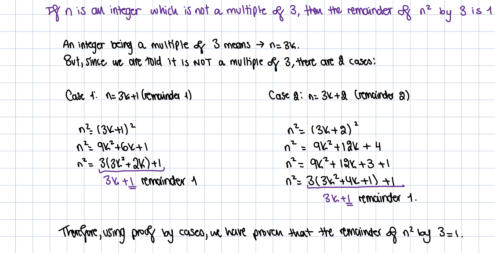

- Show that there are no solutions in integers x and y of $x^2+3y^2=8$

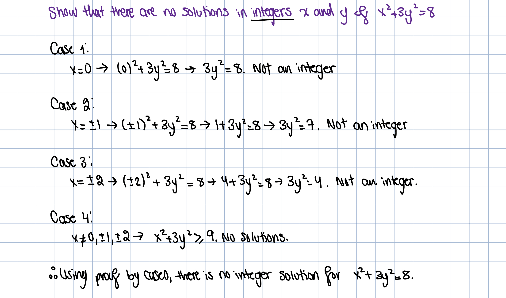

### PROOF OF EQUIVALENCES:

To prove a theorem that is a biconditional statement, which in case you forgot is in the form $p\iff q$, we show that:

- $p\rightarrow q$ is true AND
- $q\rightarrow p$ is true

Both of them MUST be true in order for the biconditional to be true

The validity of this approach is based on the tautology $(p\iff q)\iff (p\rightarrow q)\land (q\rightarrow p)$

Example:

- Prove the theorem “If $n$ is an integer, then $n$ is odd IF AND ONLY IF $n^2$ is odd”

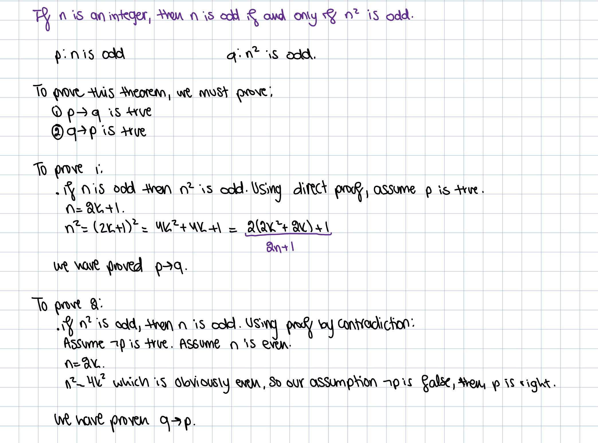

You don’t necessarily have to use proof by contradiction in the second one, you can use any proof method you like!

### EQUIVALENCE:

Sometimes, theorems state that several propositions are equivalent

Such theorems states that propositions $p_1,p_2,p_3,..,p_n$ are equivalent. This can be written as:

$$ p_1\iff p_2\iff...\iff p_n $$

As we know, if we want to prove biconditionals, we have to prove that $p_1\rightarrow p_2$ is true, and $p_2\rightarrow p_3$ is true, and all the way until you can prove that $p_n\rightarrow p_1$ is true, coming back full circle

Example:

- Show that these statements about the integer $n$ are equivalent:
    
    $p_1$: $n$ is even
    
    $p_2$: $n-1$ is odd
    
    $p_3$: $n^2$ is even
    

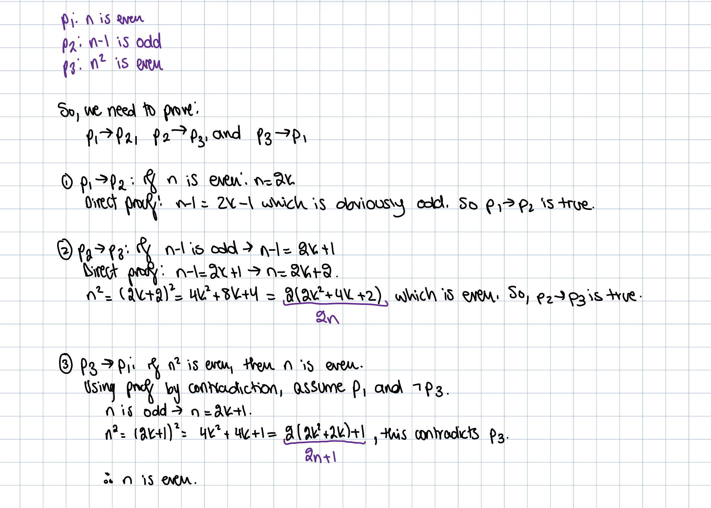

### COUNTEREXAMPLES:

Showing that a mathematical statement is true requires a lot of formal proof. However, showing that a mathematical statement is false only requires finding ONE example where the statement isn’t true. This is what we call a counterexample, this is because it goes against the statement’s conclusion. For example, if we had the statement “all birds can fly”, if you provide one counter example that at least ONE bird can’t fly, then you have proven the statement is false. For example, penguins are a type of bird, and they cannot fly. So, saying that “all birds can fly” is false.

### EXISTENCE PROOF:

Many theorems are assertions that objects of a particular type exist. A theorem of this type is a proposition in the form $\exists x P(x)$, where $P$ is a predicate. When you prove something exists, you have a choice, there is **constructive proof** and **nonconstructive proof**.

Constructive proof is basically saying “if I am trying to show that something exists, find an example for which $P(x)$ is true” therefore, it exists.

Nonconstructive proof is basically saying “assume that there are NO VALUES for which $P(x)$ is true, then contradict this own statement by saying ‘erm actually is it true’ and show an example” which I think is so stupid bro but who am I to judge…

I am going to give two examples, one of showing constructive proof, and one of nonconstructive proof:

**Constructive example:**

- Prove “there exists a pair of consecutive integers such that one integer is a perfect square and the other is a perfect cube”

The best way to go about this is honestly just start looking at the perfect squares and cubes that you have

|1|2|3|4|5|6|
|---|---|---|---|---|---|
|1|4|9||||
|1|8|27||||

We are going to stop filling the table here, because we have already found a pair of consecutive integers such that one is a perfect square and the other is a perfect cube.

We have 8 and 9, which are two consecutive integers, 8 is a perfect cube $(2^3)$ is 8, and 9 is a perfect square $(3^2)$ is 9.

$\therefore$ there exists a pair of integers such that one is a perfect cube and one is a perfect square. Sine we found one example where the statement is true, therefore, it is true

**Nonconstructive proof:**

- Prove “there is a rational number $x$ and irrational number $y$ such that $x^y$ is irrational”

So, here, you assume what you are saying here is assume that there are NO VALUES for x and y that would make $x^y$ irrational true.

Let $x=4$ (rational) and let $y=\sqrt{2}$ (irrational)

So, putting 2 and 2 together… obviously $4^{\sqrt{2}}$ is irrational, then, we have clearly found a value for x and y that makes the statement true