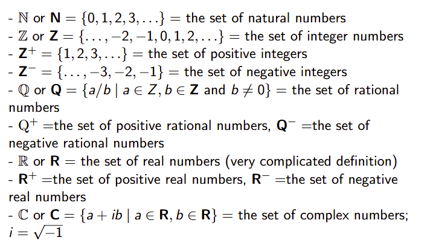
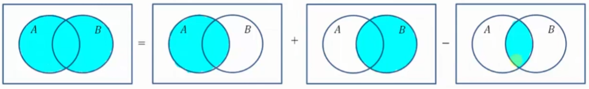
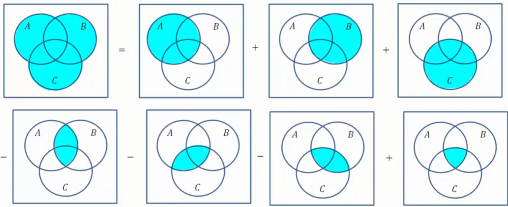

## SET:

In this course, we will use the following definition of a set:

- A set is an (unordered) collection of objects, called elements or members of the set. The set is said to contain its elements. The notation $a\in S$ means that the object a is an element of the set $S$. The notation $a\notin S$ means that a is NOT an element of set $S$
- An “object” is never specified. The theory that results from this intuitive definition of a set as a collection of objects is called a **naïve set theory.** This theory leads to logical inconsistencies (paradoxes)

What are these paradoxes?

## RUSSELL’S PARADOX:

The whole point of Russell’s paradox is to show that the above theory is flawed.

Before I explain what it is, let us use an infamous paradox that’ll help us understand this more, called the **barber’s paradox:**

The barber is the “one who shaves all those, AND ONLY THOSE, who do not shave themselves”, the question is here, who shaves the barber?

1. The barber cannot shave himself, as he only shaves those who do NOT shave themselves. Thus, if he shaves himself, he is no longer the barber he claims to be
2. But, if the barber does not shave himself, he then fits in the group of people who the barber said he would shave, and thus, the barber must shave himself

This is a paradox, because then who shaves the barber? (before you fucking geniuses say “erm maybe the barber can be a woman” no its a man filled town its an average cs class bro)

Since we never defined what an object is, this becomes a problem. Two properties emerge from naïve set theory:

1. A set may contain other sets as elements
2. A set may contain itself as an element (since sets can contain other sets, what is stopping the set to have itself as an element)

What Russell’s Paradox states it that:

- Let $S$ be a set
- This set contains ALL sets of a specific property
- The property of these elements it that they don’t contain themselves (i.e for all elements $a,a\notin a$)

So, the question is, does $S$ contain itself then

Well, if we assume that $S\in S$, this contradicts the third statement, therefore, we reach a contradiction. Then, $S\notin S$

Well, what if we assume that $S\notin S$, but this contradicts the second statement, because it should have ALL sets, therefore, $S\in S$

This set stems due to the naïve set theory, which results in a paradox

### AXIOMATIC VS. NAIVE:

There is a more proper axiomatic set theory which gets rid of the known paradoxes of naive set theory

However, since:

- Naïve set theory is enough for everyday use of set theory, it is much more user-friendly than the axiomatic set theory
- Naïve set theory is a useful stepping stone towards more formal set theories

So, long story, we will be using the naïve set theory although it results in paradoxes.

## REPRESENTING SETS:

The elements of a set $S$ are listed like this: $S=\{0,1,2,3\}$, since we said sets are unordered, the order does not matter here

It is better practice to NOT list one element more than once in a set

For larger (infinite or finite) sets, we list enough elements to highlight the pattern and then we use “…” to leave the other implied

So, if we had $A=\{a,b,c,...,x,y,z\}$, although we did not list every single alphabets in there, we can establish that $A$ is the set of alphabets in the English language

If we had $Z=\{...,-3-2-1,0,1,2,3,...,\}$, you should be able to tell that $Z$ is just the set of integers

There is also the weirdest way in mankind to define sets as well

$$ S=\{X|X\text{ is an integer between 0 and 3 (incl.)}\}\\=\{x | X\in Z\text{ and } 0\leq X\leq 3\}\\=\{0,1,2,3\} $$

We are basically saying $S$ is the set of the objects $x$ such that (which is denoted by | ) $x$ is an integer and $0\leq X\leq 3$

The variable $x$ is just a placeholder which can be changed to any other symbol to avoid clashes

- $A=\{x|x\text{ is a letter of the English alphabet}\}$ is not ideal, since X is an actual character in the English alphabet

## SET EQUALITY AND SUBSETS:

Two sets $A$ and $B$ are equal IF AND ONLY IF they have exactly the same elements:

$$ A=B\ \iff \ \forall x(x\in A\iff x\in B) $$

A set $A$ is a **subset** of a set $B$ (notation: $A\subset B$) IF AND ONLY IF every element of $A$ is ALSO an element of $B$

$$ A\subset B\ \iff\ \forall x(x\in A\rightarrow x\in B) $$

Example:

$A=\{1,2,3\}$ and $B=\{1,2,3,4,5,6\}$, then we can say that $A$ is a subset of $B$ as all the elements in A are in B $A\subset B$

$\{1,4\}\not\subset\{1,2,3\}$ since $\{1,4\}$ are not in the second set

## EMPTY SET AND UNIVERSAL SET:

As the name states, an empty set is a set that contains no elements. It is usually denoted as $\emptyset$ or $\{\}$

However, if you were to do something like $\{\emptyset\}$, this is not the same thing, this is saying a set containing an empty set.

The universal set is the set of all objects under consideration. Often denoted $U$

When we use a universal set in terms of Venn Diagram, we usually represent it as a rectangle.

## SUBSETS AND POWER SETS:

The empty set is a subset of any set, so $\emptyset\subset A$

A set is always a subset of itself $A\subset A$

The **power set** of a set $A$ is the set of ALL subsets of $A$, including $\emptyset$ and $A$. It has various notations, such as: $P(A)$ and $2^A$

$$ P(A) = \{S | S\subset A\} $$

Examples:

$P(\{0,1\})=\{\emptyset, \{0\}, \{1\}, \{0,1\}\}$

- The $2^A$ notation should make sense now. We have 2 elements in A, if we do $2^2 = 4$, which clearly matches our power set. Wow notations (i’m so sleeeep deprived help)

$P(\{0,1,2\})=\{\emptyset, \{0\}, \{1\},\{2\},\{0,1\},\{0,2\},\{1,2\},\{0,1,2\}\}$

## INSERSECTION:

Basically the conjunction of 2 sets. The intersection of 2 sets $A$ and $B$ is the set of objects which are elements in both $A$ and $B$ (notation: $A\cap B$)

$$ A\cap B=\{x|x\in A\land x\in B\} $$

Examples:

$\{0,1,2\}\cap\{1,2,3\}=\{1,2\}$, you only want the elements that are in common between the two sets, so obviously 0 wouldn’t be in there since the second set does not contain 0

$\{0,1,2\}\cap\{3,4,5\}=\emptyset$, since there are no common elements between the two sets, so it is simply the empty set. Sets with empty intersection are said to be **disjoint**

$\{x\in N\ |\ x \text{ odd}\}\cap\{x^2\ | \ x \in \{0,1,2,3\}\}= \{x\in N\ |\ x \text{ odd}\}\cap\{0,1,4,9\}=\{1,9\}$

So, you want the intersection between $x$ which is in the set of all natural numbers such that $x$ is actually odd and $x^2$ such that $x$ is in the set $\{0,1,2,3\}$. You would need to square the numbers on the right hand side of the intersection, and find the common elements between the two. Hopefully you know what natural numbers are…

### PROPERTIES:

If we know that $A\subset B$, then $A\cap B=A$

- Take an example to visual this, if we had $A=\{1,2\}$ and $B=\{1,2,3\}$, it is very obvious that $A\subset B$. Now, if we wanted to find the intersection between the two $\{1,2\}\cap\{1,2,3\}=\{1,2\}$ which is clearly $A$

Now, is this true for the converse? Is it true that if $A\cap B = A$, then $A\subset B$?

- Well, naturally, this is also true. Once again, let us take an example. If we had $A=\{1,2\}$ and $B=\{1,2,3\}$, the intersection would be: $\{1,2\}\cap\{1,2,3\}=\{1,2\}$. Then, it is clearly obvious that $A\subset B$

Now is this the correct way for proving theorems? No, but I’m giving an example to make stuff clearer.

## UNION:

Basically the disjunction of 2 sets. The union of 2 sets $A$ and $B$ is the set of objects which are elements of either $A$ or of $B$ (notation: $A\cup B$)

$$ A\cup B=\{x \ | \ x\in A \lor x\in B\} $$

It is important to note, we do not add a duplicate elements when we do the union. This will make more sense in examples

Examples:

$\{0,1,2\}\cup\{1,2,3\}=\{0,1,2,3\}$. DO NOT REPEAT THE SAME ELEMENT TWICE.

$\{0,1,2\}\cup\{4,5,6\}=\{0,1,2,3,4,5,6\}$

$[1,5]\cup(2,6]=\{x\in R\ | \ 1\leq x\leq 5 \text{ or }2<x\leq6\}=[1,6]$

- If this doesn’t make sense, you basically need the union between $\{1,2,3,4,5\}\cup\{3,4,5,6\}=\{1,2,3,4,5,6\}$

### PROPERTIES:

If we know that $A\subset B$, then $A\cup B=B$

- Okay example time just so this makes things clearer. If we had $A=\{1,2\}$ and $B=\{0,1,2,3\}$, then obviously, we can see that $A\subset B$. Now, if we were to do the union between these two sets: $\{1,2\}\cup\{0,1,2,3\}=\{0,1,2,3\}$, which is clearly $B$

Now, is this also true for the inverse? Meaning, is it true that if $A\cup B=B$, then $A\subset B$?

- Example, once again. If we had $A=\{1,2,3\}\cup\{0,1,2,3,4\}=\{0,1,2,3,4\}$, we know this is true. Now, is it true that $A\subset B$? Well no shit just look. it is very obvious that $A\subset B$

## COMPLEMENT:

Basically elements that are not in a set $A$. So, if you are given a universal set $U$, the complement of set $A$ (with respect to $U$), is the set of elements of $U$ that are NOT in $A$ (notation: $A^C$ or $\bar A$)

$$ A^C=\{x[\in U]\ | \ x\not\in A\} $$

Examples:

For any universe $U$, $U^C=\emptyset$ and $\emptyset^C=U$

In the universe $R$ of real numbers, $[1,5)^C=\{x\in R \ | \ \neg(1\leq x< 5)\}=\{x\in R \ | \ x< 1\lor x\geq 5\}=(-\infty, 1)\cup[5,+\infty)$

For any universe $U$ and any set $A\subset U$, $(A^C)^C=A$, how can we prove this?

- Let us assume we have an element $x\in A$, if $x$ is an element in $A$, this means $x$ CANNOT be in $A^C$. So, $x$ is going to be in the complement of $A^C$
- $x\in A\rightarrow x\not\in A^C\rightarrow x\in (A^C)^C$, since $x\in A$ and $x\in (A^C)^C$, this means $(A^C)^C=A$
- So, this means $x\in A\longleftrightarrow x\not\in A^C\longleftrightarrow x\in(A^C)^C$

## **DIFFERENCE:**

Given 2 sets $A$ and $B$, the difference of $A$ in $B$ is the set of elements of $B$ which are NOT in $A$ (notation: $B\backslash A\text{ or }B-A$). It is not necessary that $A\subset B$

$$ B\backslash A=\{x \ | \ x\in B\land x\not\in A\}=\{x\in B \ | \ x\notin A\} $$

Examples:

The difference with respect to the universe is the complement: $B\backslash A=B\cap A^C$. Let us prove this:

- Assume element $x\in B-A$, this means $x\in B$ and $x\notin A$, then, this means that $x\in B$ and $x\in A^C$, which can be rewritten as $B\cap A^C$
- $x\in B-A\rightarrow x\in B\land x\notin A^C\rightarrow x\in B\land x\in A^C \ (B\cap A^C)$
- This can be both ways: $x\in B-A\longleftrightarrow x\in B\land x\notin A^C\longleftrightarrow x\in B\land x\in A^C \ (B\cap A^C)$

$\{0,1,2,3,4\}\backslash\{2,3\}=\{0,1,4\}$, the elements in $B$ that are NOT in $A$

$\{0,1,2,3,4\}\backslash\{5,6,7\}=\{0,1,2,3,4\}$

## NOTABLE SET IDENTITIES:

- Identity laws: $A\cap U =A$; $A\cup\emptyset=A$
- Domination laws: $A\cup U=U$; $A\cap\emptyset =\emptyset$
- Law of disjointness: $A\cap A^C=\emptyset$
- Law of partition: $A\cup A^C=U$
- Idempotent laws: $A\cap A= A; \ A\cup A= A$
- Complementation laws: $(A^C)^C=A$
- Associative laws: $A\cap(B\cap C)=(A\cap B)\cap C; \ A\cup (B \cup C)=(A\cup B)\cup C$
- Commutative laws: $A\cap B= B\cap A;\ A\cup B= B\cup A$
- Distributive laws: $A\cap (B\cup C)= (A\cap B)\cup (A\cap C);\ A\cup(B\cap C)=(A\cup B)\cap (A\cup C)$
- De Morgan’s Law: $(A\cap B)^C=A^C\cup B^C;\ (A\cup B)^C=A^C\cap B^C$

If you ever forget, just think of $\cap =\land$, $\cup=\lor$, $\emptyset=0$, and $U=1$

## CARTESIAN PRODUCTS:

Let $A$ and $B$ be sets. The Cartesian product of $A$ and $B$, denoted by $A\times B$, is the set of all ordered pairs $(a,b)$, where $a\in A$ and $b\in B$

$$ A\times B=\lbrace(a,b)\ | \ a\in A\land b\in B\rbrace $$

Example:

$\lbrace1,2\rbrace\times \lbrace2,4,5\rbrace=\lbrace(1,2),(1,4),(1,5),(2,2),(2,4),(2,5)\rbrace$

(there is relation here but it makes more sense when we explain functions so wait)

## CARDINALITY:

We say that a set if finite if it has $n$ elements of some natural number $n$. Otherwise, we say that the set is infinite.

If you want to dumb it down, this means cardinality is simply the number of elements in the set. It is denoted by the absolute value symbol

Examples:

$|\emptyset| = 0$,
$|\lbrace\emptyset\rbrace| = 1$
$|\lbrace0,1,2,3\rbrace| = 4$
$\dots$ and so on

For infinite sets (like all real numbers, all natural numbers, and so on), their cardinality is also infinite. But, there are different types of infinity. We don’t need to know them, but its good to know there are different types

The proper definition of cardinality of infinite sets requires functions, so when we cover functions we will see cardinality again

### CARDINALITY OF UNION:

We are often interested in finding the cardinality of a union of two finite sets $A$ and $B$. I hope you know what union means. So, the cardinality of A or B is:

$$| A \cup B | = | A | + | B | - | A \cap B |$$

Why? I think drawing it out makes a lot of sense:

The reason why we subtract $A\cap B$, is because the number of elements $A\cap B$ is counted twice, once when we are counting $A$ and another time when we are counting $B$

What if we wanted to find the cardinality of union of 3 sets? What would that be? The best way is to draw it out

So, this would be:

$$| A \cup B \cup C | = | A | + | B | + | C | - | A \cap B | - | A \cap C | - | B \cap C | + | A \cap B \cap C |$$

Why is it like this?

- When we count the number of elements in $A$, we count the number of elements in $A\cap B$ once
- When we count the number of elements in $B$, we count the number of elements in $A\cap B$ twice
- Naturally, in a union, we need to only count the number of elements in $A\cap B$ once, which is why we need to subtract the number of elements in $A\cap B$ once
- Similarly can be said about $A\cap C$, when we count $A$, the intersection is counted once, when we count $C$, the intersection is counted again, so we need to subtract $A\cap C$ once
- Also, same said about $B\cap C$, when we count $B$, the intersection is counted once, when we count $C$, the intersection is counted again. So we need to subtract $B\cap C$ once
- So, we are naturally counting $A\cap B\cap C$ 3 times with each time we count $A,B,C$. The problem is, when we subtract $A\cap C, A\cap B, B\cap C$, we are subtracting $A\cap B\cap C$ 3 TIMES. So, we need to add it back again