## The 5 parts

1. [The Landscape](#the-landscape)
2. [The 3 Learning Paradigms](#the-3-learning-paradigms)
3. [From Data to a Result You Trust](#from-data-to-a-result-you-trust)
4. [Linear Regression, Your First Model](#linear-regression,-your-first-model)
5. [Finding the Best Line](#finding-the-best-line)

> Remember **Part 3** the most: Every model in this course drops into the same seven stages, and the two places students lose marks are both in there: how the data was split, and what the reported number is allowed to be.

## The Tools

| Tool         | What it is used for                            | Where you meet it         |
| ------------ | ---------------------------------------------- | ------------------------- |
| Python       | The language everything else is written in     | Every lab, from week one  |
| Jupyter      | A notebook: code, output and prose in one file | Lab submissions           |
| NumPy        | Arrays and the arithmetic on them              | Behind every model        |
| pandas       | Tables, joins, missing values                  | Data loading and cleaning |
| Matplotlib   | Plots you can put in a report                  | Exploratory analysis      |
| scikit-learn | The classical models, one interface            | Most of this course       |
| SciPy        | Optimization, linear algebra, statistics       | Under the models          |
| seaborn      | Statistical plots, in one line each            | Exploratory analysis      |
| PyTorch      | Networks you define and train yourself         | The deep learning weeks   |
| TensorFlow   | The same job, a different ecosystem            | Named so you recognize it |
> **Anaconda** installs the whole list in one step.
> So make a virtual environment for each project so that one project's package versions cannot break another's.

```bash
conda create -n ds3000
```

## The Landscape

### Question
**Artificial intelligence**, **machine learning**, and **deep learning** get used interchangeably. What does each one actually mean, and why did the middle one take off when it did?

### Goal
Place the three terms correctly inside one another, state the three ingredients every machine learning problem needs, and say what a model is really searching for.

---
### Big data, and where it actually came from

Most of the time, data that is recorded is not designed to become a dataset. This is why there are missing fields, wrong units, and incorrect labels.

For example:

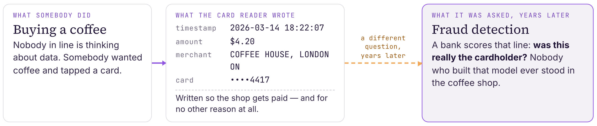

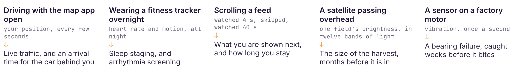

---
### Too much to read by hand

To process all of that data (the coffee data collected in the last example) it would be inefficient to read all of the lines in the file.

So there are three solutions:

1. **Look at less of it**:
	- Only read a sample of a thousand rows (Your chosen sample might not contain enough fraud cases or none at all)
2. **Write the rules by hand**:
	- You are told what a fraud case looks like and you code it as so (if the world changes then what a fraud looks like might change, thus, rendering your code useless)
3. **Have a machine find the rules**:
	- Show the machine the answers you already know (the fraud and non-frauds cases) and let it figure out what separates them.
	- This course answers **How?**

### Three words, three decades

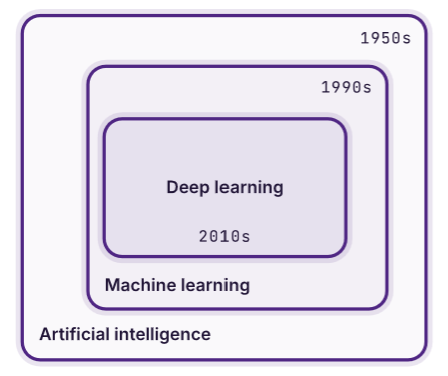

1. **Artificial intelligence**
	- The effort to automate intellectual tasks normally performed by people.
	- This includes systems that have no implicit learning at all (a chess engine searching moves, or a tax program running rules an expert wrote by hand)
2. **Machine learning**
	- These are programs that find the rules themselves using the data given to them
	- This took off when the data and hardware improved to a point that the older mathematics could use them.
3. **Deep learning**
	- This is basically just MLP (Multi-layer Perceptron) in the way that it is machine learning that builds its representation in successive layers.
	- The word **"deep"** refers to the number of layers used, not the insight that is produced.
	- Might be called **Layered** or **Hierarchical** representation learning as the model learns that to measure as well as what to conclude.

Machine Learning took a while to take off because of the state of data and hardware at the time.

Most of the mathematics behind machine learning was published before 1920 but there wasn't enough stored data to fit a model and the hardware was not fast enough to fit it.

---
### What every machine learning problem needs

1. **Input data** (Something measurable about each case, in a form a program can read)
2. **Expected output** (The right answer for each of those cases, from someone or something you trust)
3. **A measure of wrong** (A number saying how far the answer is form that right answer (and that can be made smaller))

For example:

**Speech recognition**:
- A few thousand numbers describing one slice of sound
- What a human typist heard in that slice
- How many characters the transcript got wrong

**Tomorrow's power demand**:
- The outside temperature that day, in degrees Celsius
- The power actually drawn that day, in megawatt hours
- How far the prediction landed from the real demand

> Focus on the third one (A measure of wrong). A program that has no way to prefer one answer over another cannot get better at anything.
> Choosing that measure is a modeling decision which we will get to later.

PCA (Check it out later)

---
#### Learning is a search for better coordinates

Learning finds the parameters of a mapping that sends the inputs into a space where the classes separate.

This is the raw input space data (no mapping learning)

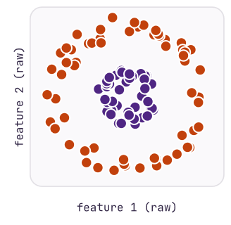

This is the learned mapping ("Distance form the center" was chosen by a human who could see the picture, but it is not what happens in deep learning)

❗(Picture of Learned Mapping goes here once prof makes slides interactive)

> Something to note is that the only thing that changed was the coordinates of the points. This new set of coordinates is called a **representation**.

Working out the mapping from the data is what the *learning* in **deep learning** refers to and why those models need far more data than anything here.

### Where this is already deployed

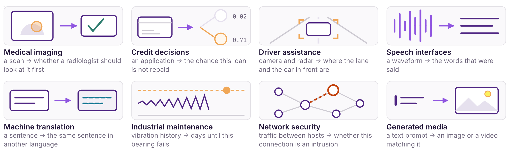

> Every one of these examples has the same **shape**.
> Something measurable goes in, and one answer, that was learned from the examples, comes out.

### What a dataset actually is

A dataset is basically just a table that can have three parts.

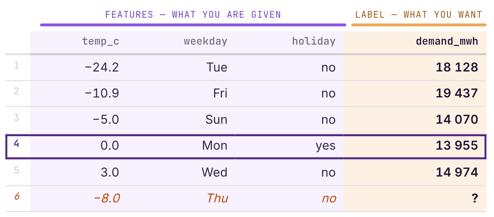

**Feature**: The data that you are given

**Label**: The outcome/result that you want

A **Feature column** is sometimes called: attribute, predictor, covariate, independent variable, or input

A **Label column** is sometimes called: target, response, outcome, dependent variable, or ground truth

A **Row** is sometimes called: instance, observation, example, sample, or record

## The 3 Learning Paradigms

### Question
What can you still learn when a label column is missing or when the only feedback you ever get is a score that arrives after the decision?

### Goal
Sort a new problem into supervised, unsupervised or reinforcement learning, and say what its data would have to look like.

### Supervised Learning

> **The data contains Feature columns AND Labeled columns**

Think of the question being: **"Predict something given this data"**

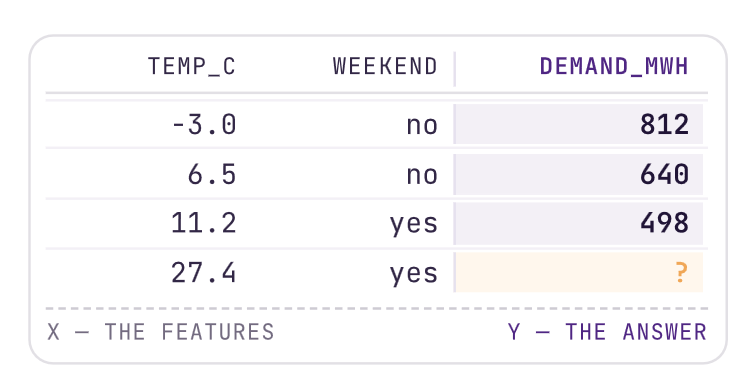

We have **2 categories**:

**Regression**

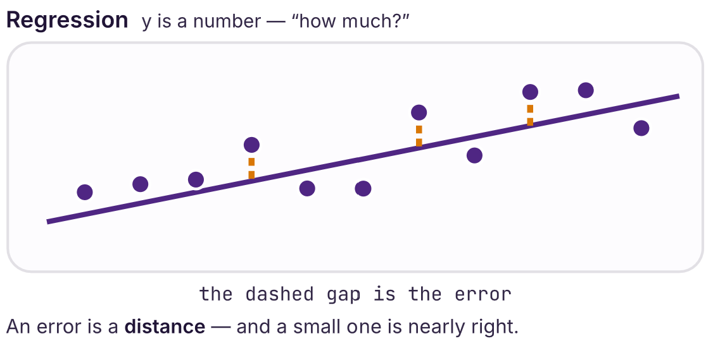

**Classification**

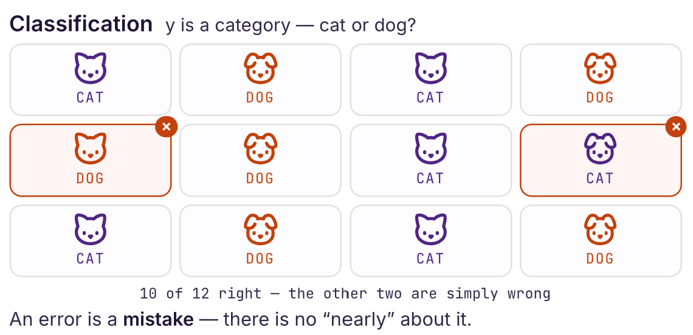

### Unsupervised Learning

> **The data only contains Feature columns**

Think of the question being: **"What is already a part of this data"**

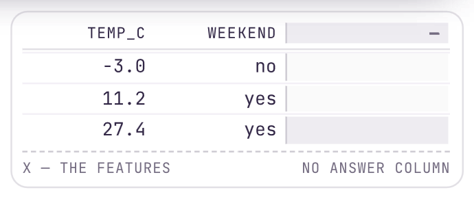

We have **2 categories**:

**Clustering**

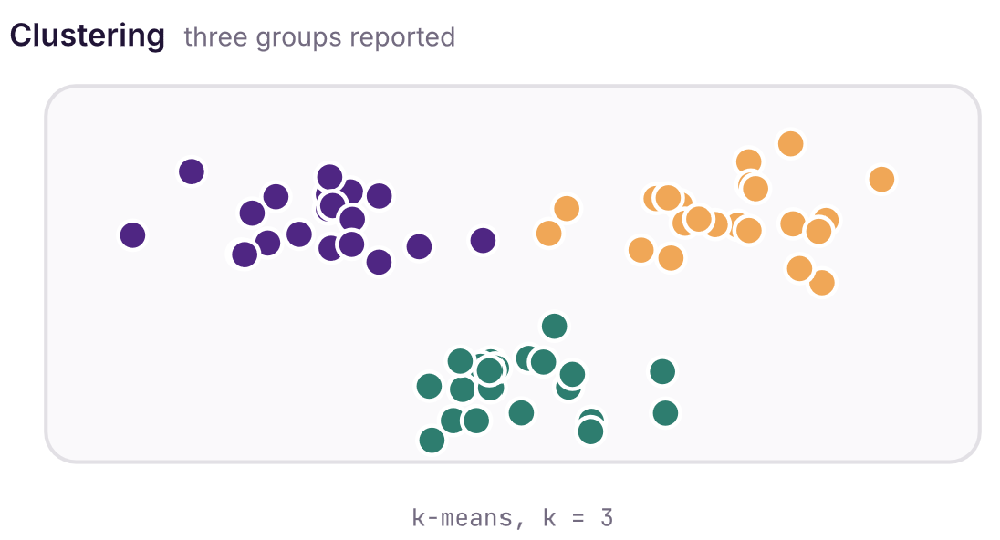

**Dimensionality reduction**

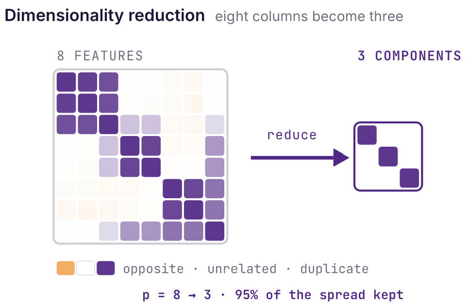

With no label columns (the expected outputs), how do we know that the mo
### Reinforcement Learning

> **There is no dataset at all**

()