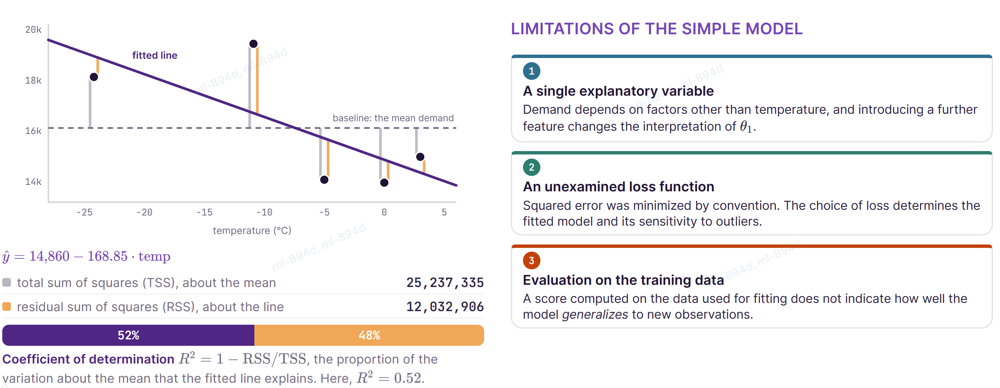

## Recap of Lecture 1

In Lecture 1, we fitted a **simple linear regression** to some data. We calculated its **Coefficient of Determination** ($R^{2} = 0.52$) on the training data and the limitations of that result is what we want to talk about in Lecture 2.

## Notation

- m: The number of **rows** (training examples).
- n: The number or **columns** (features).
- $x^{(i)}$: One **row** written as a **column vector** (vertically). $i$ = row number
- $\theta$: The **weights**, one per column plus the **intercept** ($\theta_{0}$)
- $x^{\top}\theta$: Multiply corresponding entries and sum: $\theta_{0} + x_{1}\theta_{1} + x_{2}\theta_{2} + \cdots$ The $\top$ (transpose) turns the **column** into a **row**.
- $y^{(i)}$: The **observed** target row $i$, which is **unknown** in advance.
- $\hat{y}^{(i)}$: The model's **prediction** for that row. A hat always denotes an **estimate**, not a measurement.
- H: All rows stacked into one **matrix**: The design matrix, the entire dataset as one object.

A common source of confusion: $x^{(3)}$ is the third row, $$