## The 5 parts

1. [From One Feature to Many](#from-one-feature-to-many)
2. [Solving for the Weights](#solving-for-the-weights)
3. [Choosing a Loss](#choosing-a-loss)
4. [Judging Generalization](#judging-generalization)
5. [Exploring a Real Dataset](#exploring-a-real-dataset)

> Remember **Part 4** the most: a score on the training rows is not a result you can report. Give the model enough weights and it scores $R^{2} = 1.00$ on the days it was fitted to, and misses a new day by far more than the straight line did.

## From One Feature to Many

### Question
What changes when the model gets a second feature, or a hundredth? Do you only add terms, or does the meaning of the first coefficient change as well?

### Goal
Write a model with any number of features, pack the whole dataset into one matrix, and say what one coefficient means while the others are in the model.

### Recap of Lecture 1

In Lecture 1, we fitted a **simple linear regression** to some data. We calculated its **Coefficient of Determination** ($R^{2} = 0.52$) on the training data and the limitations of that result is what we want to talk about in Lecture 2.


Three limits of that fit, and this lecture takes them in order:

1. **One feature.** Demand depends on more than temperature. Add another column and $\theta_{1}$ changes its meaning.
2. **The loss was never questioned.** Squared error was minimized because that is the usual choice. The loss decides the fitted model, and how much one wild point can drag it.
3. **The score was on the training rows.** A number computed on the data used for fitting does not say how the model does on a new day.

### Notation

- m: The number of **rows** (training examples).
- n: The number of **columns** (features).
- $x^{(i)}$: One **row** written as a **column vector** (vertically). $i$ = row number
- $\theta$: The **weights**, one per column plus the **intercept** ($\theta_{0}$)
- $x^{\top}\theta$: Multiply corresponding entries and sum: $\theta_{0} + x_{1}\theta_{1} + x_{2}\theta_{2} + \cdots$ The $\top$ (transpose) turns the **column** into a **row**.
- $y^{(i)}$: The **observed** target row $i$, which is **unknown** in advance.
- $\hat{y}^{(i)}$: The model's **prediction** for that row. A hat always denotes an **estimate**, not a measurement.
- H: All rows stacked into one **matrix**: The design matrix, the entire dataset as one object.

A **common source of confusion**: $x^{(3)}$ is the entire third row (n cells), $x_{2}$ is the entire second feature column (m cells), and $x_{2}^{(3)}$ is the second feature of the third row (one cell).

Here $m = 5$ (five days) and $n = 2$ (temperature, and business day). Bold marks a vector or a matrix. None of these indices is an exponent.

### Simple linear regression, one row at a time

Lecture 1's line, with day 2 pulled out so the residual is visible.

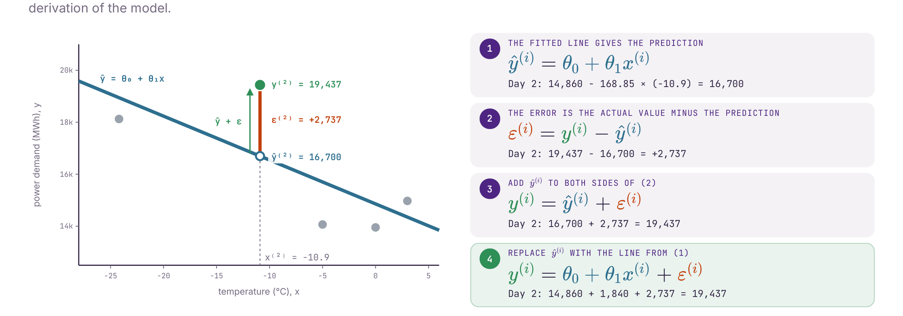

Day 2 was $-10.9^{\circ}\mathrm{C}$. The line from Lecture 1 is $\hat{y} = 14{,}860 - 168.85 \times \mathrm{temp}$.

1. The line gives the prediction.
	- $\hat{y}^{(i)} = \theta_{0} + \theta_{1} x^{(i)}$
	- Day 2: $14{,}860 - 168.85 \times (-10.9) = 16{,}700$
2. The error is the actual value minus that prediction.
	- $\varepsilon^{(i)} = y^{(i)} - \hat{y}^{(i)}$
	- Day 2: $19{,}437 - 16{,}700 = +2{,}737$
3. Add the prediction back.
	- $y^{(i)} = \hat{y}^{(i)} + \varepsilon^{(i)}$
	- Day 2: $16{,}700 + 2{,}737 = 19{,}437$
4. Replace the prediction with the line.
	- $y^{(i)} = \theta_{0} + \theta_{1} x^{(i)} + \varepsilon^{(i)}$
	- Day 2: $14{,}860 + 1{,}840 + 2{,}737 = 19{,}437$

The $1{,}840$ is the temperature term on its own: $-168.85 \times (-10.9)$.

### From one feature to several

The error is defined the same way. The model just gains terms.

**Simple (one feature):**

$\hat{y} = f(x) = \theta_{0} + \theta_{1} x$

$y^{(i)} = \theta_{0} + \theta_{1} x^{(i)} + \varepsilon^{(i)}$

**Multiple (several features):**

$\hat{y} = \theta_{0} + \theta_{1} x_{1} + \theta_{2} x_{2} + \cdots + \theta_{n} x_{n}$

$y^{(i)} = \theta_{0} + \sum_{j=1}^{n} \theta_{j} x_{j}^{(i)} + \varepsilon^{(i)}$

**Univariate** regression has one input. **Multivariate** regression has several, $x_{1}, \ldots, x_{n}$. The target is still one number per row. The job is still the same: find the $\theta$ values that make the errors small.

### The five days, with a second column

Same five days as Lecture 1. The new column is whether the day was a business day. A calendar already has it.

The **predicted** column below still uses temperature alone ($\hat{y} = 14{,}860 - 168.85 \times \mathrm{temp}$). **Miss** is the gap that line leaves.

| Day | Temp °C | Business day | Demand (MWh) | Predicted | Miss |
| --- | ------- | ------------ | ------------ | --------- | ---- |
| 1   | -24.2   | yes          | 18,128       | 18,946    | -818 |
| 2   | -10.9   | yes          | 19,437       | 16,700    | +2,737 |
| 3   | -5.0    | no           | 14,070       | 15,704    | -1,634 |
| 4   | 0.0     | no           | 13,955       | 14,860    | -905 |
| 5   | 3.0     | yes          | 14,974       | 14,353    | +621 |

A yes/no column is stored as 1 and 0. Same days, a spelling the model can multiply.

Two things in this table drive the rest of the lecture:

- Day 2 is where temperature alone fails. Mild day, highest demand, and the line is 2,737 MWh low.
- The two coldest days are both business days. Five rows, and that is an accident, but a model with only temperature cannot tell "cold" apart from "people are at work".

### A prediction is a running total

Start from the intercept, the prediction you would make with no information, then let each feature shift it.

The picture uses a **guess**, $\theta = (14{,}000,\ -150,\ 2{,}000)$, not the Lecture 1 fit. Lecture 1's temperature slope on these days was $-168.85$.

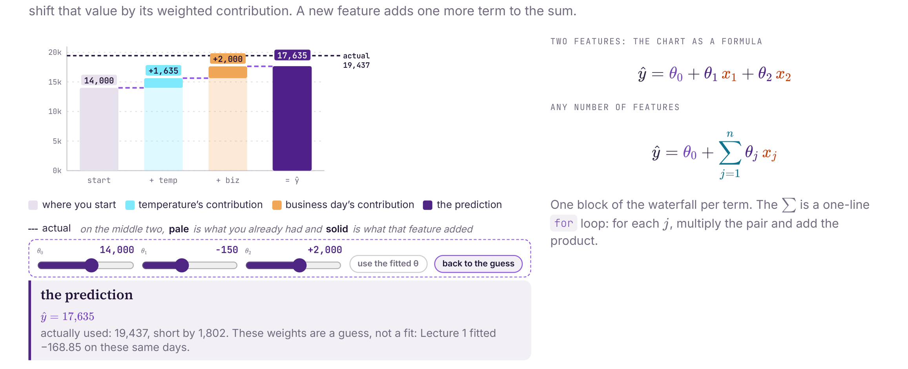

Day 2, with that guess:

- Start: $\theta_{0} = 14{,}000$
- Temperature: $(-10.9) \times (-150) = +1{,}635$
- Business day: $1 \times 2{,}000 = +2{,}000$
- Prediction: $14{,}000 + 1{,}635 + 2{,}000 = 17{,}635$

Actual demand was 19,437, so this guess is short by 1,802.

For any number of features the same chart is one line:

$$\hat{y} = \theta_{0} + \sum_{j=1}^{n} \theta_{j} x_{j}$$

The sum is a for loop. For each $j$, multiply the pair and add the product. A new feature is one more block in the waterfall.

### A coefficient belongs to the model it was fitted in

The same five days, fitted twice. Left: temperature only. Right: temperature and business day.

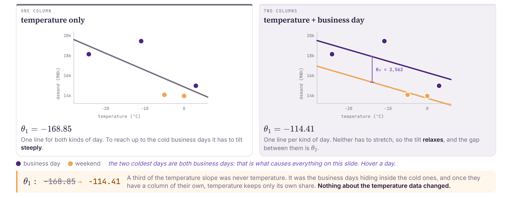

| Model | $\theta_{1}$ (MWh per °C) | What the picture is doing |
| ----- | ------------------------- | ------------------------- |
| Temperature only | -168.85 | One line for both kinds of day. To reach the cold business days it has to tilt steeply. |
| Temperature + business day | -114.41 | One line per kind of day. The gap between them is $\theta_{2} = 2{,}562$. Neither line has to stretch, so the tilt relaxes. |

About a third of the temperature slope was never temperature. It was the business days hiding inside the cold ones. Once those days have a column of their own, temperature keeps its own share. The temperature numbers did not change.

Read every weight as **the difference this feature makes, holding the others fixed**. Expect it to move when you add or drop a column. $\theta_{1}$ is a property of the model, not a property of the temperature column.

### One row as a dot product

Every term pairs a weight with one entry of the row. Put a 1 in front so the intercept has something to multiply.

Day 2, still with the guess $\theta = (14{,}000,\ -150,\ 2{,}000)$:

$$
\begin{aligned}
(x^{(2)})^{\top} \theta
&= 1 \times 14{,}000 + (-10.9) \times (-150) + 1 \times 2{,}000 \\
&= 14{,}000 + 1{,}635 + 2{,}000 \\
&= 17{,}635
\end{aligned}
$$

So one row of the model is

$$y^{(i)} = (x^{(i)})^{\top} \theta + \varepsilon^{(i)}$$

The transpose is only there so a column of features can meet a column of weights. $(x^{(i)})^{\top}$ is $1 \times (n+1)$ and $\theta$ is $(n+1) \times 1$.

### The design matrix

Stack every row, each with a leading 1, and you get **H**, the design matrix. The slides also write $H = X^{\top}$, so $X$ is that same table turned on its side. Every prediction at once is one product:

$$\hat{y} = H\theta = X^{\top}\theta$$

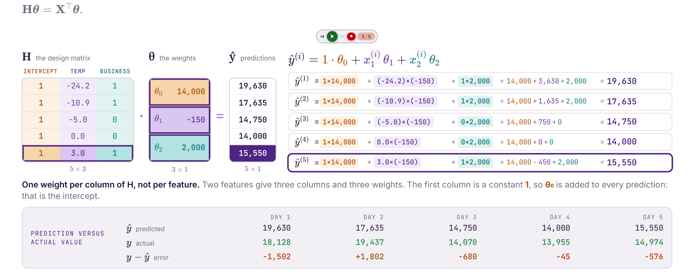

**One weight per column of H, not per feature.** Two features give three columns and three weights. The first column is a constant 1, so $\theta_{0}$ is added to every prediction. That is the intercept.

With the guess above, the five predictions are 19,630, 17,635, 14,750, 14,000, and 15,550. Against the real demand the errors are $-1{,}502$, $+1{,}802$, $-680$, $-45$, and $-576$.

In many textbooks the design matrix is called $X$, with one row per example, and the formula is written $\theta = (X^{\top}X)^{-1}X^{\top}y$. That $X$ is our $H$.

### Residual sum of squares as one product

Lecture 1 added the squared errors one row at a time. Five steps turn that sum into one product. It is the same product for five rows or five million.

1. One row's error: $\varepsilon^{(i)} = y^{(i)} - (x^{(i)})^{\top}\theta$
2. Square them and add: $\mathrm{RSS}(\theta) = \sum_{i=1}^{m} (\varepsilon^{(i)})^{2}$
3. Stack the errors into one column: $\varepsilon = y - X^{\top}\theta$
4. A row times that column squares every entry and adds them: $\mathrm{RSS}(\theta) = \varepsilon^{\top}\varepsilon$
5. Put step 3 into step 4. Only $\theta$ is free. $y$ and $X$ are the days already recorded.

$$\mathrm{RSS}(\theta) = (y - X^{\top}\theta)^{\top}(y - X^{\top}\theta)$$

For the guess $\theta = (14{,}000,\ -150,\ 2{,}000)$ that product is $6{,}299{,}409$.

A smaller example, so the arithmetic fits on a page. Three days, $H$ is $3 \times 2$, and the guess is $\hat{y} = 2x$ (so $\theta_{0} = 0$, $\theta_{1} = 2$).

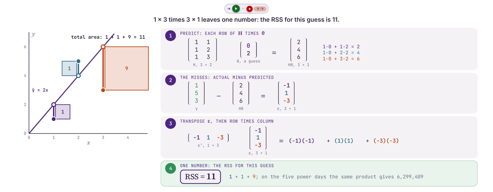

$$
H\theta =
\begin{bmatrix} 1 & 1 \\ 1 & 2 \\ 1 & 3 \end{bmatrix}
\begin{bmatrix} 0 \\ 2 \end{bmatrix}
=
\begin{bmatrix} 2 \\ 4 \\ 6 \end{bmatrix}
$$

Actual $y = (1,\ 5,\ 3)$, so $\varepsilon = (-1,\ 1,\ -3)$.

$$\varepsilon^{\top}\varepsilon = (-1)(-1) + (1)(1) + (-3)(-3) = 11$$

The squares on the plot are those three terms: areas 1, 1, and 9. The best line on these three days is $\hat{y} = 1 + x$, with misses $-1,\ 2,\ -1$ and RSS 6. No line does better. The next part is how a computer finds that $\theta$ without guessing.

## Solving for the Weights

### Question
There are infinitely many candidate values of $\theta$. How does a computer find the best one, and is there more than one method?

### Goal
Solve a regression exactly with the normal equation, approximate it with gradient descent, say when each one is the right tool, and say why the features are standardized before descent.

### The normal equation

Lecture 1 found the best line by setting each slope of the RSS to zero. On the three days that rule produces two equations, one per weight.

The days are $(x, y) = (1, 1),\ (2, 5),\ (3, 3)$, with a column of 1s for the intercept. For each weight, multiply every miss by that weight's column, add, and set the total to 0.

For $\theta_{0}$ the column is all 1s, and the equation simplifies to

$$9 = 3\theta_{0} + 6\theta_{1}$$

For $\theta_{1}$ the column is $x$, and it simplifies to

$$20 = 6\theta_{0} + 14\theta_{1}$$

The 14 is $x \cdot x$ added up. That is where the $x^{2}$ in the usual slope formula comes from.

Every number in those two equations is one data column times another, added over the days. The matrix product $XX^{\top}$ computes exactly those sums, and $Xy$ is the right-hand side:

$$
XX^{\top} =
\begin{bmatrix} 3 & 6 \\ 6 & 14 \end{bmatrix},
\qquad
Xy =
\begin{bmatrix} 9 \\ 20 \end{bmatrix}
$$

So Lecture 1's two equations are one matrix equation, for any number of features:

$$(XX^{\top})\theta = Xy$$

Solve it by multiplying on the left by the inverse (the matrix version of dividing):

$$\theta = (XX^{\top})^{-1} Xy$$

On the three days that returns $\theta_{0} = 1$, $\theta_{1} = 1$. On the five power days the same formula returns

| Weight | Value | In words |
| ------ | ----- | -------- |
| $\theta_{0}$ | 13,726 | MWh on a 0 °C day that is not a business day |
| $\theta_{1}$ | -114 | MWh for each degree warmer |
| $\theta_{2}$ | 2,562 | MWh more on a business day |

(The two-line plot labels the temperature slope $-114.41$. Same fit, rounded.)

This is what `LinearRegression().fit()` computes.

**Where it fails.** Inverting $XX^{\top}$ gets slow as the number of weights grows. It also fails when one column is a copy or a mix of the others, such as temperature stored in both °C and °F. The data cannot say how to split the effect between those two columns, so there is no single best $\theta$.

### What the formula is made of

$$\theta = (XX^{\top})^{-1} Xy$$

Three pieces, worth being able to name:

1. **$XX^{\top}$**, the square part. It is $(n+1) \times (n+1)$, however many rows you have. Five days: $3 \times 3$. The housing data later is 506 rows and 13 features, and this block is still only $14 \times 14$.
2. **The inverse.** This is the piece that can fail. It exists only when no column is a copy or a combination of the others.
3. **$Xy$**, where the answer comes from. Each column of the data, weighted against the target. The square part on the left divides out whatever the columns share, so each weight is credited only with what its own column contributes.

> Do not call `inv()` in real code. The inverse is the clearest way to *write* the formula. Computing one is slower and numerically worse than solving the system. Use `np.linalg.solve`, or better `np.linalg.lstsq`, which never forms $XX^{\top}$ at all and stays accurate when two columns nearly overlap. Library code, including what you will call in the lab, does it this way.

### The gradient

A function of several weights has one slope per weight, each taken with the others held fixed. The **gradient** is those slopes stacked.

$$\nabla \mathrm{RSS} =
\begin{bmatrix}
\partial \mathrm{RSS} / \partial \theta_{0} \\
\partial \mathrm{RSS} / \partial \theta_{1} \\
\vdots
\end{bmatrix}$$

The surface in the slides is drawn with two weights so it can be a picture. Today's model has three.

- Walk along $\theta_{0}$ only, $\theta_{1}$ held still, and the surface becomes an ordinary curve with one slope, $\partial \mathrm{RSS} / \partial \theta_{0}$.
- Walk along $\theta_{1}$ only and you get a different slope through the same point.
- Stack them and they point in the direction of steepest increase.

Descent moves the other way, which is why the update has a minus sign. At the bottom every slope is zero at once: one equation per weight. The normal equation is the solution of exactly those equations.

### Gradient descent

Same procedure as Lecture 1, now with one gradient entry per weight.

1. Initialize $\theta$ to anything. The start does not matter for this problem.
2. Compute the gradient at the current $\theta$.
3. Step the other way. The step size is $\alpha$, the learning rate. **We set $\alpha$. The model does not.**
4. Repeat until the gradient is small enough.

$$\theta^{(\tau+1)} \leftarrow \theta^{(\tau)} - \alpha \, \nabla \mathrm{RSS}(\theta^{(\tau)})$$

$\theta^{(\tau)}$ means the weights after $\tau$ steps.

The minus sign is the whole method. The gradient points toward increasing cost. We want the minimum, so we walk against it. A plus sign would climb as fast as possible.

The steps get shorter on their own as the ground flattens, because the gradient itself shrinks.

### Why iterate, and when to stop

Least squares has a formula. Three reasons to iterate anyway:

1. **Most models have no formula.** Setting the gradient to zero gives equations algebra can solve for least squares. For logistic regression and for neural networks it does not.
2. **Many features.** The normal equation's work grows with the cube of the number of weights. One descent step is a single pass over the data.
3. **Memory.** A step can use a small batch of rows, so the table never has to fit in memory. That version is stochastic gradient descent.

Descent gets closer every step and never lands exactly. Stop once the cost is nearly flat in every direction:

$$\|\nabla \mathrm{RSS}(\theta^{(\tau)})\| < \mathrm{tol}$$

The left side is one number, however many weights you have: the square root of the sum of the squared slopes. **tol** is chosen before the run, often $0.001$. A smaller tolerance gives a more precise answer and takes more steps.

On the slide's example, $\mathrm{tol} = 0.20$ and the length of the gradient falls under it at step 7 (the length there is 0.15), so the loop stops.

### Local minima and saddle points

Descent stops where the gradient is zero. On some surfaces that point is not the global minimum, and which one you hit depends on where you started.

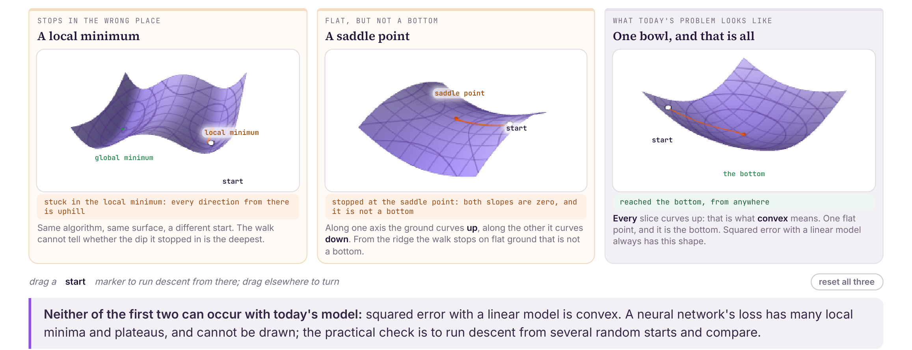

- **Local minimum.** Every direction from there is uphill. The walk cannot tell whether the dip it stopped in is the deepest.
- **Saddle point.** Both slopes are zero, and it is not a bottom. Along one axis the surface curves up, along the other it curves down.
- **One bowl.** Every slice curves up. That is what **convex** means. One flat point, and it is the bottom, from any start.

Squared error with a linear model is convex. Neither of the first two can happen to today's fit. A neural network's loss has many local minima and flat stretches. The practical check is to run descent from several random starts and compare the answers.

### Standardize before you descend

Put temperature (about $-24$ to $3$) next to a $0/1$ column and the cost surface becomes a long thin valley: steep walls, a flat floor. Descent zigzags. On the slide, 26 steps on the raw columns are still 41% of the way from the minimum. The same 26 steps on standardized columns have already arrived, and they arrived at step 7.

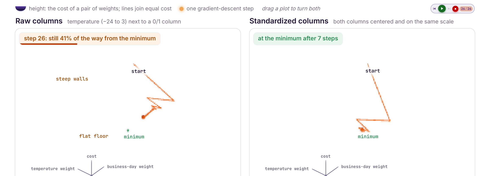

For every column, subtract its mean $\bar{x}$, then divide by its standard deviation $s$:

$$z = \frac{x - \bar{x}}{s}$$

Every column is then centered at 0 with standard deviation 1, so no column's units decide the shape of the bowl.

On these five days:

- Temperature: mean $-7.4$, standard deviation $9.6$, so $-24.2$ becomes $-1.7$.
- Business day: mean $0.6$, standard deviation $0.49$, so a 1 becomes $0.82$.

Scaling changes the search. The fitted model, the predictions, and $R^{2}$ stay the same. What changes is how fast gradient descent reaches the minimum. The normal equation does not need this step. It has no path to walk.

> Fit the scaler on the **training rows only**. A scaler fitted on every row has already seen the test set, and that leaks test information into training.

### Which solver

Both find the same $\theta$ on this problem. The choice is about how many **columns** you have.

| | Normal equation | Gradient descent |
| --- | --- | --- |
| How | Exact. One shot. No step size. | Approximate. Stops when you say so. |
| Work | $mn^{2} + n^{3}/3$ | $2mn$ per step |
| Breaks when | $XX^{\top}$ cannot be inverted, the moment two columns say the same thing | It never forms $XX^{\top}$, so a duplicated column only costs time |

At $m = 1{,}000$ rows and $n = 10$ features the normal equation is about 100 thousand operations. Descent at 200 steps is about 4.0 million. The two cost the same at about 357 features, so with 10 features you solve it exactly.

Move the row count across its whole range and that crossover barely shifts. Move the feature count one notch and it changes everything. The power on $n$ is what decides this. The normal equation's limit is wide data, not tall data.

## Choosing a Loss

### Question
We have squared the errors since Lecture 1 without asking why. What else could we minimize, and what did squaring decide for us?

### Goal
Define a loss, read its shape off a graph, explain what squaring does when the data contain an outlier, and choose a loss on purpose.

### What a loss is

A **loss** takes one prediction and the true value and returns a number for that one row. Read $L(y^{(i)}, \hat{y}^{(i)})$ as the cost of predicting $\hat{y}^{(i)}$ when the truth is $y^{(i)}$.

Three layers sit on top of each other:

1. **The loss**, per row. One prediction in, one number out.
2. **The training error.** That loss, averaged over the training rows.
3. **The fit.** Choose the $\theta$ that makes the training error smallest. That is what fitting means.

The two classical ones:

- **L1, absolute error.** An error of 200 costs twice an error of 100. Minimizing the sum is least absolute deviation.
	- $L = |y - \hat{y}|$
- **L2, squared error.** An error of 200 costs four times an error of 100. Minimizing the sum is ordinary least squares, which is everything so far.
	- $L = (y - \hat{y})^{2}$

### Squared, absolute, and Huber

Let $r = y - \hat{y}$ be the miss. **Huber** loss is a parabola near 0 and a straight line once the miss gets past a threshold $\delta$.

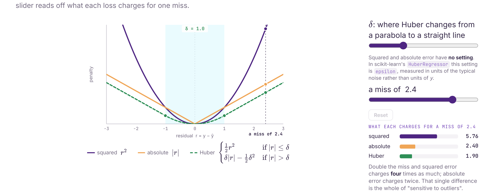

$$
L_{\delta}(r) =
\begin{cases}
\tfrac{1}{2} r^{2} & \text{if } |r| \le \delta \\
\delta |r| - \tfrac{1}{2}\delta^{2} & \text{if } |r| > \delta
\end{cases}
$$

Squared error and absolute error have no knob. Huber does. In scikit-learn's `HuberRegressor` that knob is `epsilon`, and it is measured in units of the typical noise, not in units of $y$.

With $\delta = 1$ and a miss of 2.4, the three losses charge 5.76, 2.40, and 1.90. Double the miss and squared error charges four times as much. Absolute error charges twice. That difference is the whole of "sensitive to outliers".

### What an outlier does to the line

Eleven points stay put. One point is dragged off the cloud.

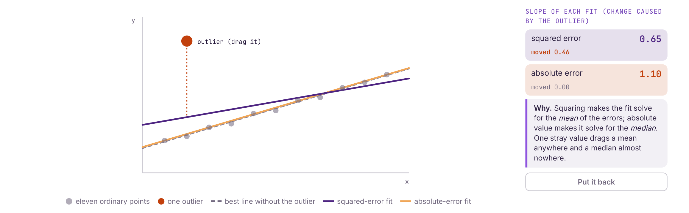

On the slide, with the outlier parked up high:

| Fit | Slope | How far the outlier moved it |
| --- | ----- | ---------------------------- |
| Squared error | 0.65 | 0.46 |
| Absolute error | 1.10 | 0.00 |

Squaring makes the fit solve for the **mean** of the errors. Absolute value makes it solve for the **median**. One stray value drags a mean. A median stays put.

### The losses you will actually call

| Name | What it averages | A large miss | Outliers |
| ---- | ---------------- | ------------ | -------- |
| MSE | squared error | counts extra (the square) | High |
| MAE | absolute error | counts in proportion to its size | Low |
| Poisson | $\hat{y} - y \log \hat{y}$, for counts | underestimating a count costs more than overestimating it | Low |
| Huber | squared while the miss is within $\delta$, then absolute | in between the two | Moderate |

Poisson is a negative log-likelihood, used when the target is a count. The outlier column is the loss curves from the previous picture: squaring weights a large error heavily, absolute error does not, Huber is squared for small errors and absolute past $\delta$.

### From RSS to a number in megawatt hours

Part 2 minimized the residual sum of squares. Two arithmetic steps turn that total into a number you can say out loud. These figures are the **fitted** five-day model, not the guess from earlier (that guess had RSS $6{,}299{,}409$).

| | Name | Value | What it means |
| --- | --- | --- | --- |
| A total | RSS | 5,526,706 | Megawatt hours squared. Grows every time you add a row, so two datasets of different sizes cannot be compared on it. |
| Divide by $m$ | MSE | 1,105,341 | Per row, so it is comparable across datasets. Still in squared units. |
| Square root | RMSE | 1,051 | Megawatt hours. Typically off by about 1,000 MWh. A squared megawatt hour is not something you can report. |

$$\mathrm{MSE} = \frac{1}{m}\sum_{i=1}^{m}(y^{(i)} - \hat{y}^{(i)})^{2} = \frac{\mathrm{RSS}}{m}, \qquad \mathrm{RMSE} = \sqrt{\mathrm{MSE}}$$

Why divide by the number of rows? Not for the algorithm. Dividing by a fixed number cannot move the minimum, so the same $\theta$ wins either way. (It does rescale the gradient, and that rescaling can be absorbed into $\alpha$.) The division is for interpretation: a total reflects how big the dataset is, and an average reflects the model.

## Judging Generalization

### Question
Every score so far was computed on the rows used to fit the model. What is that score worth, and what should be reported instead?

### Goal
Explain why training error flatters the model, read $R^{2}$ as the fraction of baseline error removed, explain why training $R^{2}$ can only rise as you add weights, and pick the metric that matches what you are reporting.

### A perfect training score can be a bad model

Adding powers of temperature makes the equation more flexible. Flexible enough, and the curve passes through every training point.

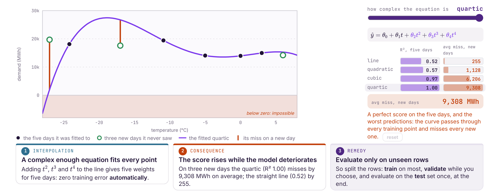

$$\hat{y} = \theta_{0} + \theta_{1} t + \theta_{2} t^{2} + \theta_{3} t^{3} + \theta_{4} t^{4}$$

| Model | $R^{2}$ on the five days | Average miss on three new days |
| ----- | ------------------------ | ------------------------------ |
| Line | 0.52 | 255 MWh |
| Quadratic | 0.57 | 1,128 MWh |
| Cubic | 0.97 | 6,206 MWh |
| Quartic | 1.00 | 9,308 MWh |

1. **Interpolation.** Adding $t^{2}$, $t^{3}$, and $t^{4}$ gives five weights for five days. Training error is zero automatically. The curve passes through every point it was shown.
2. **The score goes up while the model gets worse.** On three new days the quartic ($R^{2} = 1.00$) misses by 9,308 MWh on average. The straight line (0.52) misses by 255. The quartic also predicts negative demand, which cannot happen.
3. **Score rows the model has not seen.** This is the split from Lecture 1. Train on most of the rows, use a validation set while you are still choosing, and touch the test set once, at the end.

### R-squared

$$R^{2} = 1 - \frac{\mathrm{RSS}}{\mathrm{TSS}}$$

**TSS** is how far the points sit from the flat line at the mean demand. **RSS** is how far they sit from your line. $R^{2}$ is the share of that baseline error your line removes.

On the five days, at the Lecture 1 fit $\theta_{1} = -168.85$:

- The flat mean line misses by $\mathrm{TSS} = 25{,}237{,}335$
- The fitted line still misses by $\mathrm{RSS} = 12{,}032{,}906$
- $R^{2} = 0.523$. No other tilt of a straight line scores higher on these rows.

A flat line scores $0$, because then RSS = TSS. Tilt the line the wrong way and $R^{2}$ goes **negative**: you did worse than predicting the mean. The "between 0 and 1" rule holds for a fitted line on its training rows. On new rows, or for a line you tilted by hand, it does not.

Training $R^{2}$ can only stay the same or rise when you add a weight. A useless column cannot push it down. That is why training $R^{2}$ cannot choose between models that have different numbers of features.

### Metrics for a regression report

$m$ is the number of rows (test rows, when you are reporting a test score). $p$ is the number of features. Some books write $n$ for the rows, which collides with our $n$.

| Name | What you are reporting | Outliers |
| ---- | ---------------------- | -------- |
| RMSE | Typical miss, in the units of $y$. Large misses count extra. | High |
| $R^{2}$ | Share of the variation in $y$ that the model removes | Indirect, through the residuals |
| Adjusted $R^{2}$ | $R^{2}$ with a penalty for how many predictors you used | Same as $R^{2}$ |
| MAE | Average absolute miss. Every miss counts in proportion to its size. | Low |
| MAPE | Those misses as a percent of the actual value | High |
| Explained variance | Share of $\mathrm{Var}(y)$ captured by the predictions | Not what this one is for |

$$\mathrm{MAPE} = \frac{100}{m}\sum_{i=1}^{m}\left|\frac{y_{i} - \hat{y}_{i}}{y_{i}}\right|,
\qquad
\text{explained variance} = 1 - \frac{\mathrm{Var}(y - \hat{y})}{\mathrm{Var}(y)}$$

MAPE is sensitive because a small $y_{i}$ in the denominator blows a modest miss up into a huge percent. Pick the row of this table that matches the sentence you want to write. RMSE when you want "off by about this many megawatt hours". MAE when a few bad days should not dominate. $R^{2}$ when you want the comparison against predicting the mean.

### Adjusted R-squared

Training $R^{2}$ rises or stays flat when a feature is added, so a model with more columns always looks at least as good. Adjusted $R^{2}$ is the version that can fall.

$$R^{2}_{\mathrm{adj}} = 1 - (1 - R^{2})\frac{m - 1}{m - p - 1}$$

As $p$ grows, the fraction on the right grows, so the leftover error counts for more. A new column has to earn more than it costs. A useless one drives the number down.

| Model | $p$ | $R^{2}$ | Adjusted $R^{2}$ |
| ----- | --- | ------- | ---------------- |
| Temperature only | 1 | 0.523 | 0.364 |
| Temperature + business day | 2 | 0.781 | 0.562 |

Both go up, so the second feature is justified even after the penalty. With five rows and two features the penalty is severe: 0.781 falls to 0.562. With a few hundred rows the same penalty barely moves.

It penalizes the **number** of features. It has no idea whether a column generalizes. It is a better in-sample comparison than $R^{2}$. It is not a substitute for a test set. Use adjusted $R^{2}$ to compare models fitted on the same training rows. Use a test set to find out whether any of them work.

## Exploring a Real Dataset

### Question
Before fitting a model to a real dataset, what should we look at, and how do we load it?

### Goal
Load a dataset with pandas, describe every column, and use a correlation heatmap and scatter plots to pick features.

### 506 towns, 14 columns

Each row is one town near Boston in 1978, not one house. Thirteen columns describe the town. The last one, **MEDV**, is what we want to predict: median home value, in thousands of dollars.

| Column | What it measures |
| ------ | ---------------- |
| CRIM | Per capita crime rate |
| ZN | Share of land zoned for large residential lots |
| INDUS | Share of land used by non-retail business |
| CHAS | 1 if the town borders the Charles River, else 0 |
| NOX | Nitric oxides in the air |
| RM | Average number of rooms per home |
| AGE | Share of homes built before 1940 |
| DIS | Distance to five employment centers |
| RAD | Index of access to radial highways |
| TAX | Property-tax rate per $10,000 |
| PTRATIO | Pupil-teacher ratio |
| B | A function of the proportion of Black residents. Left out of the model. |
| LSTAT | Percent of residents with lower socioeconomic status |
| MEDV | The target. Median home value, in $1000s |

The columns before MEDV are the features, and MEDV is $y$. Once B is set aside, that is 12 features. Each town is one row of $H$ and one entry of $y$, the same shape as Part 1.

### Loading it

scikit-learn shipped this file as `load_boston()` until version 1.2 (2022), then removed it because of the B column. The original file is read from a URL instead.

```python
import pandas as pd
import matplotlib.pyplot as plt

URL = ('https://raw.githubusercontent.com/rasbt/'
       'python-machine-learning-book-2nd-edition/'
       'master/code/ch10/housing.data.txt')
cols = ['CRIM', 'ZN', 'INDUS', 'CHAS', 'NOX', 'RM', 'AGE',
        'DIS', 'RAD', 'TAX', 'PTRATIO', 'B', 'LSTAT', 'MEDV']

df = pd.read_csv(URL, header=None, sep=r'\s+', names=cols)

print(df.shape)
print(df[['RM', 'LSTAT', 'NOX', 'MEDV']].head())
print(df['MEDV'].describe().round(1))

sub = ['LSTAT', 'INDUS', 'NOX', 'RM', 'MEDV']
cm = df[sub].corr()

fig, ax = plt.subplots(figsize=(4.4, 3.6))
im = ax.imshow(cm, cmap='RdYlBu_r', vmin=-1, vmax=1)
ax.set_xticks(range(5), sub)
ax.set_yticks(range(5), sub)
for i in range(5):
    for j in range(5):
        ax.text(j, i, f'{cm.iloc[i, j]:.2f}',
                ha='center', va='center')
fig.colorbar(im)
plt.show()

fig, ax = plt.subplots(1, 2, figsize=(8, 3), sharey=True)
for a, c in zip(ax, ['LSTAT', 'RM']):
    r = df[c].corr(df['MEDV'])
    a.scatter(df[c], df['MEDV'], s=10, alpha=0.4)
    a.set_title(f'{c}   r = {r:.2f}')
    a.set_xlabel(c)
ax[0].set_ylabel('MEDV ($1000s)')
plt.show()
```

A few calls worth remembering:

- `header=None` and `names=cols` because the file has no header row. `sep=r'\s+'` because the values are separated by whitespace, not commas.
- `df.shape` is an attribute. No parentheses. It returns `(rows, columns)`.
- `df[['RM', 'LSTAT']]` with a list of names returns a smaller DataFrame. One name, `df['MEDV']`, returns a Series.
- `describe()` gives count, mean, std, min, the quartiles, and max. `round(1)` is digits after the decimal.
- `corr()` defaults to Pearson, a straight-line association, from $-1$ to $+1$.
- `imshow` paints a table of numbers. `vmin=-1` and `vmax=1` pin the color scale so a cell of 0.3 is not painted as if it were the maximum.

### What the printout says

```text
(506, 14)

      RM  LSTAT    NOX  MEDV
0  6.575   4.98  0.538  24.0
1  6.421   9.14  0.469  21.6
2  7.185   4.03  0.469  34.7
3  6.998   2.94  0.458  33.4
4  7.147   5.33  0.458  36.2

count    506.0
mean      22.5
std        9.2
min        5.0
25%       17.0
50%       21.2
75%       25.0
max       50.0
```

506 towns and 14 columns. The first rows sit around 6 to 7 rooms, with median values from 21.6 to 36.2, in thousands of dollars. MEDV runs from 5.0 to 50.0 and averages 22.5.

> The value 50 is a **cap**, not an observed price. Sixteen towns are recorded at exactly 50. Every value above $50,000 was written down as 50. A model trained on this file can never learn a price above that cap.

### Which columns actually move with price

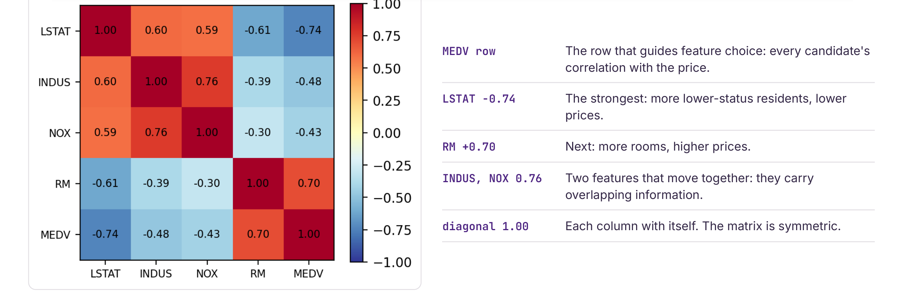

Read the **MEDV** row. That is every candidate's correlation with the price.

- **LSTAT, $-0.74$.** The strongest. More residents of lower socioeconomic status, lower prices.
- **RM, $+0.70$.** Next. More rooms, higher prices.
- **INDUS and NOX, $0.76$ with each other.** They move together, so they carry overlapping information. Same situation as temperature and business day: if you put both in, each coefficient is "holding the other fixed", and they are not fixed independently.
- **The diagonal is $1.00$.** Each column with itself. The matrix is symmetric, so the lower triangle repeats the upper one.

### A correlation does not tell you the shape

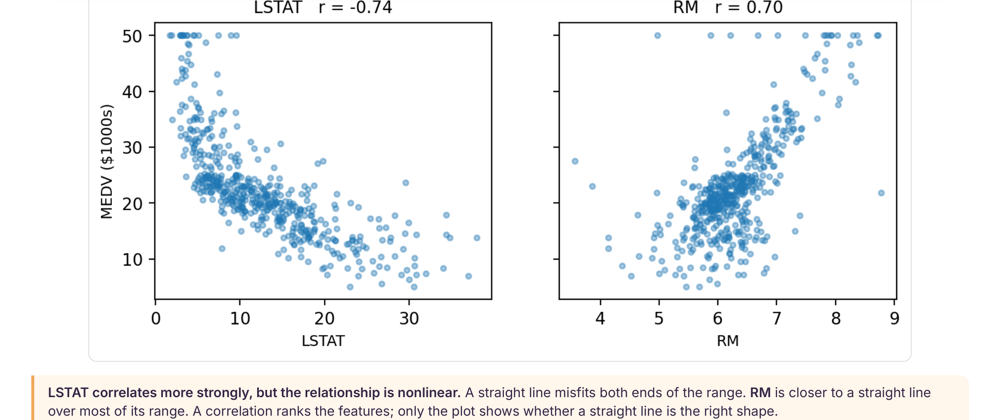

LSTAT correlates more strongly, and the cloud is curved. A straight line misfits both ends of the range. RM is closer to a straight line over most of its range. The correlation ranks the features. Only the plot shows whether a line is the right shape.

Try it: run the script, then replace the last `describe` with `df['RM'].describe()` and read off the fewest and the most rooms per home. The printed numbers should match the slides.

## What this lecture was for

Five points. The first four are there so the fifth one sticks.

1. **The notation does not care how many features you have.** Stack the rows into $H$, put the weights in $\theta$, and one multiplication predicts every row. Five features or 5,000, same notation.
2. **A coefficient belongs to the model.** Temperature was $-168.85$ alone and $-114.41$ next to business day. Read it as the difference this column makes, holding the others fixed, and expect it to move when the model changes.
3. **The solver follows the number of features.** The normal equation is exact and costs the cube of the column count. Descent approximates, scales to more columns, and works where no closed form exists, which is almost everywhere else in this course.
4. **Squaring the error was a choice.** It fits a mean rather than a median, so one stray point can drag the line. Absolute error and Huber loss are the alternatives, and each is one line of scikit-learn.
5. **A score on the training rows is not a valid result.** Enough weights and the model scores $R^{2} = 1.00$ on the rows it was fitted to, while a new day gets an impossible prediction. Split first, evaluate on the test rows once, and report that score.

The four-step recipe is unchanged since Lecture 1:

**a form for the function → a loss → minimize on the training rows → evaluate on rows the model has not seen**

This lecture worked out the loss, and that last evaluation. The multiple-feature form and the two solvers are what those two steps sit on.

## Before Lecture 3

Ten minutes with the housing code is worth more than rereading this page. Be able to explain, out loud:

- Why $H$ has a column of ones
- What $\theta_{2}$ means, with the phrase "holding the others fixed" in the sentence
- Why the normal equation struggles with many features (wide data) and is fine with many rows (tall data)
- Why training $R^{2}$ can only go up
- What a negative $R^{2}$ means

Today's answer to overfitting was "use fewer features". A column is in or it is out, which is a coarse remedy.

Lecture 3 keeps every column and shrinks the weights instead. It uses the same two norms from the loss section, L1 and L2, in a different role: as penalties on $\theta$.

If you want the derivations written out, James, Witten, Hastie, and Tibshirani, *An Introduction to Statistical Learning*, chapter 3, follows the design matrix, the normal equation, and the $R^{2}$ argument. *The Elements of Statistical Learning*, section 3.2, has the least-squares derivation in matrix form. Géron, *Hands-On Machine Learning*, chapter 4, is the normal equation against gradient descent, and why scaling changes the second and not the first.
