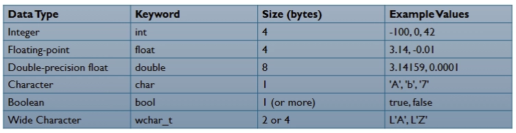

## BASIC PROGRAM STRUCTURE:

Let us learn the basics of C++ and its syntax and whatnot so the future lessons actually make sense!!!!!

A C++ program usually follows the basic structure:

```cpp
#include <iostream>

int main(){
	std::cout << "Hello, World!"; // outputs to the console
	return 0; // exit status of the program
```

what in tarnation does each line mean? lets talk about that!

`#include <iostream>` is a preprocessor directive that tells the compiler to bring the code needed for input and output before compiling

`std::cout` is essentially just saying whatever comes after the <<, OUTput the Characters (cout… get it…) into the standard stream

**Preprocessor directives** typically always start with a #. They are processed before the actual compilation of the program.

```cpp
#include <iostream>
#define PI 3.14 //defines a constant, this is processed before compilation
```

**Namespaces** allow you to group entities like classes, objects, and functions under a name. The `std` namespace is a part of the C++ standard library. You can do one of two options:

Without namespaces defined in the header:

```cpp
#include <iostream>

int main() {
	std::cout << "Hello, World!";
	return 0;
}
```

With namespaces in the header:

```cpp
#include <iostream>
using namespace as std;

int main(){
	cout << "Hello, World!";
	return 0;
}
```

While you can use the second option, the better practice is to use the first to avoid naming conflicts in larger programs

**Comments** in C++ can either be single-line or multi-line (who would’ve guessed?)

`//` is a single-line comment

`/* */` is a multi-line comment

**Variables** store data that can be manipulated within the program (i hope you know this by now this is third year cs…). Common **data types** include:

- `int` for integers
- `float/double` for floating-point numbers
- `char` for characters
- `bool` for boolean values (true or false)
- `string` for text strings

You declare them as so:

```cpp
int age = 25;
double pi = 3.14
char grade = 'A'
bool isPassing = true;
```

So this is basically how you can write a program:

```cpp
#include <iostream>
using namespace std;

int main(){
	string greeting = "Hello gang!";
	cout << greeting;
	
	return 0;
}
```

or this is also the same exact thing:

```cpp
#include <iostream>

int main(){
	std::string greeting = "Hello gang!";
	std::cout << greeting;
	
	return 0;
}
```

these two do the exact same thing brah

also something cool you can do in strings is that you can access a specific character using the square brackets [], index starts at 0 like most things do

```cpp
#include <iostream>
using namespace std;

int main() {
    string str = "hello, world";
    
    // this accesses the third letter, so the first l
    cout << str[2] << endl; // endl here is basically a newline character guys
    
    // accesses the first letter, so the h
    cout << str[0];

    return 0;
}
```

you can also update strings:

```cpp
#include <iostream>
using namespace std;

int main() {
    string str = "Geeks";
    cout << str << endl;
    
    // Updating string
    str = "Geeky";
    cout << str;

    return 0;
}
```

**Control flow** involves making decisions in a program using conditionals and loops. So a if-else statement, a for loop, etc… This will be explained in more depth in later lectures but a general example is:

```cpp
if (age >= 18) {
	cout << "Adult";
} else {
	cout << "Not an adult";
}
```

## DATA TYPES, VARIABLES, AND OPERATORS IN C++

Half of this shit is the same as C so I’m gonna briefly go over it im not giving long examples brah



To **declare** a variable, you do something like this:

`int age;` i know its rocket science

To **initialize** a variable, do this:

`int age = 21;`

you can also declare and initialize multiple variables in the same line:

`int x = 10, y = 20, z = 30`

You can use the word `const` to define a constant variable whose value cannot change throughout the program

`const double PI = 3.14`

**Explicit conversion (type casting):** you manually convert one type to another using casting

```cpp
double x = 3.14;
int y = (int) x; // x is explicitly cast to int, removing the decimal part
```

→ always truncates, so if x was 3.6, y is going to be 3.

**Implicit conversion (automatic):** happens when automatically mixing types

```cpp
int a = 10;
double b = a; // a is implicitly converted to double
```

**Operators** in C++ are no different than operators in any other language. You have:

- addition (+), subtraction (-), multiplication (*), division (/), modulo (%, returns the remainder)

```cpp
int a = 5, b = 2;
int sum = a + b; // does 5 + 2 which is 7
int remainder = a % b; // returns the remainder of 5/2 which is 1
```

**Assignment operators** either return true or false


example:

```cpp
int x = 5, y = 10;
bool result = (x > y); // this is going to return false
```

**Logical operators** are used to perform logical operations (like AND, OR, NOT, whatever) between boolean expressions

&& which is AND

|| which is OR

! which is NOT

example:

```cpp
bool a = true, b = false;
bool result = a && b; // this returns false
```

**Increment and decrement operators** increase or decrease a variable’s value:

- ++ is to increment
- - - is to decrement

```cpp
int i = 10;
i++; // now i is 11
```

there are 4 forms of incrementation and decrement:

**Post-increment: `i++`** returns the value THEN increments

**Pre-increment: `++i`** increments the value THEN returns

**Post-decrement: `i--`** returns the value THEN decrement

**Pre-decrement: `--i`** decrements value THEN returns

**Taking in input from the user**, you use the `cin` object

Here is a code snippet example:

```cpp
#include <iostream>
using namespace std;

int main(){
	int number;
	cout << "Enter a number: ";
	cin >> number;
	cout << "You have entered: " << number << endl;
	return 0;
}
```

You can also take in multiple inputs from the user as well:

```cpp
#include <iostream>
using namespace std;

int main(){
	string name;
	int age;
	
	cout << "Enter your name: ";
	cin >> name;
	cout << "Enter your age: ";
	cin >> age;
	
	cout << "Your name is: " << name << " and your age is: " << age << endl;
	return 0;
}
```

C++ allows the use of **`auto`** to automatically infer the type of a variable from its initial value

```cpp
auto x = 10; // int
auto pi = 3.14; // double
auto flag = true; // bool
```

In C++, there are two main types of **scopes:**

- **Local scope:** Variables declared inside a block {} are only accessible within that block
- **Global scope:** Variables declared outside a block {} are accessible anywhere within the program

```cpp
int globalVar = 10; // this is accessible anywhere

int main() {
	int localVar = 5; // this is only accessible in the main function
  return 0;
 }
```

## CONTROL FLOW, CONDITIONALS, AND LOOPS:

**Conditional statements** allow the program to make decisions based on certain conditions. Such as if, else if, and else statements

```cpp
int number = 10;
if (number > 5){
	cout << "Number is greater than 5." << endl;
}
```

since the if statement block evaluates to true (since 10 > 5), the statement in the block will be printed

The else block executes if the if statement evaluates to false

```cpp
int number = 3;
if (number > 5) {
 cout << "Number is greater than 5" << endl;
} else {
	cout << "Number is less than 5" << endl;
}
```

The else if statement allows multiple conditions to be checked in sequence. The first condition that evaluates to true will execute

```cpp
if (number > 10) {
	cout << "Number is greater than 10." << endl;
} else if (number == 10) {
	cout << "Number is exactly 10." << endl;
} else {
	cout << "Number is less than 10." << endl;
}
```

You can also have nested if statements:

```cpp
int number = 15;
if (number > 0) {
	if (number % 2 == 0) {
		cout << "Positive even number." << endl;
	 } else {
			cout << "Positive odd number." << endl;
	 }
} else {
	cout << "Number is not positive." << endl;
}
```

The **ternary operator (?:)** is a shorthand for if-else and is useful for simple conditions

```cpp
condition ? expression1 : expression2
```

if condition is true → execute expression1, else, execute expression2

The **switch statement** is another way of controlling the flow of the program based on multiple possible values of a single variable

```cpp
switch (variable) {
	case value1:
		//code block if variable == value1
		break;
	case value2:
		//code block if variable == value2
		break;
	// you can add more cases
	default:
		// code block if none of the cases match
```

**Loops** are used to repeat a block of code as long as a specified condition is TRUE. C++ provides several types of loops: for, while, and do-while

```cpp
for (initialization; condition; increment/decrement) {
	// code block to repeat
}
```

condition → determines how long the loop will run for

```cpp
for (int i = 0; i < 5; i++){
	cout << "Iteration " << i << endl;

```

A **while loop** repeats a block of code as long as the condition is true

```cpp
int i = 0;
while (i < 5) {
	cout << "Iteration " << i << endl;
	i++;
}
```

The **do-while** loop is similar to the whole loop, but it guarantees that the code block is executed at least once, even if the condition is false

```cpp
do {
	// code block to repeat
} while (condition);

//example:
int i = 0;
do {
	cout << "Iteration " << i << endl;
	i++;
} while (i < 5);
```

The **break** statement exits a loop early, before the loop condition becomes false

```cpp
for (int i = 0; i < 10; i++){
	if (i == 5){
		break;
	}
	cout << i << endl;
}
// so this wont do iterations 5,6,7,8,9
```

The **continue** statement skips the current iteration and move s to the next iteration of the loop

```cpp
for (int i = 0; i < 10; i++){
	if (i == 5){
		continue;
	}
	cout << i << endl;
}
// this skips iteration 5 and continues with the rest of the iterations left
```

Once again, you can also use nested loops similar to nested if statements

## FUNCTIONS:

We all know the basic definition of a function… a function is a function in any language brah

This is how a function typically looks like in C++:

```cpp
void hello() { // void means this returns nothing
	cout <<  "Hello, World!" << endl;
}

int square(int x) { // this function returns an int and takes an int as a parameter
	return x * x;
}

int main() {
	hello(); // calls the void function
	int result = square(5); 
	cout << "The square of 5 is " << result << endl;
	return 0;
}
```

A **function declaration** introduces the function to the compiler in the header. It tells the compiler the return type, name, and parameters but without the body.

```cpp
int add(int x, int y); // this is where the includes and using namespace std is
```

**Function definition** provides the actual implementation of the function in the body

```cpp
int add(int x, int y){
	return x + y;
}
```

**Parameters** are used to pass values to a function… like you didn’t know this already

When a function parameter is **passed by value,** a COPY of the argument is made, and changes to the parameter inside the function do not affect the original argument.

For example:

```cpp
#include <iostream>
using namespace std;

void increment(int num){
    num++;
}

int main(){
    int value = 5;
    increment(value);
    cout << "The new value of 'value' is " << value << endl; // this prints out 5
    return 0; 
}
```

You can pass arguments **by reference**, allowing the function to modify the original value. This is done using the & symbol

```cpp
#include <iostream>
using namespace std;

void increment(int &num){
    num++;
}

int main(){
    int value = 5;
    increment(value);
    cout << "The new value of 'value' is " << value << endl; // this prints out 6
    return 0; 
}
```

C++ allows you to provide default values for function parameters. If no argument is passed for a parameter with default values, the default is used.

```cpp
int add(int a, int b = 10){
	return a + b;
}

int main(){
	cout << add(5) << endl; // output: 15 since b is used as 10
	cout << add(5, 3) << endl; // output: 8 since you provided an argument for b
	return 0;
}
```

**Function overload** allows you to have multiple function with the same name but different parameter lists. How do you know which function is called? It’s based on the arguments provided during the call

```cpp
int add(int a, int b){
	return a + b;
}

double add(double a, double b){
	return a + b;
}

int main(){
	cout << add(5,2) << endl; //calls the int version
	cout << add(5.2,2.4) << endl; // calls the double version
	return 0;
}
```

**Recursion** happens when a function calls itself to solve smaller instances of the same problem. Each recursive call reduces the problem’s size until it reaches the **base case**

```cpp
int factorial(int n) {
	if (n <= 1) {	// base case
		return 1;
	} else {
		n * factorial(n-1); // recursive call
	}

int main(){
	cout << "Factorial of 5: " <, factorial(5) << endl; // 120 output
	return 0;
}
```

^ im not gonna draw this shit out we are in 3rd year y’all lock in…

**Inline functions** provide a way to optimize the performance of the program by reducing the overhead related to a function call. Now I went on stack overflow and essentially it said declaring a function as inline is lowkey pointless and using it back in the 90s might’ve been helpful for the compiler but technology is great wowzers

Here is an example ANYWAY

```cpp
inline int square(int x){
	return x * x;
}
```

## BASICS OF POINTERS IN C++:

Don’t you just miss pointers? I sure know I do(n’t)