## Regular Expressions

Regular Expressions are \star\starstrings\star\star over an alphabet $\Sigma$ that can be obtained as follows:

1. $\emptyset$ is a regular expression
2. $\epsilon$ is a regular expression
3. Every element $a \in \Sigma$ is a regular expression
4. If $\alpha, \beta$ are regular expressions, then so is $\alpha\beta$
5. If $\alpha, \beta$ are regular expressions, then so is $\alpha \cup \beta$
6. If $\alpha$ are regular expressions, then so is $\alpha^{\star}$
7. $\alpha$ are regular expressions, then so is $\alpha^{+}$
8. If $\alpha$ are regular expressions, then so is $(\alpha)$

Example:

If $\Sigma = \lbrace{a, b\rbrace}$, the following are regular expressions:
- $\emptyset$
- $\epsilon$
- $a$
- $(a \cup b)^{\star}$
- $abba \cup \epsilon$

## Regular Expressions Define Languages

Semantic interpretation: the \star\starlanguage L($\alpha$)\star\star expressed by a regular expression $\alpha$:
1. $L(\emptyset) = \emptyset$
2. $L(\epsilon) = \lbrace{\epsilon\rbrace}$
3. $L(c) = \lbrace{c\rbrace},\ \text{where} \ c \in \Sigma$
4. $L(\alpha \beta) = L(\alpha) L(\beta)$
5. $L(\alpha \cup \beta) = L(\alpha) \cup L(\beta)$
6. $L(\alpha^{\star}) = L(\alpha)^{\star}$
7. $L(\alpha^{+})$
	- If $L(a)$ is equal to $\emptyset$, then $L(a+)$ is also equal to $\emptyset$. Otherwise $L(a+)$ is the language that is formed by concatenating together one or more strings drawn from $L(a)$
8. $L((\alpha)) = L(\alpha)$

This is the way we create the \star\starset representations\star\star (the \star\starRegular Language\star\star) of the \star\starRegular Expression\star\star.

Examples:

$L(a^{\star}b^{\star}) = L(a^{\star})L(b^{\star}) = L(a)^{\star}L(b)^{\star} = \lbrace{a\rbrace}^{\star}\lbrace{b\rbrace}^{\star} = \lbrace{a^{n}b^{m} | n, m \ge 0\rbrace}$

$L = \lbrace{w \in \lbrace{a, b\rbrace}^{\star} \ : \  |w| \ \text{is even}\rbrace} = \lbrace{\lbrace{aa\rbrace} \cup \lbrace{ab\rbrace} \cup \lbrace{ba\rbrace} \cup \lbrace{bb\rbrace}\rbrace}^{\star}$

## Operator Precedence in Regular Expressions

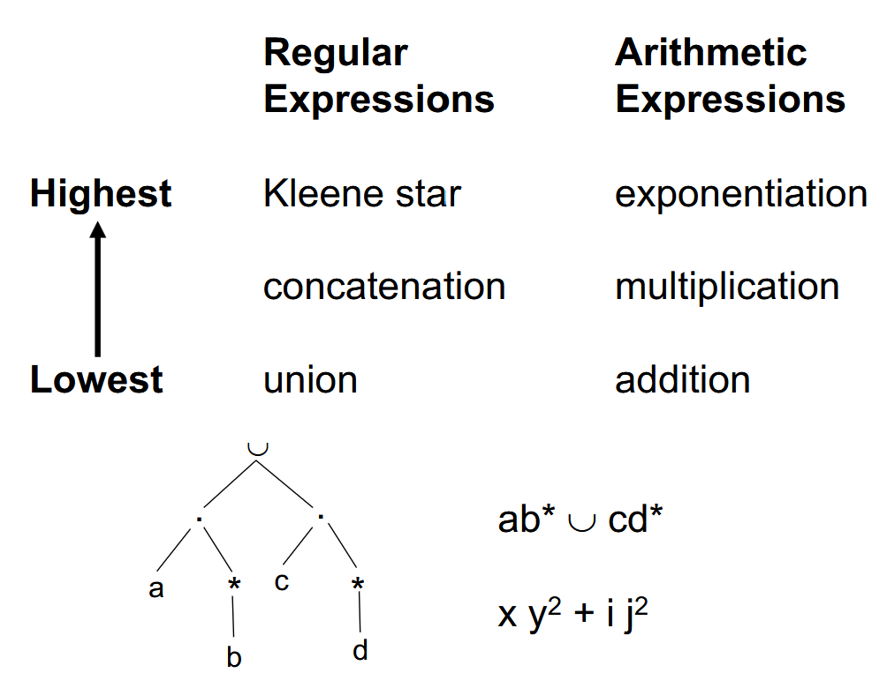

> So $a^{\star} \cup b^{\star} \neq (a \cup b)^{\star}$ and $(ab)^{\star} \neq a^{\star}b^{\star}$

Sometimes it \star\starISN'T\star\star possible to make a \star\starRegular Expression\star\star to represent a \star\starLanguage\star\star:

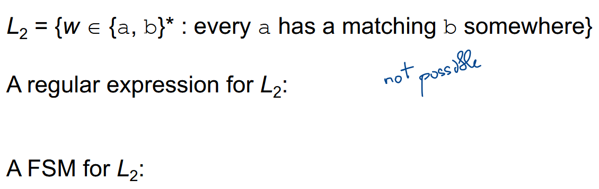

## Structural Induction

\star\starFinite State Machines\star\star and \star\starRegular Expressions\star\star define the same class of languages. This means that the class of languages that can be defined with regular expressions is \star\starEXACTLY\star\star the class of regular languages.

So by something called \star\starThompson's Construction\star\star we can build and NDFSM.

> Every NDFSM that we can build using Thompson's Construction has a \star\starstarting state\star\star with no incoming edges and \star\starONE\star\star \star\staraccepting state\star\star that has no outgoing edges

### Building Blocks

Here are the Building Blocks that we can use to build the NDFSM

\star\starBasic\star\star : $L(\emptyset) \ \text{and} \ L(a) \ \text{where} \ a \in \Sigma$

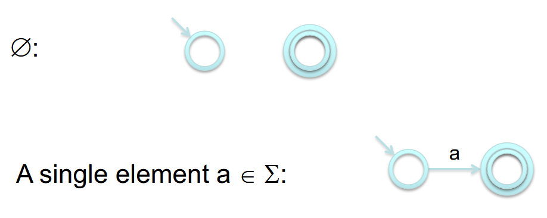

\star\starConcatenation\star\star: $\alpha = \beta \gamma \rightarrow \ \text{NDFSM for} \ L(\alpha)$

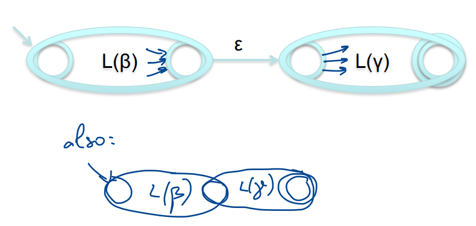

\star\starUnion (Or)\star\star: $\alpha = \beta \cup \gamma \rightarrow \ \text{NDFSM for} \ L(\alpha)$

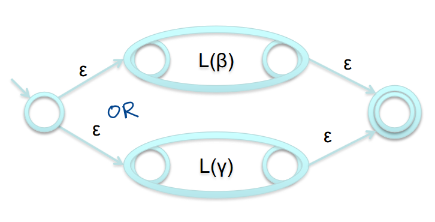

\star\starKleene \star (Star)\star\star: $\alpha = \beta^{\star} \rightarrow \ \text{NDFSM for} \ L(\alpha)$

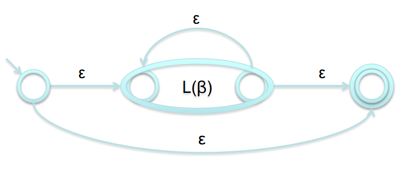

Example of Regular Expression to NDFSM using Thompson's Construction:

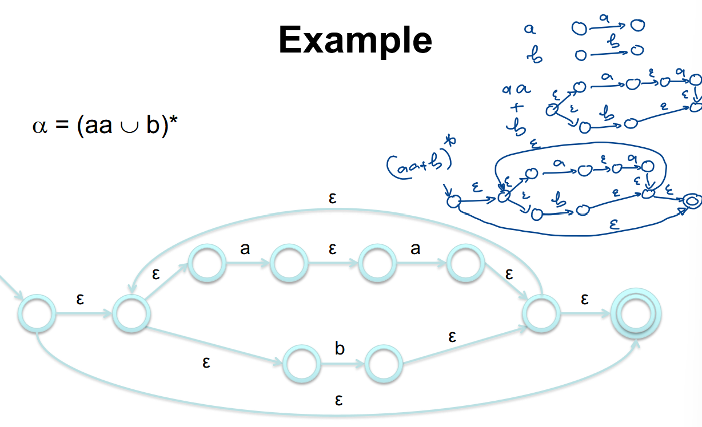

## FSM To Regular Expression

Basically, take any state, and remove it from the FSM. Then you update the \star\startransition function/relation\star\star from the state on the left to the state on the right so that it is a regular expression

Example:

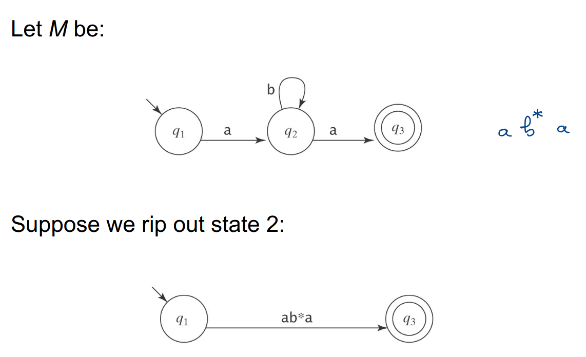

Formal Steps:

1. Create a new initial state and a new, unique accepting state, neither of which is part of a loop.

| Before                               | After                              |
| ------------------------------------ | ---------------------------------- |
| 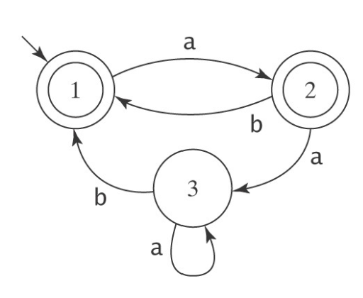 | 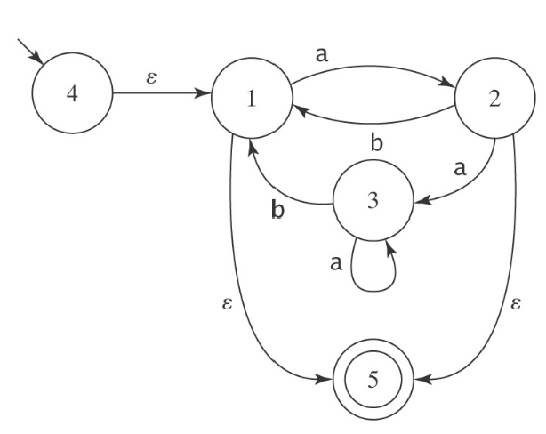 |

2. Remove states and arcs and replace with arcs labelled with larger and larger regular expressions.

- Remove State 3

| Before                               | After                              |
| ------------------------------------ | ---------------------------------- |
| 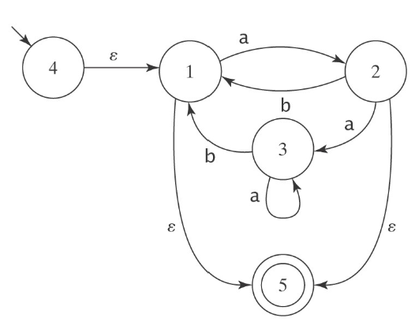 | 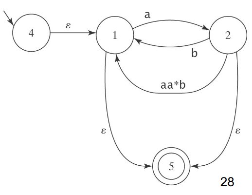 |
Explanation:

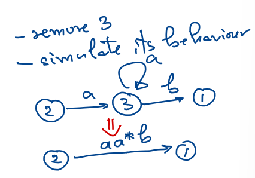

- Remove State 2

| Before                               | After                              |
| ------------------------------------ | ---------------------------------- |
| 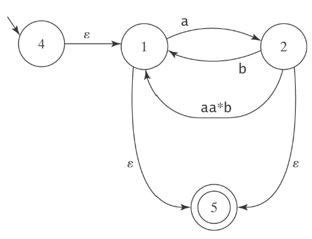 | 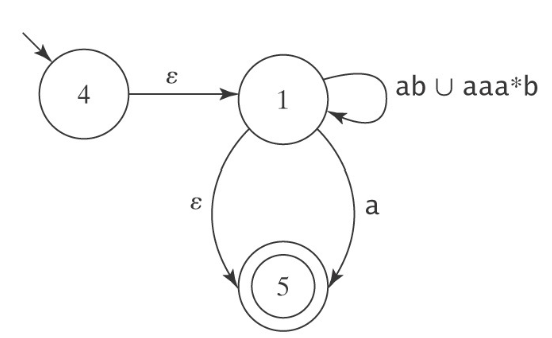 |
Explanation:

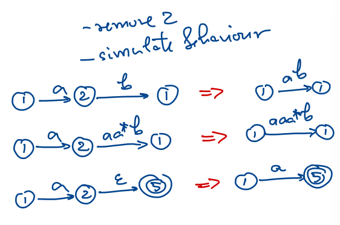

- Remove State 1

| Before                               | After                              |
| ------------------------------------ | ---------------------------------- |
| 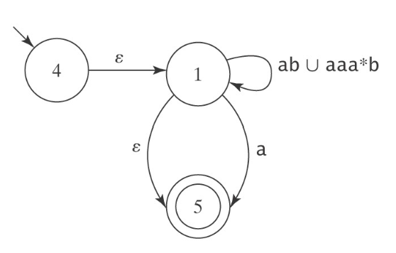 | 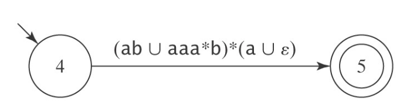 |

## Some Extra/Real World Regular Expressions

| Syntax            | Name          | Description                                                            |
| ----------------- | ------------- | ---------------------------------------------------------------------- |
| $abc$             | Concatenation | Matches $a$, then $b$, then $c$ where $a$, $b$, and $c$ are any regexs |
| $a \| b \| c$     | Union (Or)    | Matches $a$ or $b$ or $c$ where $a$, $b$, and $c$ are any regexs       |
| $a^{\star}$       | Kleene Star   | Matches 0 or more $a's$ where $a$ is any regex                         |
| Finish this later |               |                                                                        |

## Pattern Matching

Any file that \star\starcontains\star\star the pattern

$L(\Sigma^{\star} \ \text{abcabb} \ \Sigma^{\star})$ -> NFA -> DFA -> Minimize -> gets the minimal DFSM on 43

## Pattern Searching

Any file that \star\starends with\star\star the pattern

$L(\Sigma^{\star} \ \text{abcabb})$ -> NFA -> DFA -> Minimize -> gets the minimal DFSM on 44

