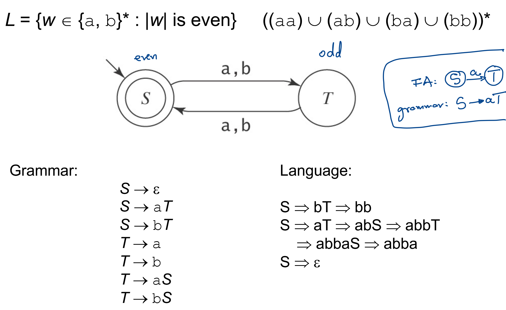
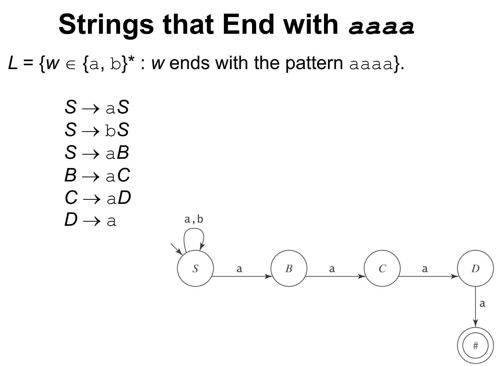
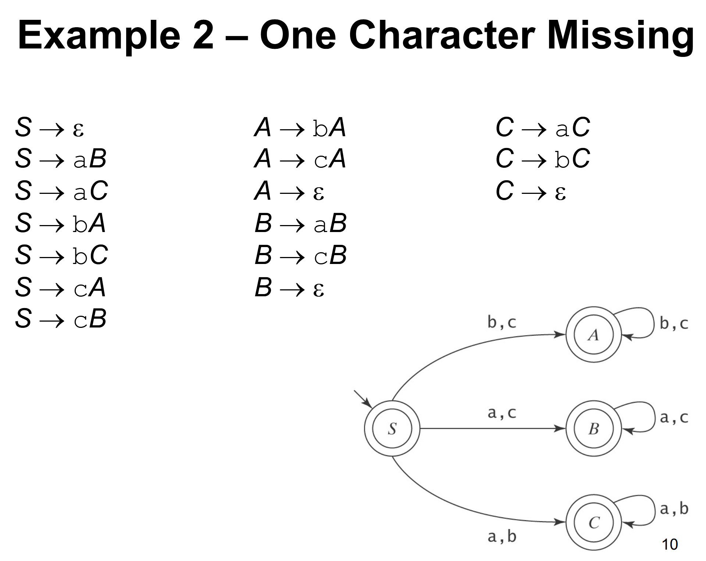
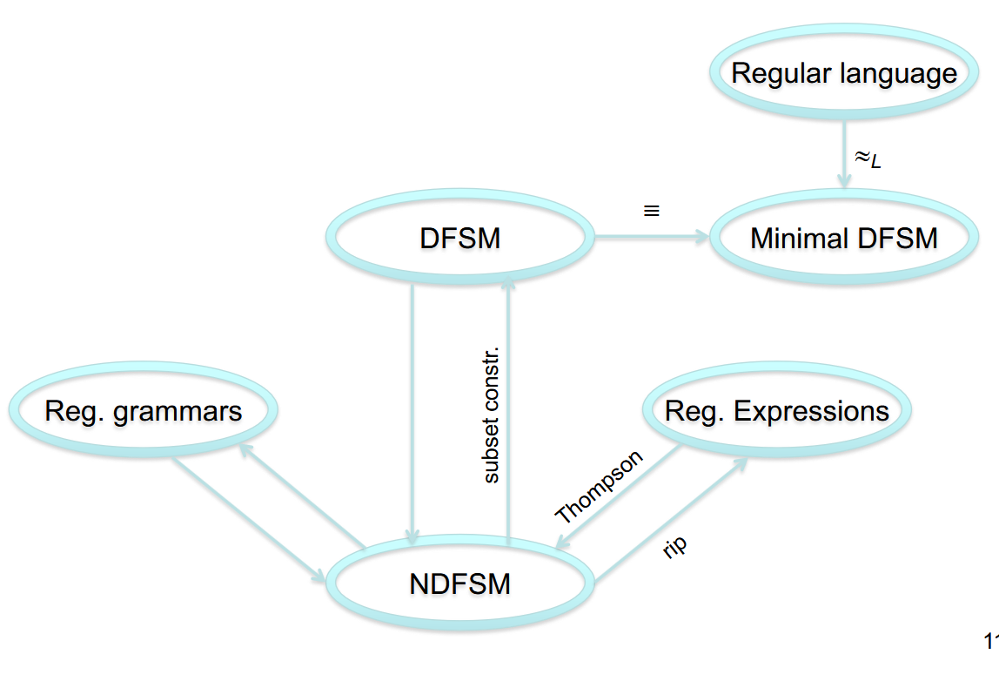

## Grammars

- Grammars are rewriting systems (that produce strings)
- **Non-terminals** will do the work (Upper case)
- **Terminals** form the final strings (Lower case)

E.g.

$S \rightarrow Sa$
$S \rightarrow \epsilon$

1. Non-terminal: S
2. Terminal: a

A Grammar G is a quadruple of the form (V, $\Sigma$, R, S)
- **V** is the rule alphabet (it contains the Non-terminals and Terminals)
- $\Sigma$ is the set of terminals which is a subset of **V**
- **R** has a finite set of **rules** of the form: $X \rightarrow Y, X Y \in V^{*}$ where **X** can be rewritten as **y**
- $S \in V - \Sigma$ which just means that it is the **start symbol**.

## How to Derive Strings

Start with **S** and then apply rules (rewrite left hand side with the right hand side) until you have ONLY **terminals**.

$S \overset{1}{\Rightarrow} Sa \overset{1}{\Rightarrow} Saa \overset{1}{\Rightarrow} Saaa \overset{2}{\Rightarrow} aaa$

---

---

In a Regular Grammar, all rules in **R** must:
- Have a left hand side that is a **single nonterminal**
- Have a right hand side that is:
	- $\epsilon$ or
	- a single terminal or
	- a single terminal followed by a single nonterminal

Legal: $S \rightarrow a, S \rightarrow \epsilon, \ \text{and} \ T \rightarrow aS$
Not Legal: $S \rightarrow aSa \ \text{and} \ aSa \rightarrow T$

The **language** defined by a grammar: all terminal strings that can be obtained starting from S and applying the rules.

## Regular Grammar Example

> Note $S \rightarrow \epsilon$ is a part of the Grammar because the empty string has a length of 0, which is even.

Also notice that in **FSA**, when $S$ (state) goes to $T$ (another state) by $a$, you have the Grammar rule: $S \rightarrow aT$

The reason $T \rightarrow a$ and $T \rightarrow b$ is because from State $T$ (a string of odd length) to successfully end the string (go to an accepting state), you need to add either an $a$ or a $b$ to make it even.

However when at State $S$, the accepting state, if you add just an $a$ or a $b$, then you won't be at an accepting state (you would have a string of odd length). That's why $S \rightarrow a$ and $S \rightarrow b$ and not a part of the Grammar.

## Some More Examples

## Conversions

This is arguably the **most important part** of this chapter or unit or section, or whatever.

Given a Regular Grammar you can kind of see exactly what the NDFSM will look like.

Given a Regular Expression, you can make the NDFSM by using Thompson Construction (Take the expression, break it down into sets: L(a) = $\lbrace{a\rbrace}$, L(a*) = $\lbrace{a\rbrace}^{*}$, etc. and then use the building blocks to create the DFSM). Now, to minimize you need to create the Epsilon Closure of every state (eps($q_i$) = $\lbrace{q_{i}\rbrace} \ \cup \ \lbrace{p_{1} : p_{1} \ \text{is a state that can be reached by} \ \epsilon \ \text{from} \ q_{i} \rbrace} \ \CUP \ $)