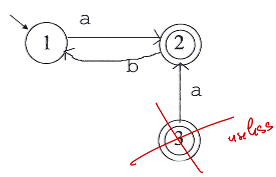
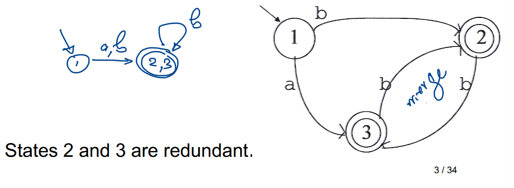
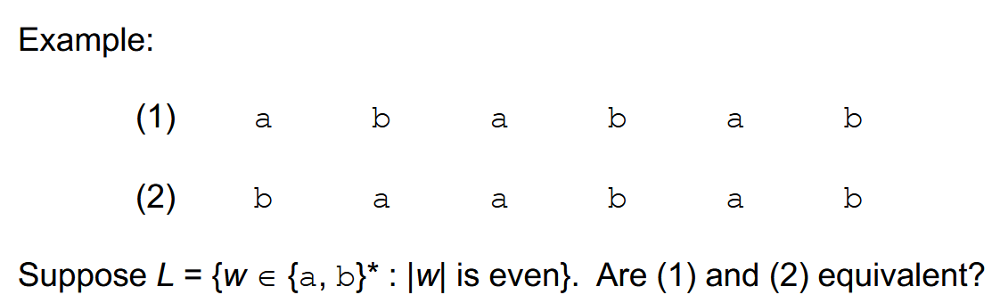
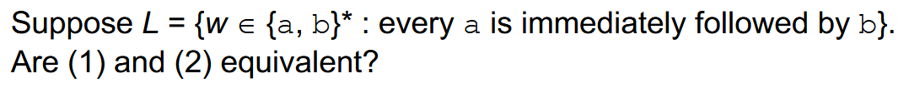
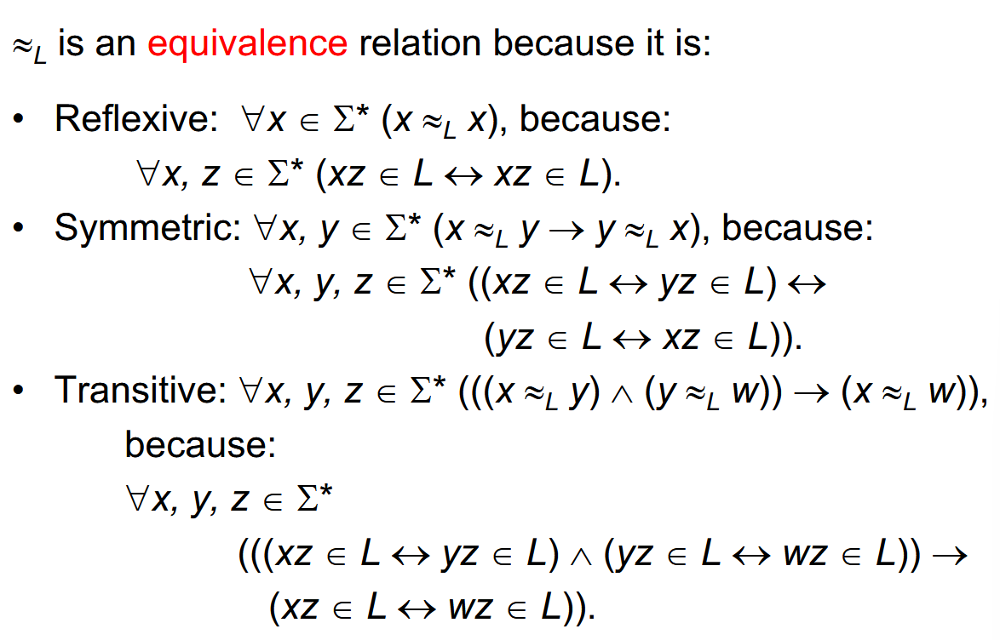
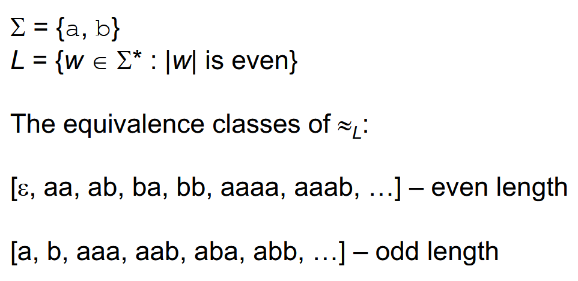
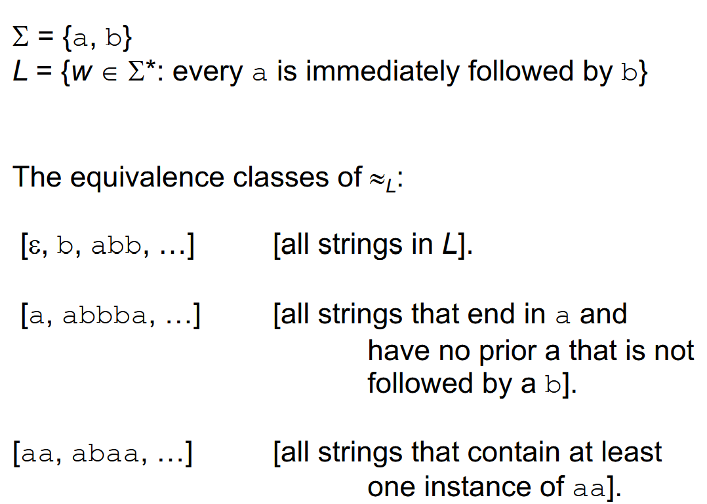
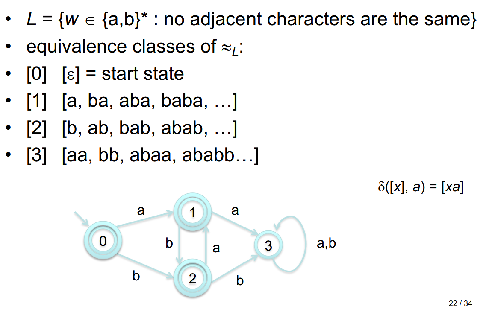

## State Minimization

To Minimize the number of states in a DFSM we can do two things

**Step 1**: Get rid of **unreachable states**:

- Find the reachable ones and then see which ones are not reachable (duh)

**Step 2**: Get rid of **redundant states**:

- Find the states that are **equivalent**. This means that by their **transition functions**, they both lead to the same state (have the same fate)
- In this example, by transition $a$, both $q_2$ and $q_3$ lead to $q_1$ and by transition $b$, both $q_2$ and $q_3$ lead to $q_1$ again.
- So we can merge them!

## Finding a Minimal DFSM

Two problems:

1. Given a regular language, find a minimal DFSM for it
2. Given a DFSM, find a minimal DFSM equivalent to it.

Lets focus on problem 1 for now...

Given a language:
- Capture the notion of **equivalence classes** of strings with respect to that language
- Prove that we can always find a (unique up to state naming) DFSM with a *number of states* **equal** to the number of *equivalence classes of strings*.
- Describe and algorithm for finding that DFSM

**Indistinguishable** (with respect to a language L):
- If, no matter what is tacked on to them on the **right**, either they will **both** be in $L$ or **neither** will be in $L$.
- Obviously, strings that are **Indistinguishable** are also **Equivalent** with respect to $L$.

If $x$ and $y$ are **indistinguishable**, then we can merge $p$ and $q$ to minimize the DFSM.

Yes, they are because the lengths of the strings will be the same so every time one is odd it is not in the language and every time |w| is even then it is in the language.

No, because (after adding the empty string to the end), one can be in the language while the other is not.

## Equivalence Relation

Because $L$ is an **equivalence relation**:
- No **equivalence class** of L is **empty**
- Each string in $\Sigma^{*}$ is in exactly one equivalence class of $L$
- Also it defines a partition meaning that each string goes to only ONE equivalence class and no equivalence classes are empty (we just said this but whatever)
- The union of the equivalence classes is equal to $\Sigma^{*}$

E.g.

E.g.

Some equivalence classes in $\Sigma^{*}$ are $\in L$ while others are not. The ones that are in $L$ are the **Accepting States**. The rest are the non-accepting states and the dead states.

## The Best We Can Do is also Unique

$\delta : [x] \overset{a}{\rightarrow} [x, a]$

e.g.

$[x, y] \overset{a}{\rightarrow} [xa, ya]$

because $x \approx_{L} y$

so $\therefore xa \approx_{L} ya$

> Remember: The number of states has to be at least the number of classes

The # of Accepting States = # of equivalence classes that have all strings $\in L$

