## MEMORY HIERARCHY:

From a programmer’s point of view, CPU performance depends on:

- CPU Frequency
- The type of instructions performed
- **Memory access time**

Why we are concerned with memory access time is because of the **processor memory gap**

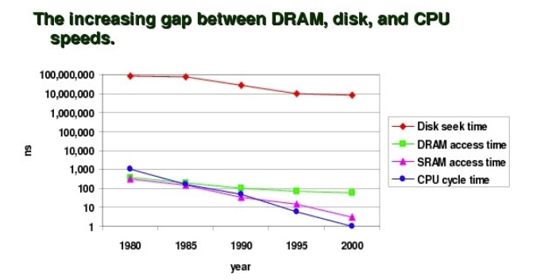

The increasing gap between the memory speeds and the CPU speeds contributes to the memory wall.

- **Memory wall:** A point at which a programs performance is limited by memory speed

Therefore, faster processors will not make programs faster!

Recalling this example:

```c
void copymatrix1(int** src, int** dst, int n) {
	int i,j;
	for (i = 0; i < n; i++)
		for (j = 0; j < n; j++)
			dst[i][j] = src[i][j];
}
```

```c
void copymatrix2(int** src, int** dst, int n) {
	int i,j;
	for (j = 0; j < n; j++)
		for (i = 0; i < n; i++)
			dst[i][j] = src[i][j];
}
```

here, we said that **`copymatrix1`** is accessed via rows first then columns. the second one **`copymatrix2`** accesses columns first (so it chooses the first column, and moves DOWN)

The way we access data has a LARGE impact on overall performance

As the results showed us:

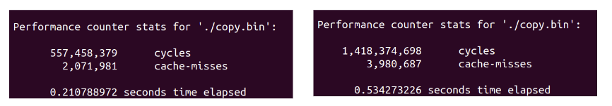

**Cache misses** is the largest impact on this performance drop (we will discuss what a cache miss is later on)

## TRENDS AND BASICS:

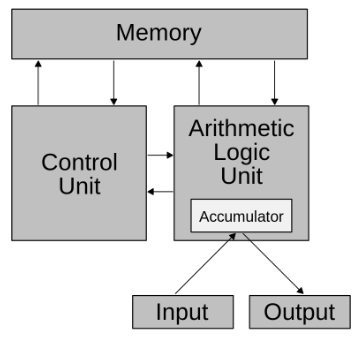

This simple organization is symmetric with how a software or programmer views the hardware

Obviously… it is not that easy. The hardware does a lot of sophisticated stuff internally to this communication.

Back then, programmers were concerned with _how much_ memory was used

- Speeds of processor and memory were about the same
- Memory access time was roughly same as arithmetic time

Today, this is no longer a problem, because memory size is no longer a limiting factor

- Some laptops have up to 64GB of memory

But, as we know, the speed of DRAM is not quite as fast as we would hope.

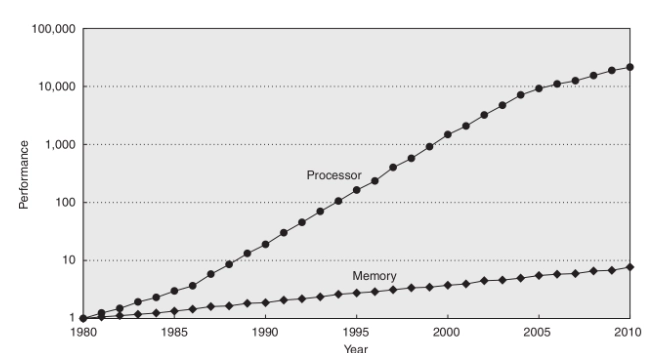

DRAM is very very slow in comparison to the processor speed

Because of this slowness, we have what we called the **memory wall.** Even, if our program was data heavy, due to the **processor memory gap,** this too makes our program slower

In order to counter this gap between processor speeds, memory speeds, we introduced the **memory hierarchy**

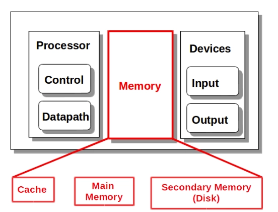

At first, this was very simple. We had a cache memory and a main memory (and HDDs but whatever who cares about those)

The **cache** would be implemented using static RAM, and therefore much faster. but, because of the cost because of the size of static RAM, cache would be quite small in capacity

- so, the idea is that cache would be fast but small.

The cache would store a **SUBSET** of main memory so that the CPU could access a small amount of the data that it required via the cache

However, once the processor is done with that data, obviously it would need more data that was from main memory. If that data was not in the cache, it would have to dig its way into main memory, which results in something called a **cache miss**

So, at the time, what memory would do is that it would swap data OUT of cache, and then new data from main memory would be loaded in the cache

- **CACHE MISSES ARE UNAVOIDABLE**

We can minimize cache misses via how we access data. If we access it in a smart way, cache misses can be minimized

Unfortunately, the swapping data between the main memory and the cache is a slow operation. If the cache is fast, processor is fast, but the main memory is slow, well when you swap data between the cache and the main memory, that swapping is going to be slow

So, some knobheads came up with the idea that if swapping between cache and main memory is slow, then why don’t we add multi-level caches in order to avoid this slow process. so a small cache swaps with a slightly larger cache, and that slightly large cache swaps with main memory

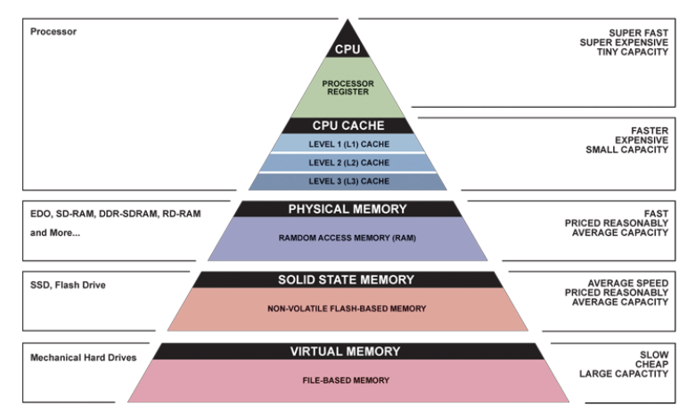

So L1 is very very small but also very very fast

L2 is slightly larger and slightly slower

L3 is slightly larger again and slightly slower again

The whole point of these different cache levels is to minimize the cost of a cache miss

What if the CPU wants data that isn’t from the L1 cache?

- well, obviously this results in a cache miss, and L1 and L2 communicate w each other. L1 will be like “heyyy i want this piece of data can you give me it please and thanks”
- IF the data can be swapped between L1 and L2, then L2 gives L1 the requested piece of data and everyone is joyful
- sometimes, since L2 since it still is not THAT large, sometimes L2 doesn’t even have the requested data L1 asked for. here comes in L3, which is the backup of L2.
- L2 goes to L3 and asks “hey do you have this piece of data or what”. if it does L3 will swap in that piece of data into L2 and L2 will swap it in with L1 and L1 will return that data to the CPU

Even though sometimes we have to go all the way down to L3, this is obviously better than having to access physical memory since we are still within the cache range. Remember, caches are implemented using STATIC RAM technologies, meaning they are quite fast

## PRINCIPLE OF LOCALITY:

The idea of locality is that if we access a piece of data, then we are highly likely to access the adjacent piece of data soon as well

- like if you access array index i, you are HIGHLY likely going to access array index i + 1

with that in mind, instead of swapping a single piece of data between each level, we instead swap entire sections of data between levels

Locality just also helps our hardware execute our programs more efficiently

When it comes to our program code, accessing data, there are two different ways we can describe locality:

**Temporal locality:** If we accessed a piece of data or a particular line of code recently, then we are highly likely to access that piece of data again in the near future

- so if we accessed array at index i, we are most probably going to access array at index i again
- good temporal locality would be accessing this index over and over and over again in a short amount of time
- poor temporal locality would be if i accessed index i and then 200 lines of code later i accessed it again

**Spatial locality:** If we accessed one piece of data or one line of code, then you are going to access adjacent or nearby pieces of data in the nearby future

- so if we accessed array at index i, we are most probably going to access array at index i + 1 at some point
- good spatial locality would be accessing index i, then i + 1, i + 2, i + 3, and so on
- poor spatial locality would be if i accessed index i and then i accessed index 107, then index 34, like you’re going all over the place. you’re not being linear

YOU CAN HAVE BOTH AT THE SAME TIME!

So, you can access array index 0,1,2,3 again, 0,1,2,3 then again, 0,1,2,3.

- this is good temporal locality because you are accessing those 4 indices over and over again
- and this is good spatial locality because you are accessing adject indices

Different programming constructs will result in different types of locality. What sorts of programming constructs would lead to good temporal or good spatial locality

**Temporal:**

- Loops
- Repeated calls to the same method

**Spatial:**

- Loops
- Repeated calls to the same method (if your methods are short)
- **Sequential** operation, no unconditional jumps!

Continually using the same _type_ of instructions is not locality. It must be the EXACT same instruction _after compilation_

- like if you have 4-5 addition operations in a row, those are compiled into 4-5 different add operations in the compiled code, so it isn’t good locality

More comments on data locality:

- Repeated access to the same variable is good temporal locality
- Sequential access to an array is good spatial locality
- Initializing a variable just before it is used is good temporal locality
- Re-use previous variables that are finished being useful instead of initializing new ones is good temporal locality

```c
int arr[n];
for (int i = 0; i < n; i++){
	printf("%d", arr[i]);
}
```

This is called a **stride-1 access pattern** because the accesses are one apart from each other. we’re accessing index 0, then index 1, then index 2, so the stride length between the accesses is one

In contrast, a stride-2 access pattern would be if you were to do index 2 then index 4, index 6… you’re still in a linear access but the stride length is 2 because you are accessing every 2nd element

Depending on what language you are using will influence how those multi-dimensional arrays are linearized in main memory

There are two different ways arrays can be allocated in memory:

- **Row-major order:** The row is linear but the columns are not
    
    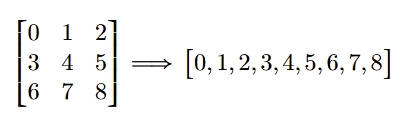
    
    this is how its allocated in C
    
- **Column-major order**: The columns are linear but the rows are not
    
    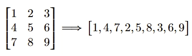
    
    this is how its allocated in FORTRAN
    

So, if we take the example from the beginning of these slides:

```c
void copymatrix1(int** src, int** dst, int n) { 
	int i,j;
	for (i = 0; i < n; i++)
		for (j = 0; j < n; j++)
			dst[i][j] = src[i][j];
}
```

```c
void copymatrix2(int** src, int** dst, int n) {
	int i,j;
	for (j = 0; j < n; j++)
		for (i = 0; i < n; i++)
			dst[i][j] = src[i][j];
}
```

In C, if we access matrices by column, we notice that we are going to go from 0 → 3 → 6 in memory, which is a stride-3 access pattern

- this isn’t that big of a jump, but imagine if the matrix was like 1000x1000, your strides when you access down a column in a row major based language would be a stride-1000 access pattern because the entire would would be saved in memory before the next row. so obviously, accessing column wise in a row major way is horrible

Obviously, if you’re in a column major language, then accessing by row would be bad

Example:

Does this function in C have good locality? If yes, which type

```c
int sumArray(int* a, int n){
	int sum = 0;
	for (int i = 0; i < n, i++)
		sum += a[i];
	return sum;
}
```

We have good spatial locality, because we have a stride-1 access to the array a

We have good temporal locality in access to sum, i, and n

Note: It is important to note that since a is a pointer to an array, we are performing pointer arithmetic on it:

- `a[i] = *(a+i)` so, a itself has good TEMPORAL locality, because it is used in this instruction over and over again. but the array elements themselves have no temporal locality, because we never access the same index of the array twice

Example:

Where is locality present in this C function? For each specify the type of locality

```c
int sumarray(int[][] a, int M, int N){ // M rows, N columns
	int i,j,sum = 0;
	
	for (i = 0; i < M; i++)
		for (j = 0; j < N; j++)
			sum += a[i][j];
	return sum;
} 
```

Spatial locality in access to a → good spatial locality because we are accessing the array in a row major way. We are doing stride-1 access

Temporal locality in access to sum, i, j, N

- Now, why is M not listed in the temporal locality? You have to think about how frequently M is being accessed. Assume like M = N = 100. If you were to trace out this code, the inner loop would loop like 100 times before we even go back to the outer loop, so obviously that’s not a good temporal locality

Example:

```c
int sumarray(int[][] a, int M, int N){ // N rows, M columns
	int i,j,sum = 0;
	
	for (j = 0; j < M; j++)
		for (i = 0; i < N; i++)
			sum += a[i][j];
	return sum;
} 
```

Here, this is good spatial locality for N, sum, i, j

There is NO spatial locality for a

- this is because C is a row major language, meaning it gets stored in memory row by row. but, we are accessing the elements via a column, so it has to jump around in order to get the second element, there is no linear locality → bad spatial locality

Temporal locality would be possible for M IF M was small, but assume its just bad unless its really small

## CACHE HIERARCHY:

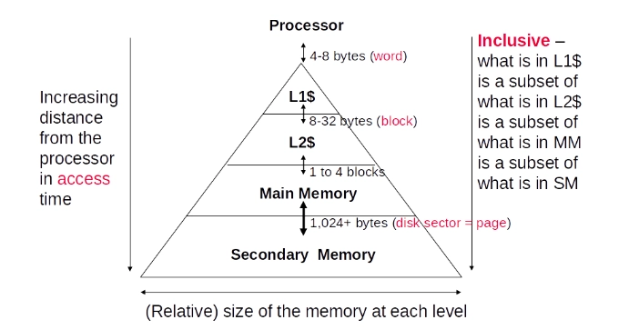

We have talked about cache and everything but let us give it a set definition

**Cache:** Small, and fast storage device which acts as a staging area between the CPU and the larger and slower main memory

- When we have multiple levels of cache, we can say that a cache at level $k$ serves as the cache for the larger and slower memory device at level $k+1$

Each level $k$ caches a subset of the data from level $k+1$

Why is memory organized this way? Due to locality!

- Programs tend to access data at level $k$ more often than they access data at level $k+1$
- A good program obviously has good locality. so, it will access data in the higher level cache very frequently and rarely need to access the lower level

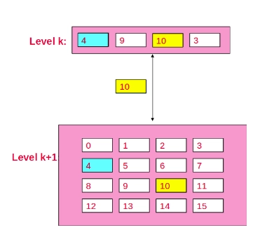

When we want to access data that’s not in level $k$ (and assuming $k+1$ has it), a swap has to occur between the two caches

Due to spatial locality, a whole block of data is swapped between the two caches

Something important to note is that the block sizes that are swapped between each level is the same. Obviously $k+1$ will store more data, and more numbers of blocks, but the individual block size is the same

Let us consider what happens when the processor requests different pieces of data that are contained or not contained in a particular block

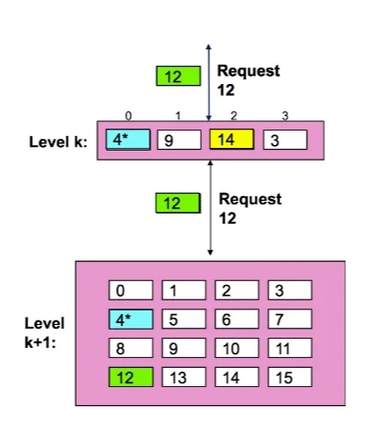

First, we have something called a **cache hit**

A **cache hit** is when the requested data from the processor is found in the cache at level $k$

A **cache miss** is when the piece of data is requested and not found in the cache at level $k$. When this happens, the cache must:

- Fetch the block contained the data from level $k+1$
- Evict/replace an existing block in cache if it is full to make space for a new block. The choice of which block to evict is determined by the **replacement policy**

### CACHE POLICIES:

There are mainly two types of policies when trying to evict a block:

- **Placement (mapping) policy:** where can the new block go?
    - a mapping policy sees that each block fits into exactly one slot, and one particular mapping is the mod four mapping
    - so, we take the block number (in our picture 12), mod it with 4 and that is the slot number which gets replaced. so 12 mod 4 is 0, so 4 gets overwritten
- **Replacement policy:** which block should be evicted. the common policies are;
    - **LRU (Least Recently Used):** Evict the block that hasn’t been used for the longest time
    - **FIFO (First in, First Out):** Evict the block that has been in the cache the longest

There are different kinds of cache misses:

- **Cold (compulsory) miss (at level $k$):** A cold miss occurs at level $k$ for a block $b$ when this block is missing _for the first time_ at level $k$ cache
    - Obviously, cold misses always occur, you cannot avoid them
- **Capacity miss (at level $k$):** Occurs when the working set (the set of active blocks) is larger than the cache size. The cache simply isn’t big enough to hold all the needed data
    - so, for example, let us say your cache can store eight data elements, and then you access in indices 0 → 7 in your array, now your cache is full. but when you access index 8 or 9, 10, etc. the cache is full, it can no longer fit data elements in it, therefore swapping needs to occur
- **Conflict miss (at level $k$):** Occurs because of restrictions from the placement policy. Multiple blocks from memory compete for the same limited set of cache slots, causing thrashing (e.g., repeatedly accessing blocks `0` and `8` with a mod-4 mapping, this can cause a lot of cache misses because 0 and 8 both map to the same cache “index”). So, what you expect to have been a cache hit could lead to a cache miss because of mapping policies

You can have hits at multiple levels:

So, for example, if the CPU requests the data from cache and it doesn’t have it, obviously this is a cache miss. So, L1 requests it from L2, and if L2 has the requested data, we have a cache hit at L2. Obviously, if the data wasn’t found in L2, it would be a cache miss at L2

## CACHE AND MEMORY PERFORMANCE:

Now, this brings us to a way where we can quantify cache misses, cache hits, and the resulting memory access time and memory performances

Simplified CPU Time:

$$\text{CPU Time} = \text{Instruction Count} \times \text{CPI} \times \text{clock cycle}$$

Here, $CPI\rightarrow CPI_{ideal}$, meaning this does NOT consider cache misses

CPU Time WITH memory:

$$ \text{CPU Time} = \text{IC} \times (\text{CPI}_\text{ideal} + \text{Average memory stall cycles}) \times \text{CC}$$

Here $CPI_{ideal}+\text{Average memory stall cycles}$ is called the $CPI_{stall}$, this takes into consideration cache misses, because when a cache miss occurs, we have to access the lower level of cache, and therefore the slower memory. and when this happens, the processor stalls. it has to wait until some cache has the piece of data it is looking for

$$\text{Average mem stall cycle} = \text{access count} \times \text{miss rate} \times \text{miss penalty}$$

- `access_count` is the number of memory accesses that occur
- `miss_rate` is the percentage of accesses that are going to be a miss
- `miss_penalty` is going to be the penalty for the miss

→ Depending on where the data is, the processor will stall for a different amount of time

So, the stall time between cache L1 and cache L3 would be different. Even the stall time between L1 and L2 are different. same can be said about L2 and L3 stall time

It is generally assumed that cache hit time is included as part of CPI for load/store instructions

**Hit rate:** The percentage of memory accesses which result in a cache hit

**Miss rate:** The percentage of memory accesses which result in a cache miss

- so, hit rate + miss rate = 100%

**Hit time:** The amount of time it takes to determine if the requested memory access results in a hit or miss

- time to determine hit/miss + time to access/transmit the block

**Miss penalty:** The time required to search and retrieve the requested block from a lower (and slower) level of cache

- time to determine hit/miss + time to access the block on that lower level + time to transmit the block BACK to the current level + time to insert the block in that level + time to pass the block to the requester

Because of this, hit time is ALWAYS less than the miss penalty

Hit time is usually included in the $CPI_{ideal}$

The cost of a cache miss increases as processor performance increases

- the faster and faster a CPU runs, the more cache miss will impact the performance
- the relative cost of a cache miss increases as clock cycles decrease as processor performance increases as clock rate increases
- so, to give an example:

The cost of a cache miss is how many OTHER instructions the CPU could have processed during the stall

So, let us say a trip to main memory (a cache miss) takes 100 nanoseconds to complete.

Assume:

- CPU A (Older, Slower): Has a clock rate of 1 GHz.
    - Clock Cycle Time = `1 / 1,000,000,000 Hz = 1 ns`
    - Miss Penalty in Cycles = `100 ns / 1 ns = 100 cycles`
    - During a cache miss, CPU A stalls and cannot work for **100 clock cycles**.
- CPU B (Newer, Faster): Has a clock rate of 4 GHz.
    - Clock Cycle Time = `1 / 4,000,000,000 Hz = 0.25 ns`
    - Miss Penalty in Cycles = `100 ns / 0.25 ns = 400 cycles`
    - During the same 100 ns cache miss, CPU B stalls for **400 clock cycles**.

Even though the memory speed didn't change, the miss penalty in cycles got 4x larger on the faster CPU. The faster CPU is stalls way longer for many more of its own clock cycles while waiting for the slow memory.

For a fixed CPU and main memory, you cannot change `miss_penalty`

What we can change is the miss_rate and the number of memory accesses

- the miss_rate is derived from the locality of our program

The calculation assumes an **idealized cache:** one level of cache between CPU and main memory

Example:

A program running on a particular processor has a $CPI_{ideal}$ of 2, a 100 cycle miss penalty, 36% load/store instr’s, and a 4% miss rate. What is the average memory stall cycles? What is $CPI_{stall}$?

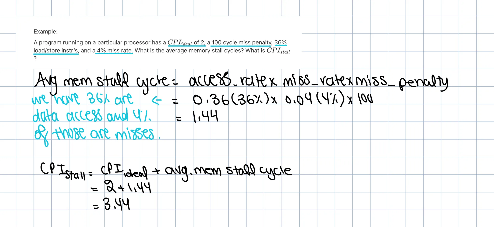

Consider this:

What if the previous miss rate is broken down as 2% instruction-cache miss rate and 4% data-cache miss rate?

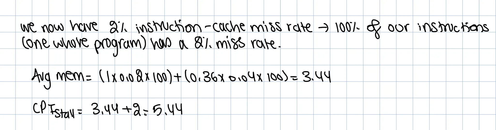

Another example:

A program running on a particular processor has a $CPI_{ideal}$ of 2, a 100 cycle miss penalty, 36% load/store instr’s, and a 4% miss rate. What is the average memory stall cycles? What is $CPI_{stall}$? (these have already been answered above)

What if the $CPI_{ideal}$ is reduced to 1?

What if the data-cache miss rate went up by 1%? (Instruction-cache miss rate is still 2%)

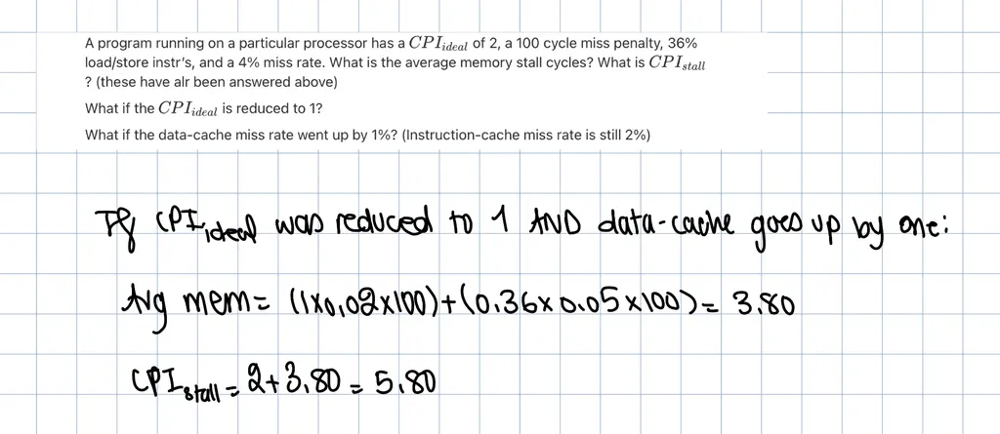

**Banked cache:** A cache that is divided into two sections: one for instructions and one for data

- this is nice because the CPU can easily (and simultaneously) access both instructions and data

**Unified cache:** A cache where instructions and data are stored together and likely intermixed

### **AMAT:**

**AMAT (Average Memory Access Time)** is the average time to access memory considering both hits and misses. AMAT is measured in seconds, whereas $CPI_{stall}$ is measured in clock cycles

$$  
AMAT=\text{Time for a hit + Miss Rate}\times \text{Miss Penalty}  
$$

Example:

What is the AMAT for a processor with a 200 ps clock, a miss penalty of 50 clock cycles, a miss rate of 0.02, and a cache access time of 1 clock cycle?

$$  
AMAT=\text{Time for a hit + Miss Rate}\times \text{Miss Penalty}\\= 1 +0.02\times 50\\=2\text{ clock cycles OR}\\=2\times 200=400ps  
$$

AMAT, much like CPI, is in an idealized world, where these only exists one level of cache and one level of backing memory. But, life is not so easy

Given the memory hierarchy, speed at each level differs. You must calculate the miss penalty on a per level basis

Miss penalties defined per cache level:

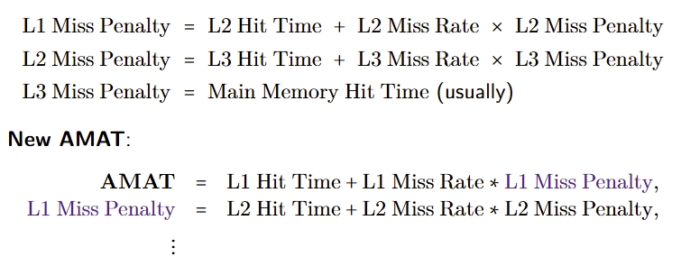

Example:

Calculate AMAT given:

200 ps clock cycle,

1 cycle L1 hit time, 2% L1 miss rate,

5 cycle L2 hit time, 5% L2 miss rate,

100 cycle main memory access time.

Without L2 cache:

With L2 cache:

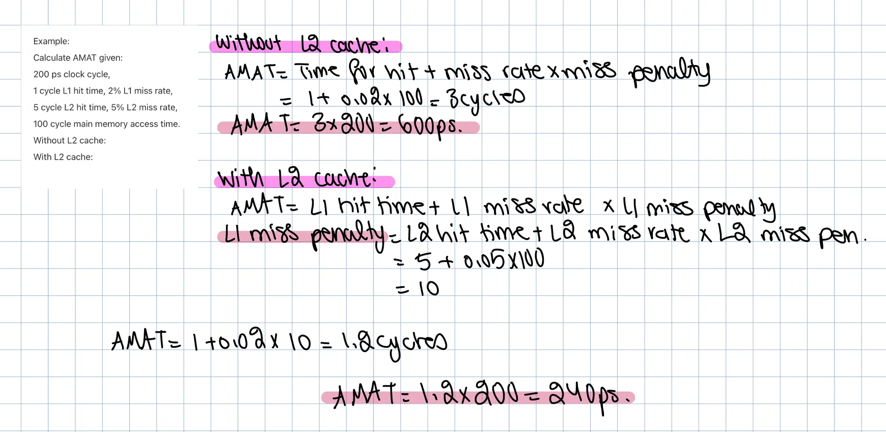

## LOCALITY AND CACHE:

Back to our example:

```c
int sumarray(int[][] a, int M, int N){ // M rows, N columns
	int i,j,sum = 0;
	
	for (i = 0; i < M; i++)
		for (j = 0; j < N; j++)
			sum += a[i][j];
	return sum;
} 
```

Recall: Temporal locality of M depends on the size of N

For this example, assume the cache only fits 8 pieces of data

- We have the parameters a, M, and N, so these are in the cache. We then have some local variables i, j, and sum which will also be stored in the cache
- When we start accessing the loop, we go from i from 0 → M so M is obviously in the loop, so M is now in the cache. Then, we access j from 0 → N, so N is obviously now in the cache since it is in the loop
- Then, we access a[i][j], which is now a new data element because we are accessing the array, getting a piece of data. This also gets stored in the cache, then it gets added to sum and sum was already in our cache so we are chill
- j is now incremented (and assuming N is bigger than 1) we now have to go in the loop again which we get a[0][1] which is a NEW data element. Let us say j is = 2, and the inner loop is accessed again, meaning we have to access a[0][2] which is a NEW data element, therefore the cache takes it in and now we are at 9 pieces of data
- This is gonna be a problem, because our cache can only hold 8 pieces of data, so when this 9th piece wants to come in, we have to evict one of our existing ones. Which element do we evict here?
- If we use a LRU policy, M is going to be evicted because its been the least used

This is why the locality of M depends on the size of N, because the larger the N is, the more the inner loops there are, and the less M is going to be used, therefore it is going to get evicted at some point

If `sizeof(int) x (N + 6)` ≤ cache size, then M can still be in cache (the 6 comes from a, i, j, N, sum, and M)

In a row major language like C, iterating through rows is a beautiful thing

```c
for (i = 0; i < N; i++)
	sum += a[0][i];
```

- Accesses successive element of size $k$ bytes
- If our block size (B) > $k$ bytes, we can exploit spatial locality in order to reduce our cache miss rate and in particular our cold miss rate = $k$ bytes / B
- Basically, consider you access a[0][0], that would be a particular data element and that data element will exist in a specific block, obv that block size is going to be larger than a single data element, say the block size is 4
- now, obviously a[0][0] is going to cause a cold miss, and now you’ll get a block with 4 data elements a[0][0], a[0][1], a[0][2], and a[0][3] which are going to be loaded into cache
- now, when you access a[0][1], it is in the same block as a[0][0] and therefore will be in the cache, and we no longer get a cold miss because of spatial locality

In contrast, consider stepping through rows in one column in a row major language:

```c
for (i = 0; i < N; i++)
	sum += a[i][0];
```

obv, this is bad because you’re jumping in linearized data in a non linear way which is bad spatial locality

the reason why its bad is because we no longer take advantage of savings of blocks of data. if we access data and we have huge strides in between our data, then those data accesses will not result in the same block being accessed. so, in our case, if we access a[0][0], thats in one block that gets loaded in to the cache. then when we access a[1][0], that is going to be in a different block so that is going to result in another cold miss, same can be said about a[2][0] and so on. so every single access is a cold miss because of no spatial locality

Example:

Calculate the number of cache hits and cache misses given:

- `a` has a row-major `INT4` (stores 4 byte integers) elements and is cache-aligned
    - this means a[0] is the first data element of the block, and since this block is 32 bytes, and each integer is 4 bytes, this means 8 integers can be stored in one block, so a[7] is the last element in the block
- Cache capacity of 4 Kilobytes, cache block is 32 bytes
- All local variables are stored in REGISTERS, not cache (so only data elements of the array are stored in the cache)

```c
int i, sum = 0, N = 16384;
for (i = 0; i < N; i++)
	sum += a[i];
```

So, when it comes to spatial locality, we know that the cold miss rate is the data element size divided by the block size. So, the data element size is 4, block size is 32, so we end up with 1/8=0.125% cold miss rate.

Now, given that miss rate, how many references (which is basically the size of the array) are there in general. because the number of misses is going to be equal to the number of references x miss rate

then, the number of hits is the number of references - miss rate

We have:

stride-1 access to `a`

since cache block is 32 bytes, each block holds 8 ints

We have one cold miss for each block

So, we have $1/8\times 16384=2048$ cache misses

$16384-2048=14336$ cache hits