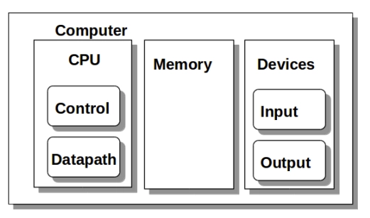
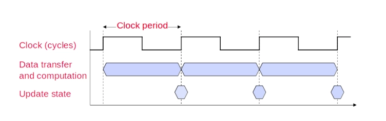
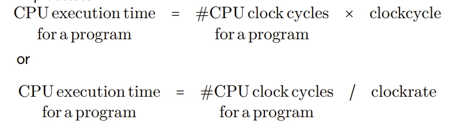
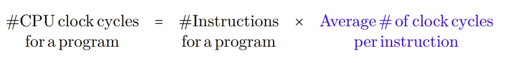
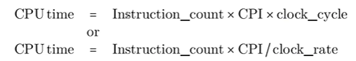
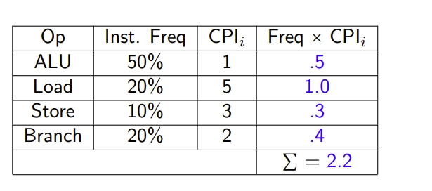
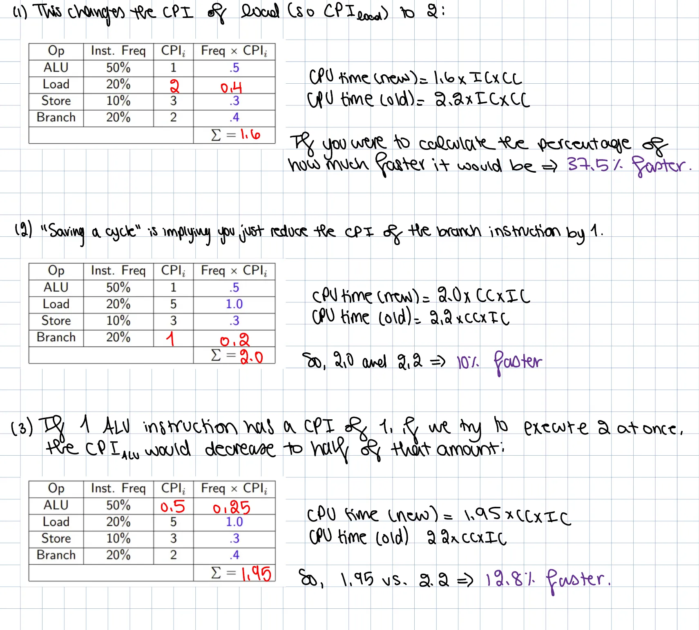

## **CPU:**



Quick review:

- The CPU, the Memory, and I/O devices collectively together make up the Computer
- Memory (like its name suggests) is simply for storing data, storing our programs, accessing our data, etc..
- The CPU is what is actually responsible for the processing of the program and data
    - The Control Unit of the CPU is what is responsible for interpreting the program and ensures that the program is actually being executed as intended
    - The Datapath is the circuitry which is actually executing the instruction the Control Unit interprets

**Micro-architecture:** how the insides of the CPU are put together—the design and architecture of the CPU

CPU and Memory are highly coupled, meaning they are very dependent on one another

**TERMINOLOGY REVIEW:**

**CPU** - The Central Processing Unit, the core component which executes instructions

**Processor** - Sometimes the CPU, but this is the actual circuitry doing the processing within the CPU (so here the control and datapath form the processor)

**Memory Word** - The standard unit of data (e.g., 32 or 64 bits) that the CPU operates on

- so this is basically the smallest unit of memory which gets passed around between the processor, the memory, hard drive, etc.

**RAM** - Random Access Memory. Some storage of data that can be accessed well, randomly. It can either be static (faster and more expensive, used in caches) or dynamic (slower, cheaper, and needs refreshing, used in main memory). This loses whatever memory it was storing if the power goes out

**HDD and SSD** - Both are non-volatile storage (retains stored data even when the device’s power is lost). The difference is that SSD are faster and more reliable than HDDs

### PROGRAMMER’S VIEW OF CPU PERFORMANCE:

There are 3 basic elements that impact the overall performance of the running time of a program on a CPU

- **Clock Rate:** The speed of the CPU (e.g., 3.4GHz)
- **Instruction Type:** Different instructions take different amounts of time (e.g., division is slower than addition). This affects the average clock cycles per instruction (CPI)
- **Memory Access Time:** How long does it take to retrieve a piece of data from Main memory

Assuming you are a normal person and you don’t change your CPU frequently, with a fixed clock rate, performance can be optimized by users. This is done by choosing faster instructions and writing code that accesses memory more efficiently

Changing instructions for performance can be very beneficial

On 6th-gen Intel CPUs:

- 32 bit division takes around 26 clock cycles which is a LOT. But, if you know stuff about bit shifting and 2’s complement and the sort, you’ll know that if you shift an integer to the right by one, then that is the same as diving by two. And you know how many clock cycles a bit shift takes? around 1 clock cycle. That is much better to do!
- Floating point division takes around 14 clock cycles. Let us say you want to divide your number by 2, that would be the same as multiplying by 0.5, and multiplication only takes around 5 clock cycles, so multiplying would be more efficient!
- For example, you can reduce 1 division operations to 3 multiplication operations to improve performance

### UNDERSTANDING AND ANALYZING PERFORMANCE:

Performance is influence by multiple layers:

- **Algorithmic analysis:** The fundamental $O(n)$ complexity
	- Remember that as n increases (the size of the data input) then that is where the differences show. For smaller input sizes of n, the algorithm relatively runs despite its time complexity.
- **Programming language, compiler, architecture:** Determines the number and type of machine instructions generated from the source code. So, what programming language is the program written in? Is it a compiled or interpreted language? Also the architecture, an Intel CPU from 10 years ago won’t perform as well compared to CPU’s nowadays
- **Processor and Memory:** Determines how fast instructions are executed and how fast data moves to and from the processor
- **I/O System (including OS):** Determines how fast I/O operations are executed

What is the point in understanding performance to begin with?

- **Purchasing perspective:** What is the BEST cost? What is the best cost relative to performance?
- **Design perspective:** What is the best performance improvement? The best cost relative to a performance improvement?

Our goal is to understand how the architecture we’re using contributes to overall performance of programs that we want to execute

### CPU PERFORMANCE:

**LATENCY:** How long does it take between you clicking a button and the computer giving you a result. The time to complete a single task

A simple way of giving a quantitative value to performance would be the inverse of execution time:

$$  
performance_X = 1/execution\_time_X  
$$

the faster something is (your execution time) if you get the reciprocal of that, the higher your performance would be for some program $X$

- so, if your execution time is 10 seconds, then your performance is $1/10=0.1$

If we have two programs $X \ \text{and} \ Y$, and we say that $X$ is $n$ times faster than $Y$, then:

$$  
\frac{performance_X}{performance_Y}=\frac{execution\_time_X}{execution\_time_Y}=n  
$$
- so, if program x executes in 10 seconds, and program t executes in 30 seconds, then we can say that program x is 0.33 times faster than program y.

**THROUGHPUT:** The total amount of work done in a given unit of time. Crucial for data centers and servers. This isn’t really concerned with how fast your program is, it is more focused on how much data can we put through the processor at a given time.

- We can the increase throughput
- Dependent on the code being executed as different instructions result in different throughput measures.

**CLOCK FREQUENCY:** A static metric of saying how quickly does my CPU execute

- typically, the faster a CPUs clock, the higher its performance

But, the micro-architecture and the instruction set architecture (ISA) play a large role, they influence how much work the CPU does per cycle (i.e. efficiency).

- there is a tradeoff between speed and the complexity of the tasks we want to complete (duh)

Example:

CPU A runs at 3 GHz and a division takes 20 cycles

CPU B runs at 2 GHz and a division takes 10 cycles

$20\ cycles/ 3\ GHz=20/3\times10^9=6.66ns$

$10\ cycles/2\ GHz = 10/2\times 10^9=5.00ns$

So, while CPU B would seem slower at face value, the time it takes to execute a division instruction is actually faster than CPU A

So, the clock frequency itself is not enough to guarantee the performance, rather, the microarchitecture and the ISA also play a role in actual performance of a CPU

## CPU CLOCKING:

The CPU is a synchronous digital system. This means all its internal components (like the control unit and the datapath) need to move and work together.



Every time a clock goes from 0 to 1 → uptick

**Clock period (cycle):** Duration of time between two clicks/ticks of the CPU

- determines the speed of a computer processor
- three main things happen during this cycle (uptick and downtick)
    - **block (cycle):** the cycle begins
    - **data transfer and computation:** when the clock is high (or low), values are moved around (data transfer) and operations like add are performed
    - **update status:** at the end of the cycle, the results of the computation are saved into registers

**Clock frequency or rate (CR): How many cycles happen in one second

- the inverse of the clock period

$$  
CR=1/CC  
$$

### **CPU TIME:**

It is important to distinguish _elapsed time_ and the _time spent on your task_

- so this is **Wall time** vs. **CPU time**
- CPU Time does NOT include the time waiting for I/O or the time spent on other processes

#CPU clock cycles for a program → how many times does the CPU need to tick for a program to be executed

clockcycle → the length of time for every single clock tick/clock cycle



CPU execution time only measures the amount of time that that particular program spent actively being executed by the CPU, it does NOT take into consideration that you may have 30 other things open in the background. That execution time is not necessarily the amount of time in real life that actually elapsed for you waiting for that program to finish. That real life time is called **wall time**

We can improve performance by reducing either the length of the clock cycle or the number of clock cycles required for a program

How do we reduce the number of clock cycles required for a program? Well, first we need to understand what a CPI is

## CLOCK CYCLES PER INSTRUCTION (CPI):

**Clock cycles per instruction (CPI):** Average ****number of clock cycles needed to execute a single instruction

- different instructions may take different amounts of time depending on what they do
- two different hardware's could execute the same instruction in different numbers of clock cycles. a good way to compare two different implementations of the same ISA



If we want to talk about the number of cycles for a specific instruction type, this is usually denoted by $CPI_i$

So, modifying our first equation



CPI is influenced by the hardware you are executing on and the actual program you are executing

Let us consider an example of computing CPI for a program:

$$  
\text{Overall\ effective}\ CPI=\sum_{i=1}^n(CPI_i\times IC_i)/IC  
$$

(ic just means instruction count btw)

So how the hell did we get this averaging?

- its the number of cycles needed to execute a particular type of instruction, then you multiply it by the NUMBER of instructions of that specific type, divide that by the total number of instructions in your entire program



Inst. Freq basically is just what proportion of instructions in the program are of a particular type

Consider the following questions:

(1) How much faster would the machine be if a better data cache reduced the average load time to 2 cycles?

(2) How does this CPI compare with using branch prediction to save a cycle off the branch time

(3) What if two ALU instructions could be executed at once



### UNDERSTANDING PROGRAM PERFORMANCE:

The performance of a program depends on the algorithm, the language, the compiler, the architecture, and the actual hardware


algorithm, programming language, and compiler are all software level things. whereas isa and processor organization are hardware level things.

the algorithm, programming language, isa, and compiler all influence the instruction count and the CPI

- the reason why the isa influences the instruction count is because imagine a world where your isa does not have a multiplication operator. so, the compiler has to instead take all the multiplications in your high level language and convert all instances of multiplication into addition, which would influence the amount of instructions

the clock_cycle is not going to be impacted by any of the software related parts. it is only influenced by the hardware related parts

CPI is influenced by all of them

- How the hardware is implemented is most definitely going to affect the number of cycles per instruction. Which instructions we choose to use from an ISA are also dependent on what algorithm you use, what programming language you use, and what compiler you use

EXAMPLE:

A given application written in Java runs 15 seconds on a desktop processor. A new Java compiler is released that requires only 0.6 as many instructions as the old compiler. Unfortunately, it increases the CPI by a factor of 1.1. How fast can we expect the application to run using this new compiler? Pick the right answer from the three choices below:

1. $\frac{15\times 0.6}{1.1}=8.2sec$
2. $15\times0.6\times 1.1=9.9sec$
3. $\frac{15\times 1.1}{0.6}=27.5sec$

Consider the CPU time equation:

$Time_1=IC_1\times CPI_1\times CC_1$

$Time_2=IC_2\times CPI_2\times CC_2$

- we know that the new instruction count requires only 0.6 as many instructions as the old compiler. that means our new (or $IC_2$) instruction count would be:
    - $IC_2=0.6\times IC_1$
- We also know that the new CPI increases by a factor of 1.1
    - $CPI_2=1.1\times CPI_1$
- The processor we are running it on hasn’t changed, only the compiler has changed, therefore:
    - $CC_2=CC_1$

$$  
Times_2=IC_2\times CPI_2\times CC_2\\= (0.6\times IC_1)\times (CPI_1\times 1.1)\times CC_1\\=Time_1\times 0.6\times 1.1\\=15\times 0.6\times 1.1  
$$

so the answer is 2

## POWER, TRENDS, LIMITATIONS:

### CPU POWER USAGE:

Depending on the architect’s design goals they may want to look at metrics different from latency, throughput, time, or clock frequency

Obviously, the more power we use on our CPU, the hotter it’s going to get. And the more power we use on it, our battery life is going to decrease

**THE POWER WALL**

- We simply cannot consume any more power to get more performance
- We cannot decrease the transistor size anymore. If we did, that would cause more transistors per chip, therefore leading to a greater power density. A bigger power density would cause extra heat buildup, and removing that extra heat is very difficult
- We cannot reduce voltage very much, it will be very difficult because there still needs to be a measurable voltage difference between on and off

So, does this mean that Moore’s law is failing? Moore’s law basically states ****that the speed and capability of computers can be expected to double every two years, as a result of increases in the number of transistor a microchip can contain.

Moore’s law failing? Great idea! Performance vs Parallelism

- Multi-core processors
    - this is basically putting more than one processor on a single CPU

However, this is quite hard to do:

- for programmers, this is basically hell
- you have to take thread management, load balancing and all of the sorts into consideration which is hard to control

With multi-core processors, you need explicit parallel programming, meanwhile pipelining is implicit and hidden from the programmer

## BENCHMARKS AND PROFILING:

How do you, as a programmer, have a practical measure of program performance

- because, if we are being real, we are not going to just sit down and count every single instruction that we have, you’re not going to compute the average CPI of your program, that would be some nonsense. we have hundreds of different types of instructions—maybe billons

We are going to use benchmarks profiling as a way of measuring CPU performance without having to go through all these equations

### BENCHMARKS:

**Benchmarks** are essentially a collection of programs which are used to evaluate the performance of a particular hardware.

- some programs are maybe data intensive, others are branch intensive, etc.

Different benchmarks exist, but there is a standardized one called SPEC, **Standard Performance Evaluation Corp**

- These programs are used to test different types of CPU. They have negligible I/O, so they truly focus on evaluating CPU performance

In order to get a quantitative value for that program’s performance, you take the performance of each of those programs in the benchmark suite, you normalize that with respect to some reference machine, then do an average over all the programs in the suite

- a **benchmark suite** is a collection of programs that are chosen that test the performance of a computer
- a **reference machine** is a standard computer system chosen to be the fixed baseline for comparison. Its performance provides the benchmark for "normal" speed
    - so, if you got a ratio of 2.5, that means the machine is 2.5 faster than the reference machine


This gives us a broad understanding of this CPUs performance on a variety of tasks

### PROFLING:

In order to understand the performance of a particular program on a fixed machine, that is when we use profiling.

**Profiling** is trying to understand why a particular program runs/behaves in a particular way on a particular sort of hardware

Different types of tools to use:

- **Static instrumentation `gprof`** before the program is run (during compilation/linking phase), the source code (or binary) is permanently modified. special instructions, called **probes**, are inserted into the code at specific, predetermined points
- **Dynamic instrumentation `cachegrind`** while the program is running. the profiler injects tiny bits of code into the programs memory image at any location, without changing the original executable file on disk
- **Performance counters `perf`** this counts particular events that happen. it basically counts the number of clock cycles which occur, cache misses, branch instructions, etc. it basically counts all the different things you can do on a CPU

These are different types of tools we can use to see why our program might be slow on a specific hardware

The difference between profiling and benchmark is:

- Benchmarking asks “HOW fast is my hardware” while profiling asks “WHY is my program so slow ON said hardware”

Exercise1:

Given these two blocks of code:

```c
void copymatrix1(int** src, int** dst, int n) {
	int i,j;
	for (i = 0; i < n; i++)
		for (j = 0; j < n; j++)
			dst[i][j] = src[i][j];
}
```

```c
void copymatrix2(int** src, int** dst, int n) {
	int i,j;
	for (j = 0; j < n; j++)
		for (i = 0; i < n; i++)
			dst[i][j] = src[i][j];
}
```

the difference between these two is that `copymatrix1` uses row-major order while `copymatrix2` uses column-major order

now, we will get to what cache misses and hits are, but know having a lot of cache misses is a bad thing

Why does this matter? Well, arrays in C are stored in row-major order. So, the first matrix accesses memory sequentially—which is cache-friendly. whereas, matrix2 jumps between rows, which causes many cache misses

We performed:

```c
perf stat -e cycles -e cache-misses ./copymatrix1
perf stat -e cycles -e cache-misses ./copymatrix2
```

and got these results


here, we can see that copymatrix1 has far fewer cycles and cache misses in comparison to matrix2

copymatrix2 also has ~2.5x more cycles and ~2x more cache misses, making it MUCH slower

Exercise2:

```c
void lower1 (char* s) {
	int i;
	for (i = 0; i < strlen(s); i++)
		if (s[i]>=’A’ && s[i]<=’Z’)
			s[i] -= ’A’-’a’;
}
```

```c
void lower2 (char* s) {
	int i;
	int n = strlen(s);
	for (i = 0; i < n; i++)
		if (s[i]>=’A’ && s[i]<=’Z’)
			s[i] -= ’A’-’a’;
}
```

lower1 calls strlen(s) in the loop condition EVERY iteration. lower2 calls it only once before the loop and stores the result

- the reason why this matters is because it must rescan the entire remaining string on every loop check which makes the program more complex

we performed:

```c
perf stat -e cycles -e cache-misses ./lower1
perf stat -e cycles -e cache-misses ./lower2
```

and got these results:


here, we can clearly see that lower1 has WAY more cycles and cache misses in comparison to lower2

- when we say something has more cycles than another program, we are basically saying that lower1 takes more time to execute in comparison to lower2. it is a direct measure of how much more time it takes to execute