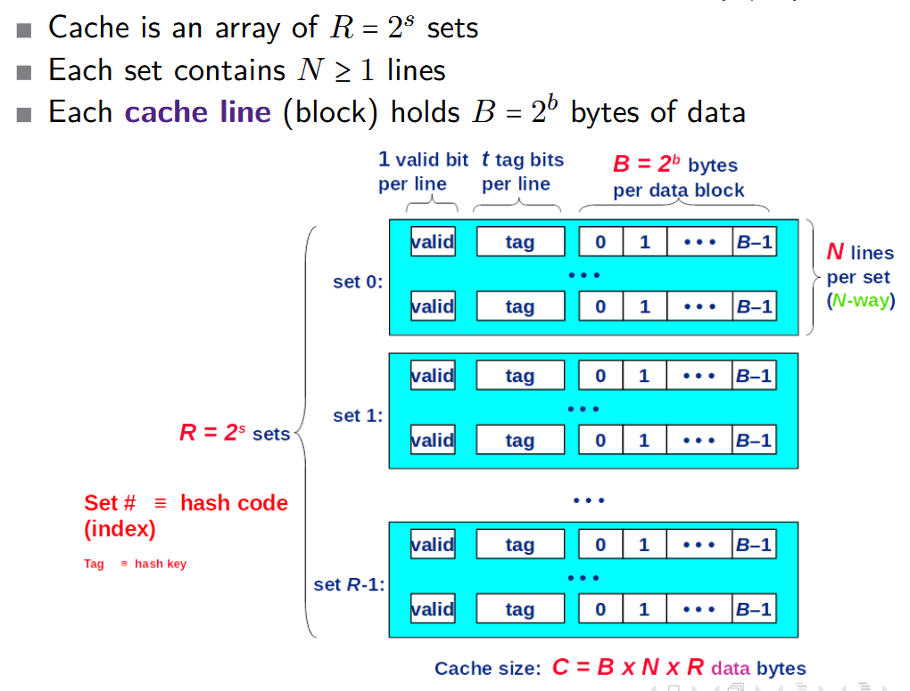
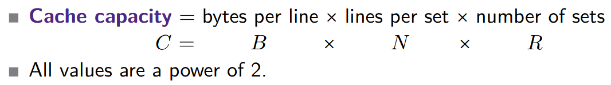
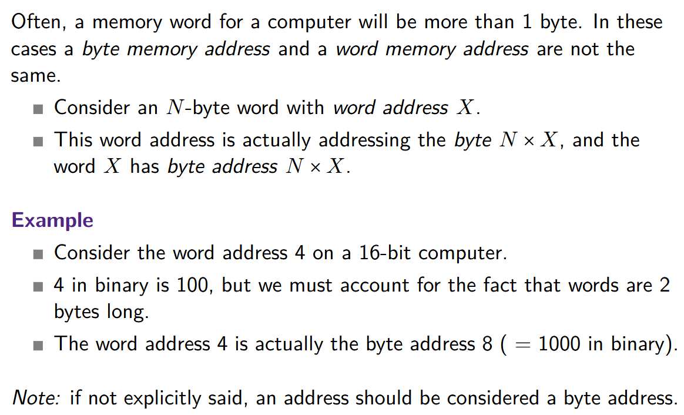

## Cache Design Questions

We are going to answer these in this course

1. How best to organize the memory block (a.k.a lines) inside the cache?
2. To which block (line) of the cache does a given (main) memory address map?
	- Note: Since the cache is a subset of the main memory, multiple memory addresses can map to the same cache location
3. How do we know if a block of the main memory currently has a copy in cache?
4. How do we quickly find a particular copy of main memory (memory address contents) in the cache?

## General Organization of a Cache Memory

- How do we get the exact location of the block (line) we need?
	- First, use the **set** index (calculated from the address of the first byte)
	- Then, we can use the **tag** to find the exact location in the given set and the given line.

## Memory-Cache Mapping (Addressing Cache Memories)

![[Pasted image 20260918105341.png]]

The data word at the *m*-bit address A is in cache if the tag bits in one of the $<\text{valid}>$ lines in set $<\text{set index}>$ match $<\text{tag}>$

The word contents begin at offset $<\text{block offset}>$ bytes from the beginning of the block

**Address Mapping**:

block address = $<\text{tag}> || <\text{set index}>$
set # = (block address) mod R
- just take the "s bits" as set index

**Block Offset**:

| x   | y         |
| --- | --------- |
| 0   | 000...000 |
| 1   | 000...001 |
| 2   | 000...010 |
| ... | ...       |
| B-1 | ...       |
**Word Address**: Viewing the main memory as a succession of bytes

**Byte Address**:

I'm kinda not getting this so I'll add a simple Explanation:

From $1^{st}$ year, we know that **8 Bits = 1 Byte**

$\underbrace{00000000}_{1 \ \text{Byte} \ = \ 8 \ \text{Bits}}$

A **Word** is a natural unit of data used by a processor, which often spans multiple bytes (*N* bytes) and is based on the number of bits a processor has (e.g. 16-bit processor means 1 **Word** = 16 **bits** = 2 **bytes**).

e.g. *N* = 8 (1 **Word** = 8 **Bytes**) -> I used 8 in this example because it will make sense in a couple sentences so keep reading:

$\underbrace{\underbrace{00000111}_{1 \ \text{Byte}}, \underbrace{00000110}_{1 \ \text{Byte}}, \underbrace{00000101}_{1 \ \text{Byte}}, \underbrace{00000100}_{1 \ \text{Byte}}, \underbrace{00000011}_{1 \ \text{Byte}}, \underbrace{00000010}_{1 \ \text{Byte}}, \underbrace{00000001}_{1 \ \text{Byte}}, \underbrace{00000000}_{1 \ \text{Byte}}}_{1 \ \text{Word}}$

Okay so the **Word** in this example is equal to a large number (made from the **64 bits (8 Bytes)**) but that number could be whatever (we don't really care right now).

All we want to know is *where* that word is in the **Word Address**.

So to find the **Byte Address** (where this word is located in memory) we can multiple the **Word Address** *X* for a **Word** with *N* **Bytes**: $N \times X$

So in this case (assuming the common **64-bit** computer):
- We chose *N* = 8 because to get the size of a **Word**, you take the *M* from the *M*-bit computer and divide it by **8** (because again, **8 bits = 1 Byte**). This tells you the number of **Bytes** a **Word** has for that given processor (or computer architecture).

Lets say this **Word** is at **Word Address** 16

Therefore the **Byte Address** of this **Word** = $N \times X = 8 \times 16 = 128$

## Types of Cache Organization

**Direct-Mapped**:

N = 1
- One line per set
- Each memory address is mapped to exactly one line in the cache
- $b = log_2(B), N = C/B, s = 0, t = m - b$

**Fully Associative**:

- R = 1 (allow a memory address to be mapped to any cache block)
- Tag is whole address except block offset
- $b = log_2(B), N = C/B, s = 0, t = m - b$

**N-way set associative (We use this most of the time**):

- N is typically 2, 4, 8, or 16 (sometimes 32)
- A memory block maps to a specific set but can be placed in any way of that set (so there are N choices of mapping).
- $b = log_2(B), R = C/(B \times N), s = log_2(R), t = m - s- b$

## Why Middle Bits For Set Index?

![[Pasted image 20260918101658.png]]

**High-Order Bit Indexing**:

Underlined bits are the set (so which of the 4 sets to go to)
Non-underlined bits are the set (so which line)

**Middle-Order Bit Indexing**:

Underlined bits are the tag (so which line)
Non-underlined bits are the set (so which of the 4 sets to go to)

**SO WE USE MIDDLE-ORDER BIT INDEXING!!!**

Oh! Lets see an example for a **Direct-Mapped Cache**

![[Pasted image 20260918104935.png]]

