# Synchronous Circuits

## Part 1: Gates, Switches, and Boolean Algebra

## Layers of Abstraction

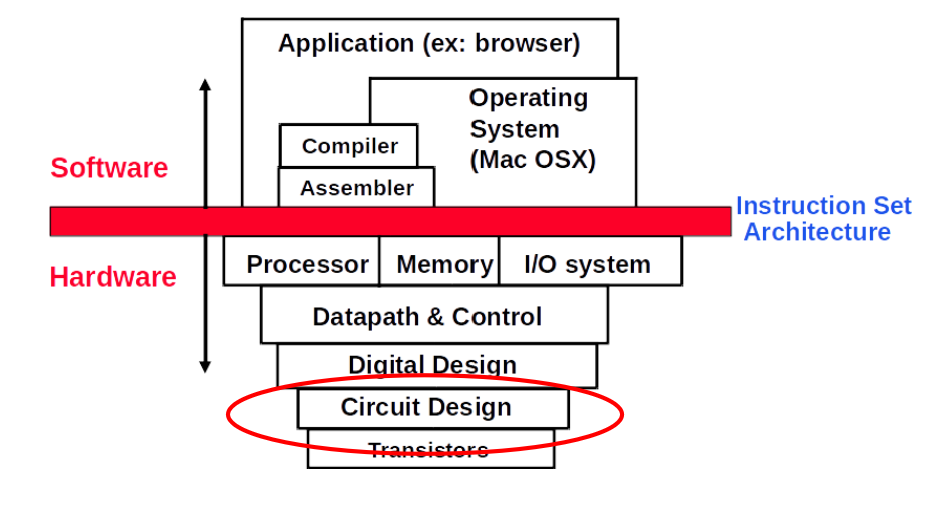

We are now going to be looking at the **lowest level** of the hierarchy (BUT NOT TRANSISTORS).

**Digital (Logic) Design**: Using circuits to implement some logic

**Circuit Design**: The Design of individual circuits

## Circuit Design

### Why do we care? (good question)
- Appreciate the limitations of hardware.
- Understand why some things are fast and some things are slow.
- Need circuit design to understand logic design.
- Need logic design to understand CPU Datapath

## Digital Circuits

NOT DIGITAL (LOGIC) DESIGN!!!

This just talks about how everything to do with circuits is **digital** in the sense that they are represented by discrete, individual values (so no gray areas or ambiguity).

However, this means that we must convert an **analog**: take a continuous variable (in our case electricity) and change that signal to digital

In other words we take the analog signal, electricity (voltage) and covert it into binary (0's and 1's)
- "High" voltage $\Rightarrow 1$
- "Low" voltage $\Rightarrow 0$

## Physicality of Circuits

In terms of **Circuits**, everything is a **switch**.

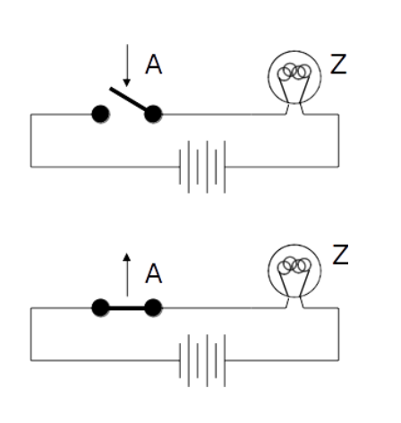

- "Input" $\Rightarrow A$
- "Output" $\Rightarrow Z$

I don't really need to explain this but I got some time right now so...

If A is 0 (false) then the switch is **open** and Z is **off**.
If A is 1 (true) then the switch is **closed** and Z is **on**.

So, since the state of A is equal to the state of Z, we can summarize and say that this circuit implements:

$$
A \equiv Z
$$

## Transistors: Electrically Controlled Switches

Like I said, we don't care about transistors so nothing more needs to be said here. Maybe learn it for midterm or exam (idk)

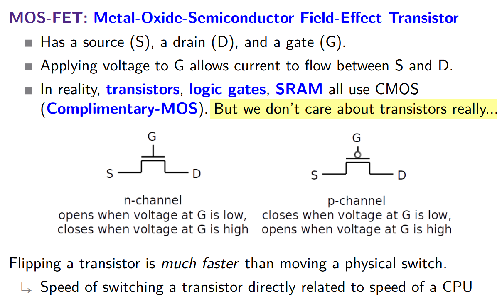

## Logic as Circuits

**Propositional Logic**: A set of propositions (mathematical sentences that are either **true** or **false**) combined by some **Logical Connectives**.
- Each proposition is represented by a binary digital signal (0 or 1 as false and true respectively).
- **Local Connectives** are presented by **Logic Gates**.

**Logic Gate**: A circuit mapping **a number of propositions** to one (sometimes more) proposition(s).

The Basics: AND ($\wedge$), OR ($\vee$), NOT($\neg$):

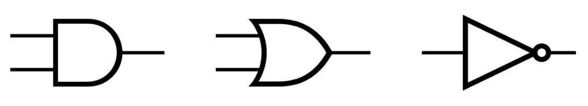

**Arity**: The number of input signals a gate/function has (AND = 2, OR = 2, NOT = 1)

## Gates as Switches

When it comes to implementing **Logic Gates** as **Switches**, we can just think of the switches as **Boolean Integers**:

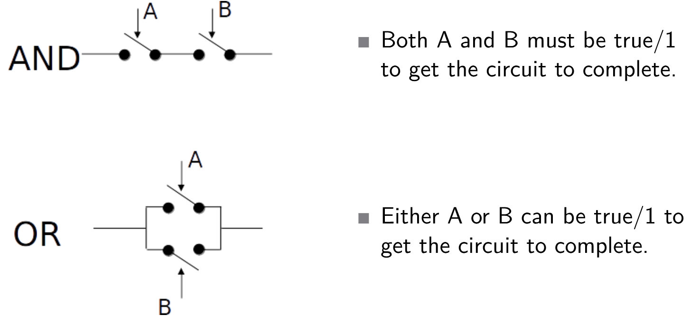

## Logic Gates in Detail

### AND

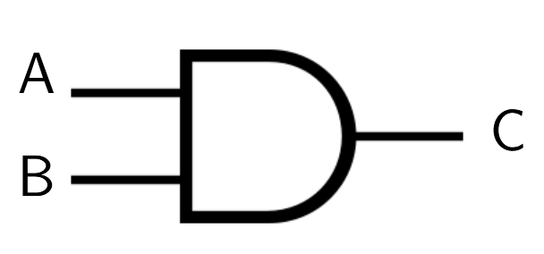

- $A \wedge B \equiv C$
- $A \cdot B \equiv C$

Truth Table for **AND**

| A   | B   | $A \wedge B \equiv C$ |
| --- | --- | --------------------- |
| 0   | 0   | 0                     |
| 0   | 1   | 0                     |
| 1   | 0   | 0                     |
| 1   | 1   | 1                     |

### OR

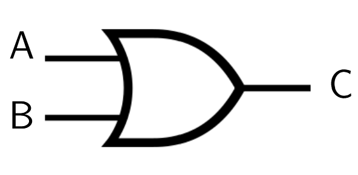

- $A \vee B \equiv C$
- $A + B \equiv C$

Truth Table for **OR**

| A   | B   | $A \vee B \equiv C$ |
| --- | --- | ------------------- |
| 0   | 0   | 0                   |
| 0   | 1   | 1                   |
| 1   | 0   | 1                   |
| 1   | 1   | 1                   |
### NOT

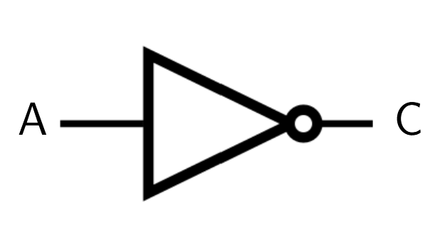

- $\neg A \equiv C$
- $\bar{A} \equiv C$

Truth Table for **NOT**

| A   | $\neg A \equiv C$ |
| --- | ----------------- |
| 0   | 1                 |
| 1   | 0                 |

### NAND

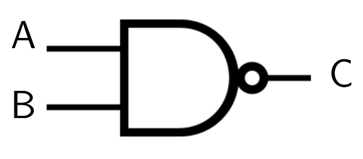

- $\neg (A \wedge B) \equiv C$
- $\overline{A \cdot B} \equiv C$
- $A \ | \ B$ 

> "|" = Sheffer Stroke

Truth Table for **NAND**

| A   | B   | $\overline{A \cdot B} \equiv C$ |
| --- | --- | ------------------------------- |
| 0   | 0   | 1                               |
| 0   | 1   | 1                               |
| 1   | 0   | 1                               |
| 1   | 1   | 0                               |

### NOR

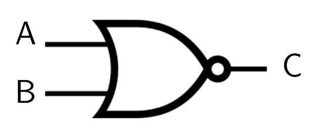

- $\neg (A \vee B) \equiv C$
- $\overline{A + B} \equiv C$

Truth Table for **NOR**

| A   | B   | $\overline{A + B} \equiv C$ |
| --- | --- | --------------------------- |
| 0   | 0   | 1                           |
| 0   | 1   | 0                           |
| 1   | 0   | 0                           |
| 1   | 1   | 0                           |

### XOR

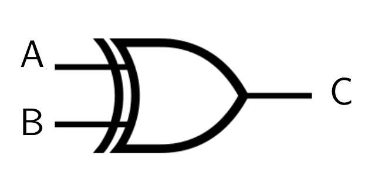

- $A \oplus B \equiv C$

Truth Table for **XOR**

| A   | B   | $A \oplus B \equiv C$ |
| --- | --- | --------------------- |
| 0   | 0   | 0                     |
| 0   | 1   | 1                     |
| 1   | 0   | 1                     |
| 1   | 1   | 0                     |

## The Algebra of Logic Gates

Due to the equivalence of Truth Tables and Binary Digital Signals, Boolean Algebra is heavily used when discussing Circuitry.

Associativity:
- l
- l

Identity:
- l
- l

Commutativity:
- l
- l

Annihilation:
- l
- l

Distributivity:
- l
- l

Idempotence:
- l
- l

Absorption:
- l
- l

Double Negation:
- l
- l

De Morgan's Laws:
- l
- l

Complementation:
- l
- l

## Proving De Morgan's Laws

We have seen this a billion times but whatever, here we go again!

Proof By Exhaustion: The easiest way to prove something is to write out each expression's truth table.

$$
\overline{A + B} \equiv \overline{A} \cdot \overline{B}
$$

| A   | B   | $A + B$ | $\overline{A + B}$ |
| --- | --- | ------- | ------------------ |
| 0   | 0   | 0       |                    |
| 0   | 1   | 1       | 0                  |
| 1   | 0   | 1       | 0                  |
| 1   | 1   | 1       | 0                  |

**CNF**: $(A + B) * (C + D) * (E + F)$

**DNF**: $(A * B) + (C * D) + (E * F)$

