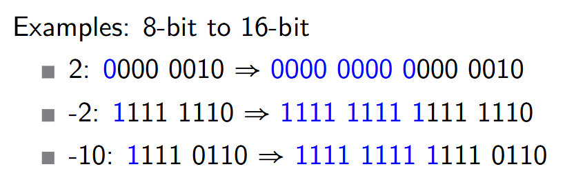
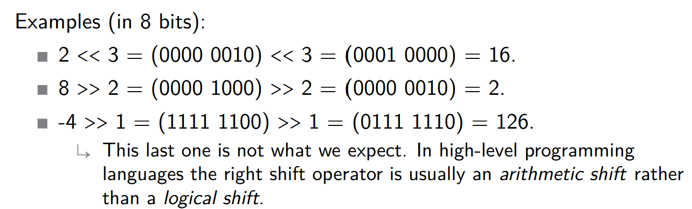
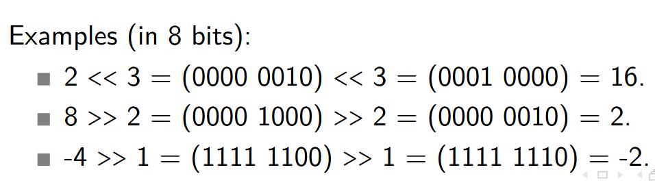

## Synchronous Circuits: Prelude

## Radix Representations

**Radix** is the **base number** in some numbering system.

In a **radix**, $r$ representation digits $(d_{i})$ are from the set $\lbrace{0, 1, \dots, r - 1\rbrace}$ 

$$
x = d_{n-1} \times r^{n-1} + d_{n-2} \times r^{n-2} + \cdots + d_{1} \times r^{1} + d_{0} \times r^{0}
$$

- $r = 10 \Rightarrow$ decimal, $\lbrace{0, 1, 2, 3, 4, 5, 6, 7, 8, 9\rbrace}$
- $r = 2 \Rightarrow$ binary, $\lbrace{0, 1\rbrace}$
- $r = 8 \Rightarrow$ octal, $\lbrace{0, 1, 2, 3, 4, 5, 6, 7\rbrace}$
- $r = 16 \Rightarrow$ hexadecimal, $\lbrace{0, 1, 2, 3, 4, 5, 6, 7, 8, 9, a, b, c, d, e, f\rbrace}$

Decimal vs Binary:

- $(13)_{10} = (1 \times 10^{1}) + (3 \times 10^{0})$
- $(1101)_{2} = (1 \times 2^{3}) + (1 \times 2^{2}) + (0 \times 2^{1}) + (1 \times 2^{0}) = 8 + 4 + 0 + 1 = (13)_{10}$

> Going from Decimal to Binary:

## Unsigned Binary Integers

**Unsigned Binary Integers** $\Longrightarrow$ the normal representation

An $n$-bit number:

$$
x = x_{n-1}2^{n-1} + x_{n-2}2^{n-2} + \cdots + x_{1}2^{1} + x_{0}2^{0}
$$

- Has a term up to $2^{n-1}$
- Has a range: $0$ to $(2^n - 1)$
- Example:
	- $(11)_{10} = 0\text{x}0000000\text{B}$
	- $(11)_{10} = 0000 \ 0000 \ 0000 \ 0000 \ 0000 \ 0000 \ 0000 \ 1011_{2}$
	- $(11)_{10} = 0 + \cdots + 1 \times 2^{3} + 0 \times 2^{2} + 1 \times 2^{1} + 1 \times 2^{0}$
	- $(11)_{10} = 0 + \cdots + 8 + 0 + 2 + 1$
- If we had $32$ bits, then we could represent the numbers $0$ to +$4,294,967,295$

## Signed Binary Integers

So the question is probably: "How do we encode a Negative integer?"

Well, we have two methods:
- One's Complement
- Two's Complement

### One's Complement

- The **Leading Bit** (the one on the far left) decides if the integer is negative or not: 1 = Negative
- All positive numbers have the same representation as unsigned.

**Get the Value of a Negative Number by inverting all bits then multiply by -1**

Example:

- $(0101)_{2} = (0101)_{2} = 5$
- $(1101)_{2} = -1 \times (0010)_{2} = -2$
- $(0000)_{2} = (0000)_{2} = 0$
- $(1111)_{2} = -1 \times (0000)_{2} = -0 ????$ So it does not deal with **overflow**

So it's pretty obvious that one's complement is rarely used!

### Two's Complement

- The **Leading Bit** (the one on the far left) decides if the integer is negative or not: 1 = Negative
- If a number is non-negative (so 0 is included), then same representation as unsigned, otherwise:

**You invert the leading bit, read the expansion as a non-negative integer and add $-2^{n}$, ignoring any overflow**

> The $n$ in $-2^{n}$ is the exponent on the 2. So in $(1101)_{2}$, the leading bit = 1 so its a negative number. That leading bit is the 3th bit because $\rightarrow$ $\underbrace{1}_{2^{3}}\underbrace{1}_{2^{2}}\underbrace{0}_{2^{1}}\underbrace{1}_{2^{0}}$ so $n = 3$

Example:

- $(0101)_{2} = (0101)_{2} = 5$ 
- $(1101)_{2} = (0101)_{2} - 2^{3} = 5 - 8 = -3$
- $(0000)_{2} = (0000)_{2} = 0$
- $(1111)_{2} = (0111)_{2} - 2^{3} = 7 - 8 = -1$

Advantages:

- Arithmetic is the same whether positive or negative:

$$
\begin{aligned}
(0101)_{2} &= 5 \\
+ \ (1101)_{2} &= -3 \\
\hline
(0010)_{2} &= 2
\end{aligned}
$$

- No signed 0
- One extra value is represented with the same number of bits

For an $n$-bit number:
- Range of values is from $-2^{n-1}$ to $2^{n-1} - 1$

## Same bits, but different numbers

It is important to realize that the same bit sequence can represent different numbers

$$
\begin{aligned}
(1001 \ 1010)_{2} &\Longrightarrow (154)_{10} \ \ \ \ \text{interpretted as unsigned} \\
&\Longrightarrow (-102)_{10} \ \text{interpretted as two's complement}
\end{aligned}
$$

This can clearly be a problem when programming!

```c
unsigned int a = (1 << 31); // a = 2147483648 (unsigned)
int b = a;                  // b = -2147483648 (signed)
```

## Computing the opposite (signed negation)

In two's compliment, sometimes we want to find the negative representation of a binary number.

Let's say we have the number 6. We know that this is $(0110)_{2}$ in binary. But what is -6 in binary?

We can get the **bit-wise complement** and then **add 1** to it:

$$
\begin{aligned}
6 = (0110)_{2} &= (0 \times 2^{3}) + (1 \times 2^{2}) + (1 \times 2^{1}) + (0 \times 2^{0}) \\
\Downarrow \ &\text{complement} \\
(1001)_{2} &= (-1 \times 2^{3}) + (0 \times 2^{2}) + (0 \times 2^{1}) + (1 \times 2^{0}) = -8 + 1 \\
\Downarrow \ &\text{add one} \\
(1001)_{2} + (0001)_{2} &= (1010)_{2} = -8 + 0 + 2 + 0 = -6
\end{aligned}
$$

This also works in reverse! (from negative to positive)
- $-6 = (1010)_{2} \Rightarrow (0101)_{2} + 1 \Rightarrow (0110)_{2} = 6$

## Signed Extension

- Represent a number using more bits but keep numerical value.
- Very easy in two’s compliment!
- Copy the signed bit to the left until desired number of bits



## Logical Shift

- Shift the bits **left** or **right** a specified number of times.
- Fills the vacancies with 0s on shift left and shift right.
- Throw away any bits that flow out.
- << (shift left) and >> (shift right) in C (**unsigned**).



## Arithmetic Shift

- Shift the bits **left** or right a specified number of times.
- Fills the vacancies with 0s on shift left.
	- indeed an arithmetic shift left is a multiplication by a power of 2
- Fills the vacancies with 1s on shift right if number is negative.
	- indeed an arithmetic shift right is an integer quotient by a power of 2
- **Fills the vacancies with 0s on shift right if number is positive.**
- Throw away any bits that flow out.
- << (shift left) and >> (shift right) in C (**signed**).



<< 0
